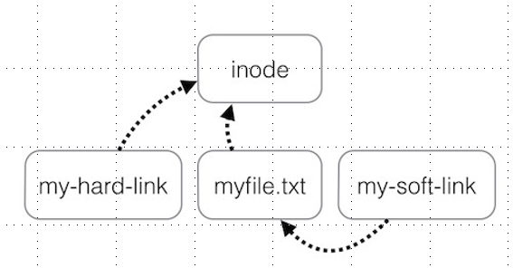

# 파일 및 디렉터리 조작
1. 빈 파일 생성
> touch 명령어 사용 
> 
          touch 파일명1 [파일명2 ...]
        - '>' 사용
1. 빈 디렉터리 생성
> mkdir은 make directory의 약자

        mkdir 디렉터리명1 [디렉터리명2 ...]

1. 파일삭제
> rm: remov의 약자
    
    사용방법: rm 파일명1 [파일명2 ...]

파일이 삭제되면 복구가 불가능하기 때문에 신중하게 사용

옵션

    -i, --interactive: 파일을 삭제하기 전에 확인하는 옵션
    -r, --recursive: 재귀적으로 하위 디렉터리를 순회하면서 모든 파일과 디렉터리를 삭제함,  (디렉터리도 파일입니다.)
    -f, --force: 존재하지 않는 파일에 대하여 확인 메시지 없이 무시하고 진행하라는 의미


> 안전하게 삭제하는 방법
> > rm *.html
> 
> >shell은 공백과 개행으로 문자를 구분하기 때문에
> > rm * .html 모든파일삭제를 의미한다

4. 디렉터리 삭제
>rmdir: remove directory의 약자로 비어 있는 디렉터리만 삭제 가능

        사용 방법: rmdir 디렉터리명1 [디렉터리명2 ...]

5. 복사
> cp: copy의 약자로 파일 및 디렉터리를 복사할 때 사용
 
    사용방법: cp 파일명... 디렉터리 ex) cp hello.txt mysub
    cp 파일명1 파일명2 ex) cp hello.txt hello1.txt

옵션

    -i, --interactive: 만약 복사될 곳에 기존의 파일이 존재한다면 덮어쓰게 된다는 위험성이 있음,
    때문에 기존 파일을 덮어쓰기 전에 확인하기 위해 사용
    
    -r, --recursive: 디렉터리를 통째로 복사할 때 사용
    
    -u, --update: 파일을 다른 곳으로 복사할 때,  그 곳에 없는 파일이나 최신 버전의 파일만 복사함

6. mv
> move의 약자로 파일이나 디렉터리를 이동할 때 사용

    사용 방법 : mv 파일명... 디렉터리명
               mv 디렉터리명1 디렉터리명2

옵션

    -i, --interactive: 기존 파일이 존재할 경우, 덮어쓰기 때문에 이를 확인하는 옵션임

    mv의 기본 동작은 이동 대상 파일이 존재할 경우, 덮어쓴다는 것이 원칙!

    -u, --update: 파일을 다른 곳으로 이동할 때, 그 곳에 파일이 없거나 최신 파일만 이동


> 파일이나 디렉터리의 이름을 변경할 때, mv 명령어를 사용
>> mv OLDNAME NEWNAME

7. ln
> link의 약자로 하드 링크 또는 심볼릭 링크를 만들 때 사용하는 명령어

    하드링크 : 같은 파일에 대하여 다른 이름을 부여하는 개념
    사용방법 : ln 파일명 링크명
    ex) ln hello world

- 하드링크가 필요한 이유
  
    >파일의 이름을 바꿀때 사용된다.

        원본파일 : ubuntu.iso (4GB)

        1) ubuntu.iso를 변경할 이름으로 복사를 수행
        cp ubuntu.iso linux.iso
        1) 복사가 완료된 후, ubuntu.iso를 삭제하면 됨
        

        하드 링크 기능이 있는 경우
        ln ubuntu.iso linux.iso
        rm ubuntu.iso

하드링크의 2가지 제약 조건

    파일 시스템 외부에서 파일을 참조할 수 없음, 
    다시 말해 하드 링크는 같은 디스크 파티션 안에 있는 파일이 아니면 참조할 수 없다.
    리눅스를 비롯한 대부분의 운영체제는 서로 다른 파티션의 아이노드 정보(테이블)를 
    공유하는 기능을 제공하지 않기 때문

```
하드 링크는 디렉터리를 참조할 수 없다. cp나 ls에 대하여 -R 옵션을 사용 수 없기 때문
(무한 루프에 빠짐)
단, 자신과 부모는 허용
  
```

> 이를 극복하기 위해 사용 하는 것이 소프트 링크 또는 심볼릭 링크

- 심블릭 링크 사용 방법
  
        ln  -s[파일명 또는 디렉터리명] 별칭

> 심볼릭 링크는 아이노드를 참조하는 것이 아닌 해당 디렉터리 또는 파일에 대한 경로 정보를
가지고 있는 특수 파일
>>윈도우즈의 바로가기가 리눅스의 심볼릭 링크

> 심볼릭 링크를 사용하여 디렉터리를 링크를 건 경우, 상황에 따라 다시 무한 루프에 빠질 수
있다(순환 링크가 걸린 경우).
이는 몇 회 이상 루프를 수행하면 리눅스 시스템은 탐색을 중지

>하드링크와 소프트링크의 구성도

---
# 명령어의 개념

1. 프로그래밍 언어나 스크립트 언어로 구현되어 실행 가능한 프로그램

        - C/C++와 같은 언어로 작성되어 컴파일된 바이너리 파일
        - python/ruby/javascript/shell과 같은 스크립트 언어로 작성된 텍스트 파일


2. shell이 자체적으로 제공하는 실행 가능한 명령어, 이는 내장명령어라고한다
   > 대표적 예> cd

3. shell 함수, mini script라고도 함
4. 별칭, alias 명령어로 정의
---
## 별칭(alias)
> 복잡한 형태의 명령어를 간단하게 수행할 수 있도록 지정하는 별명

    사용방법 : alias 별칭='기존명령어'
    ex) alias cls='clear'

기존 정의된 별칭 확인 방법
```s
$ alias
alias egrep='egrep --color=auto'
alias fgrep='fgrep --color=auto'
alias grep='grep --color=auto'
alias l='ls -CF'
alias la='ls -A'
alias ll='ls -alF'
alias ls='ls --color=auto'
```

별칭을 삭제하는 방법: unalias 별칭

    ex) unalias cls
---
## 명령어 도움말
> 어떤 명령어에 대하여 도움말을 확인하고 싶다면 먼저 그 명령어에 대한 타입을 알아야한다

>> 명령어에 대한 타입을 확인할 수 있도록 type 명령어를 제공

```s
$ type cd
cd is a shell builtin

$ type mv
mv is hashed (/bin/mv)

$ type ls
ls is aliased to `ls --color=auto'
```
- 내장 명령어의 도움말 확인 방법
>help 명령어를 사용

    사용방법: help 내장명령어 ex) help alias 
    usage: alias [-p] [name[=value] ... ] -> []는 생략 가능

- 실행 파일에서 도움말 확인 방법
    
        옵션사용, -h, --help
        -> manpage로 넘어간다.
---
## man
> manual page의 약자로 리눅스의 각종 도움말을 볼 수있다

섹션(section): 종류
```
1: 사용자 명령어
2: Syscall API
3: C library
4: 특수 파일(장치 관련 파일)
5: 파일 포맷
6: 게임이나 미디어 파일
7: 그 외 여러 종류
8: 시스템 관리용 명령어
```

    사용 방법: man [section] 명령어

> 사용자 명령어는 빈번하게 사용되므로 생략할 수 있다. man 1 ls 또는 man ls
