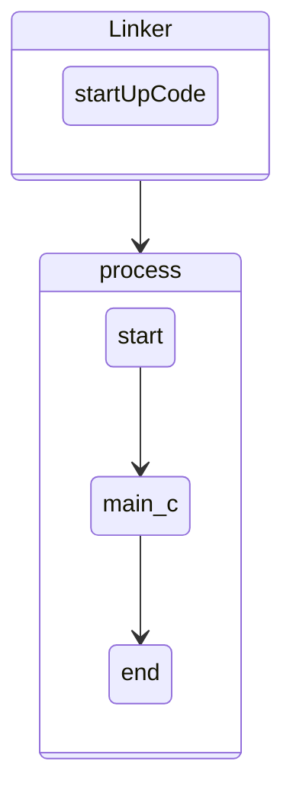

# 1. 권한
## 1.1. 파일의 권한
- 파일 및 디렉토리 권한
#


- 각각의 기능 <br/>
<br/>
 파일권한을 바꾸는 모습
```powershell
linux@ubuntu:~/0612$ touch hello.txt
linux@ubuntu:~/0612$ ls ll
drwxrwxr-x  2 linux linux 4096 Jun 11 17:49 ./
drwxr-xr-x 17 linux linux 4096 Jun 11 17:49 ../
-rw-rw-r--  1 linux linux    0 Jun 11 17:49 hello.txt
```
```powershell
linux@ubuntu:~/0612$ chmod -r hello.txt
    #읽기권한을 뺀 hello.txt
linux@ubuntu:~/0612$ ll
total 8
drwxrwxr-x  2 linux linux 4096 Jun 11 17:49 ./
drwxr-xr-x 17 linux linux 4096 Jun 11 17:49 ../
--w--w----  1 linux linux    0 Jun 11 17:49 hello.txt
#모든 읽기권한이 없어졌다.
```
```powershell
linux@ubuntu:~/0612$ cat hello.txt
cat: hello.txt: Permission denied
#권한이 없어 hello.txt의 내용을 알 수 없다.
```
## 1.2. 파일의 권한 변경 방법

    
    퍼미션을 정수로 사용하여 8진수로 저장 설정
    ex> chmod 444 a.txt
#
    8진법의 장점 : 다수의 권한을 한 번에 설정할 수 있다
            단점 : 일부 권한을 설정할 수 없으며 다른 권한이 변경될 수 있음
```powershell
-rw-rw-r-- 1 linux linux 0 Jun 11 17:39 hello.txt
linux@ubuntu:~/0612$ chmod 644 hello.txt
```
- chmod 명령어 사용
  - 1. 관리자 (root)
  - 2. 파일 소유자
#

    사용 방법 : chmod [permission] [filename]
```
Usage: chmod [OPTION]... MODE[,MODE]... FILE...
  or:  chmod [OPTION]... OCTAL-MODE FILE...
  or:  chmod [OPTION]... --reference=RFILE FILE...
Change the mode of each FILE to MODE.
With --reference, change the mode of each FILE to that of RFILE.

  -c, --changes          like verbose but report only when a change is made
  -f, --silent, --quiet  suppress most error messages
  -v, --verbose          output a diagnostic for every file processed
      --no-preserve-root  do not treat '/' specially (the default)
      --preserve-root    fail to operate recursively on '/'
      --reference=RFILE  use RFILE's mode instead of MODE values
  -R, --recursive        change files and directories recursively
      --help     display this help and exit
      --version  output version information and exit

Each MODE is of the form '[ugoa]*([-+=]([rwxXst]*|[ugo]))+|[-+=][0-7]+'.

```
```powershell
linux@ubuntu:~/0612$ chmod 444 hello.txt
linux@ubuntu:~/0612$ ll
total 8
drwxrwxr-x  2 linux linux 4096 Jun 11 17:49 ./
drwxr-xr-x 17 linux linux 4096 Jun 11 17:54 ../
-r--r--r--  1 linux linux    0 Jun 11 17:54 hello.txt
```
### 1.2.1. chmod character
| 구분           | 문자 | 의미                     |
| -------------- | ---- | ------------------------ |
| 카테고리       | u    | 파일소유자(user)         |
|                | g    | 소유자가 속한 그룹(group |
|                | o    | 이외의 나머지(other)     |
|                | a    | 전체 사용자(all)         |
| 연산자 기호    | +    | 권한 추가                |
|                | -    | 권한 삭제                |
|                | =    | 권한 설정                |
| 접근 권한 문자 | r    | 읽기                     |
|                | w    | 쓰기                     |
|                | x    | 실행                     |
### 1.2.2. 사용의 예
    u+x: 소유자에게 실행 권한을 부여
    u-w: 소유자로부터 쓰기 권한을 제거
    g+rw: 그룹에게 읽기/쓰기 권한을 부여
    o-wx: 이외릐 사용자로부터 쓰기/실행 권한 제거
    ug-x: 소유자와 그룹으로부터 실행 권한을 제거
    +x: 모든 사용자에게 실행 권할을 부여
    u=rwx: 소유자에게 읽기/쓰기/실행 권한을 설정
    u+w,go-w: 소유자에게 쓰기 권한을 부여하고 그룹과 나머지는 쓰기 권한을 제거
```powershell
linux@ubuntu:~/0612$ chmod +x hello.txt
linux@ubuntu:~/0612$ ll
total 8
drwxrwxr-x  2 linux linux 4096 Jun 11 17:49 ./
drwxr-xr-x 17 linux linux 4096 Jun 11 17:54 ../
-r-xr-xr-x  1 linux linux    0 Jun 11 17:54 hello.txt*
#실행권한이 추가된 hello.txt
```
```powershell
-rwxrwxr-x  1 linux linux    0 Jun 11 17:54 hello.txt*
linux@ubuntu:~/0612$ chmod g-w hello.txt
#그룹에 대해서만 w 기능 제거
linux@ubuntu:~/0612$ ll
total 8
drwxrwxr-x  2 linux linux 4096 Jun 11 17:49 ./
drwxr-xr-x 17 linux linux 4096 Jun 11 17:54 ../
-rwxr-xr-x  1 linux linux    0 Jun 11 17:54 hello.txt*
#그룹에서 w 속성이 제거된 모습
```
다른 속성은 그대로 유지한 채 특정 속성 수정 가능하다.
그러나 수정할 속성이 많아지면 다소 복잡해진다는 점이 존재.
## 1.3. 파일의 생성
```powershell
linux@ubuntu:~/0612$ touch world.txt
#기본적으로 파일 생성시 664로 지정되어 만들어진다.
linux@ubuntu:~/0612$ ls -l
total 0
-rwxr-xr-x 1 linux linux 0 Jun 11 17:54 hello.txt
-rw-rw-r-- 1 linux linux 0 Jun 11 18:44 world.txt
```
왜 이렇게 만들어질까?
리눅스는 파일이나 디렉토리가 생성이 될 때 기본 접근권한을 준다.
### 1.3.1. umask
리눅스에서 파일이 생성될 때, 주어진 기본 퍼미션을 제어하기 위한 명령어
```powershell
linux@ubuntu:~/0612$ umask
0002
    # 해당 내용을 바꾸게 되면 모든 생성자가 파일을 생성할때마다 실행권한을 줄 수 있게 될 수 있다
```
리눅스에서 파일이 생성되면 기본적으로 모든 권한이 1로 설정

    111 111 111 -> -rwxrwxrwx
    여기다가 umask로 설정된 bit로 연산이 이루어진다.

    111 111 111 -> rwx rwx rwx
    000 000 010 -> 000 000 010

    111 111 101 -> rwx rwx r-x
    110 110 110 -> rw- rw- r-- 
    
- 보안상의 이유로 일반 파일에 대해서는 실행권한을 제거 

보안에 대한 취약성이 어느정도 막아진다.

# 2. Super User, root
보안상의 이유로 리눅스최초 설치시 super user가 비활성화 되어있다.
그러므로 로그인한 후 super user(root)를 설정할 수 있다.
```powershell
#초기의 root는 비밀번호를 설정할 수 있다
linux@ubuntu:~/0612$ sudo passwd root
[sudo] password for linux:
#전에 비밀번호를 설정해두었으면 해당 비밀번호를 물어본다
Enter new UNIX password:
Retype new UNIX password:
passwd: password updated successfully
#최종적으로 root passwd가 바뀜
```
이런식으로 설정해도 원격으로 입장시에는 보안상의 이유로 root로 로그인할 수 없다
```powershell
#su(substitute user) : 현재 사용자를 로그아웃하지 않고 다른 사용자 계정으로 로그인
su [-[l]] [userid]
linux@ubuntu:~/0612$ su root # root로 사용자 변경
Password:
root@ubuntu:/home/linux/0612# #prompt의 Character가 바뀌었다.
#root@ubuntu
-l : 새로운 사용자의 환경을 로드하고 디렉터리를 해당 사용자의 홈디렉토리로 이동.

root@ubuntu:/home/linux/0612# su -l linux
linux@ubuntu:~$ ll
```
## 2.1. sudo(substitute user)


    su 명령어를 사용한 실행은 반드시 root 사용자의 비밀번호를 알아야만 가능
    하지만 sudo 명령어는 일반 계정 사용자에 대해서도 명령을 수행할 수 있게한다
sudo는 sudoers에 등록된 유저들만 사용가능하다
초기 설정은 모든 유저로 되어있다
```powershell
# User privilege specification
root    ALL=(ALL:ALL) ALL

# Members of the admin group may gain root privileges
%admin ALL=(ALL) ALL

# Allow members of group sudo to execute any command
%sudo   ALL=(ALL:ALL) ALL

```
# 3. 프로세스
* Program : 일반적으로 영구정인 저장 장치에 저장되어 있는 실행코드
* Process : 로더에 의해 프로그램이 주기억 장치에 로드되어 실행되고 잇는것 

프로그램은 1개이지만 하나의 프로그램을 여러번 구동하면 프로세스는 1개 이상이 될 수 있다
```powershell
운영체제가 다수의 프로세스를 구분하기 위해 고유한 번호 -> 프로세스 아이디(PID)
linux@ubuntu:/$ ps
   PID TTY          TIME CMD
  2013 pts/0    00:00:00 bash #putty의 bash
  8222 pts/0    00:00:00 bash #ubuntu의 bash 
  8278 pts/0    00:00:00 bash #ubuntu의 bash
  8342 pts/0    00:00:00 ps 
#linux에서 ps 는 window의 작업관리자와 같다
```
top 명령어를 통해 사용중인 자원을 확인할 수 있다.
```powershell
top - 19:49:51 up  2:02,  2 users,  load average: 0.07, 0.03, 0.00
Tasks: 324 total,   1 running, 253 sleeping,   0 stopped,   0 zombie
%Cpu(s):  0.0 us,  0.0 sy,  0.0 ni,100.0 id,  0.0 wa,  0.0 hi,  0.0 si,  0.0 st
KiB Mem :  4002276 total,  1589628 free,  1195292 used,  1217356 buff/cache
KiB Swap:  1459804 total,  1459804 free,        0 used.  2540404 avail Mem

   PID USER      PR  NI    VIRT    RES    SHR S  %CPU %MEM     TIME+ COMMAND
   246 root      20   0       0      0      0 I   0.3  0.0   0:04.78 kworker/1:2-eve
   532 root      20   0       0      0      0 I   0.3  0.0   0:05.29 kworker/0:3-eve
  8382 linux     20   0   51448   4320   3532 R   0.3  0.1   0:00.12 top
     1 root      20   0  159824   9112   6748 S   0.0  0.2   0:02.95 systemd
     2 root      20   0       0      0      0 S   0.0  0.0   0:00.01 kthreadd
     3 root       0 -20       0      0      0 I   0.0  0.0   0:00.00 rcu_gp
     4 root       0 -20       0      0      0 I   0.0  0.0   0:00.00 rcu_par_gp
     6 root       0 -20       0      0      0 I   0.0  0.0   0:00.00 kworker/0:0H-kb
     9 root       0 -20       0      0      0 I   0.0  0.0   0:00.00 mm_percpu_wq
            ...
   130 root       0 -20       0      0      0 I   0.0  0.0   0:00.00 edac-poller
    #동적으로 계속 받아온다.
```
    top 명령어
        - q : 종료
        - R : 정렬순서변경
        - l : 전체 CPU 및 각 CPU별 사용률을 확인

## 3.1. 프로세서의 종료 코드
```c
int main() {
///....
    return 0;
    //새삼스럽지만 반환값의 의미
}
```

    main함수 호출되기전에 선행되는 코드 startup Code를 Linker가 붙여준다.
    main함수의 return은 exit(-1)과 같다.
    사용자에게 현재프로세스가 올바르게 종료되었는지 판단할 수 있게해주는 코드


프로세스는 종료 시 자신의 종료 상태를 설정해야 한다 이 종료 상태는 ? 라는 환경 변수에 저장
이를 확인하는 방법은 다음과 같다
```powershell
linux@ubuntu:/$ echo $?
0 # 정상 종료 시 반환 값
linux@ubuntu:/$ ls dsjgopafojadojpoadj
ls: cannot access 'dsjgopafojadojpoadj': No such file or directory
#ls가 실패했다
linux@ubuntu:/$ echo $?
2 # 실패한 뒤의 반환 값
```
    bash의 환경변수중 '?' 라는 환경변수는 가장 최근에 종료된 프로세스의 종료상태값이 들어있다.
    바로 이게 return 하여 날라온 값이다.

종료 코드를 설정하는 명령어 : exit 종료코드값
exit를 실행한 프로세스를 종료하면서 ?에 종료코드값을 설정한다

    리눅스는 종료 상태 값을 저장하기 위해 부호 비트없이 8비트를 사용
| unsigned |     |     |     |     |     |     |     |     |
| -------- | --- | --- | --- | --- | --- | --- | --- | --- |
3.2. |          | 1   | 1   | 1   | 1   | 1   | 1   | 1   | 1   |
---

때문에 종료코드의 값은 음수를 가질 수 없으며 그 값의 범위는 0~255 으로 한정
0~255값으로 설정할 경우 미정의 동작
