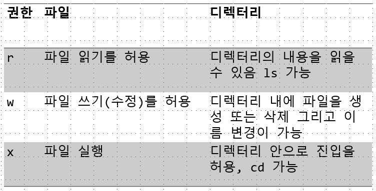
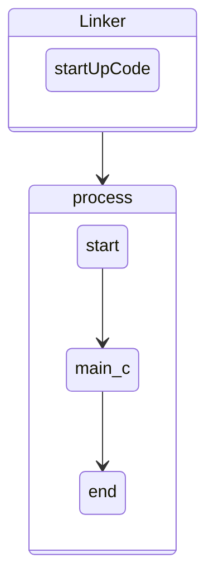

# 1. 권한
## 1.1. 파일의 권한
- 파일 및 디렉토리 권한<br/>


- 각각의 기능 <br/>
<br/>
 파일권한을 바꾸는 모습
```powershell
linux@ubuntu:~/0612$ touch hello.txt
linux@ubuntu:~/0612$ ls ll
drwxrwxr-x  2 linux linux 4096 Jun 11 17:49 ./
drwxr-xr-x 17 linux linux 4096 Jun 11 17:49 ../
-rw-rw-r--  1 linux linux    0 Jun 11 17:49 hello.txt
```
```powershell
linux@ubuntu:~/0612$ chmod -r hello.txt
    #읽기권한을 뺀 hello.txt
linux@ubuntu:~/0612$ ll
total 8
drwxrwxr-x  2 linux linux 4096 Jun 11 17:49 ./
drwxr-xr-x 17 linux linux 4096 Jun 11 17:49 ../
--w--w----  1 linux linux    0 Jun 11 17:49 hello.txt
#모든 읽기권한이 없어졌다.
```
```powershell
linux@ubuntu:~/0612$ cat hello.txt
cat: hello.txt: Permission denied
#권한이 없어 hello.txt의 내용을 알 수 없다.
```
## 1.2. 파일의 권한 변경 방법

    
    퍼미션을 정수로 사용하여 8진수로 저장 설정
    ex> chmod 444 a.txt
#
    8진법의 장점 : 다수의 권한을 한 번에 설정할 수 있다
            단점 : 일부 권한을 설정할 수 없으며 다른 권한이 변경될 수 있음
```powershell
-rw-rw-r-- 1 linux linux 0 Jun 11 17:39 hello.txt
linux@ubuntu:~/0612$ chmod 644 hello.txt
```
- chmod 명령어 사용
  - 1. 관리자 (root)
  - 2. 파일 소유자
#

    사용 방법 : chmod [permission] [filename]
```
Usage: chmod [OPTION]... MODE[,MODE]... FILE...
  or:  chmod [OPTION]... OCTAL-MODE FILE...
  or:  chmod [OPTION]... --reference=RFILE FILE...
Change the mode of each FILE to MODE.
With --reference, change the mode of each FILE to that of RFILE.

  -c, --changes          like verbose but report only when a change is made
  -f, --silent, --quiet  suppress most error messages
  -v, --verbose          output a diagnostic for every file processed
      --no-preserve-root  do not treat '/' specially (the default)
      --preserve-root    fail to operate recursively on '/'
      --reference=RFILE  use RFILE's mode instead of MODE values
  -R, --recursive        change files and directories recursively
      --help     display this help and exit
      --version  output version information and exit

Each MODE is of the form '[ugoa]*([-+=]([rwxXst]*|[ugo]))+|[-+=][0-7]+'.

```
```powershell
linux@ubuntu:~/0612$ chmod 444 hello.txt
linux@ubuntu:~/0612$ ll
total 8
drwxrwxr-x  2 linux linux 4096 Jun 11 17:49 ./
drwxr-xr-x 17 linux linux 4096 Jun 11 17:54 ../
-r--r--r--  1 linux linux    0 Jun 11 17:54 hello.txt
```
### 1.2.1. chmod character
| 구분           | 문자 | 의미                      |
| -------------- | ---- | ------------------------- |
| 카테고리       | u    | 파일소유자(user)          |
|                | g    | 소유자가 속한 그룹(group) |
|                | o    | 이외의 나머지(other)      |
|                | a    | 전체 사용자(all)          |
| 연산자 기호    | +    | 권한 추가                 |
|                | -    | 권한 삭제                 |
|                | =    | 권한 설정                 |
| 접근 권한 문자 | r    | 읽기                      |
|                | w    | 쓰기                      |
|                | x    | 실행                      |
### 1.2.2. 사용의 예
    u+x: 소유자에게 실행 권한을 부여
    u-w: 소유자로부터 쓰기 권한을 제거
    g+rw: 그룹에게 읽기/쓰기 권한을 부여
    o-wx: 이외릐 사용자로부터 쓰기/실행 권한 제거
    ug-x: 소유자와 그룹으로부터 실행 권한을 제거
    +x: 모든 사용자에게 실행 권할을 부여
    u=rwx: 소유자에게 읽기/쓰기/실행 권한을 설정
    u+w,go-w: 소유자에게 쓰기 권한을 부여하고 그룹과 나머지는 쓰기 권한을 제거
```powershell
linux@ubuntu:~/0612$ chmod +x hello.txt
linux@ubuntu:~/0612$ ll
total 8
drwxrwxr-x  2 linux linux 4096 Jun 11 17:49 ./
drwxr-xr-x 17 linux linux 4096 Jun 11 17:54 ../
-r-xr-xr-x  1 linux linux    0 Jun 11 17:54 hello.txt*
#실행권한이 추가된 hello.txt
```
```powershell
-rwxrwxr-x  1 linux linux    0 Jun 11 17:54 hello.txt*
linux@ubuntu:~/0612$ chmod g-w hello.txt
#그룹에 대해서만 w 기능 제거
linux@ubuntu:~/0612$ ll
total 8
drwxrwxr-x  2 linux linux 4096 Jun 11 17:49 ./
drwxr-xr-x 17 linux linux 4096 Jun 11 17:54 ../
-rwxr-xr-x  1 linux linux    0 Jun 11 17:54 hello.txt*
#그룹에서 w 속성이 제거된 모습
```
>다른 속성은 그대로 유지한 채 특정 속성 수정 가능하다.
그러나 수정할 속성이 많아지면 다소 복잡해진다는 점이 존재.
## 1.3. 파일의 생성
```powershell
linux@ubuntu:~/0612$ touch world.txt
#기본적으로 파일 생성시 664로 지정되어 만들어진다.
linux@ubuntu:~/0612$ ls -l
total 0
-rwxr-xr-x 1 linux linux 0 Jun 11 17:54 hello.txt
-rw-rw-r-- 1 linux linux 0 Jun 11 18:44 world.txt
```
>>왜 이렇게 만들어질까?

리눅스는 파일이나 디렉토리가 생성이 될 때 기본 접근권한을 준다.
### 1.3.1. umask
리눅스에서 파일이 생성될 때, 주어진 기본 퍼미션을 제어하기 위한 명령어
```powershell
linux@ubuntu:~/0612$ umask
0002
    # 해당 내용을 바꾸게 되면 모든 생성자가 파일을 생성할때마다 실행권한을 줄 수 있게 될 수 있다
```
리눅스에서 파일이 생성되면 기본적으로 모든 권한이 1로 설정

    111 111 111 -> -rwxrwxrwx
    여기다가 umask로 설정된 bit로 연산이 이루어진다.

    111 111 111 -> rwx rwx rwx
    000 000 010 -> 000 000 010

    111 111 101 -> rwx rwx r-x
    110 110 110 -> rw- rw- r-- 
    
> 보안상의 이유로 일반 파일에 대해서는 실행권한을 제거 
보안에 대한 취약성이 어느정도 막아진다.

# 2. Super User, root
보안상의 이유로 리눅스최초 설치시 super user가 비활성화 되어있다.
그러므로 로그인한 후 super user(root)를 설정할 수 있다.
```powershell
#초기의 root는 비밀번호를 설정할 수 있다
linux@ubuntu:~/0612$ sudo passwd root
[sudo] password for linux:
#전에 비밀번호를 설정해두었으면 해당 비밀번호를 물어본다
Enter new UNIX password:
Retype new UNIX password:
passwd: password updated successfully
#최종적으로 root passwd가 바뀜
```
이런식으로 설정해도 원격으로 입장시에는 보안상의 이유로 root로 로그인할 수 없다
```powershell
#su(substitute user) : 현재 사용자를 로그아웃하지 않고 다른 사용자 계정으로 로그인
su [-[l]] [userid]
linux@ubuntu:~/0612$ su root # root로 사용자 변경
Password:
root@ubuntu:/home/linux/0612# #prompt의 Character가 바뀌었다.
#root@ubuntu
-l : 새로운 사용자의 환경을 로드하고 디렉터리를 해당 사용자의 홈디렉토리로 이동.

root@ubuntu:/home/linux/0612# su -l linux
linux@ubuntu:~$ ll
```
## 2.1. sudo(substitute user)


    su 명령어를 사용한 실행은 반드시 root 사용자의 비밀번호를 알아야만 가능
    하지만 sudo 명령어는 일반 계정 사용자에 대해서도 명령을 수행할 수 있게한다
sudo는 sudoers에 등록된 유저들만 사용가능하다
초기 설정은 모든 유저로 되어있다
```powershell
# User privilege specification
root    ALL=(ALL:ALL) ALL

# Members of the admin group may gain root privileges
%admin ALL=(ALL) ALL

# Allow members of group sudo to execute any command
%sudo   ALL=(ALL:ALL) ALL

```
# 3. 프로세스
>> Program : 일반적으로 영구정인 저장 장치에 저장되어 있는 실행코드
>Process : 로더에 의해 프로그램이 주기억 장치에 로드되어 실행되고 잇는것 

프로그램은 1개이지만 하나의 프로그램을 여러번 구동하면 프로세스는 1개 이상이 될 수 있다
```powershell
운영체제가 다수의 프로세스를 구분하기 위해 고유한 번호 -> 프로세스 아이디(PID)
linux@ubuntu:/$ ps
   PID TTY          TIME CMD
  2013 pts/0    00:00:00 bash #putty의 bash
  8222 pts/0    00:00:00 bash #ubuntu의 bash 
  8278 pts/0    00:00:00 bash #ubuntu의 bash
  8342 pts/0    00:00:00 ps 
#linux에서 ps 는 window의 작업관리자와 같다
```
---
>top 명령어를 통해 사용중인 자원을 확인할 수 있다.
```powershell
top - 19:49:51 up  2:02,  2 users,  load average: 0.07, 0.03, 0.00
Tasks: 324 total,   1 running, 253 sleeping,   0 stopped,   0 zombie
%Cpu(s):  0.0 us,  0.0 sy,  0.0 ni,100.0 id,  0.0 wa,  0.0 hi,  0.0 si,  0.0 st
KiB Mem :  4002276 total,  1589628 free,  1195292 used,  1217356 buff/cache
KiB Swap:  1459804 total,  1459804 free,        0 used.  2540404 avail Mem

   PID USER      PR  NI    VIRT    RES    SHR S  %CPU %MEM     TIME+ COMMAND
   246 root      20   0       0      0      0 I   0.3  0.0   0:04.78 kworker/1:2-eve
   532 root      20   0       0      0      0 I   0.3  0.0   0:05.29 kworker/0:3-eve
  8382 linux     20   0   51448   4320   3532 R   0.3  0.1   0:00.12 top
     1 root      20   0  159824   9112   6748 S   0.0  0.2   0:02.95 systemd
     2 root      20   0       0      0      0 S   0.0  0.0   0:00.01 kthreadd
     3 root       0 -20       0      0      0 I   0.0  0.0   0:00.00 rcu_gp
     4 root       0 -20       0      0      0 I   0.0  0.0   0:00.00 rcu_par_gp
     6 root       0 -20       0      0      0 I   0.0  0.0   0:00.00 kworker/0:0H-kb
     9 root       0 -20       0      0      0 I   0.0  0.0   0:00.00 mm_percpu_wq
            ...
   130 root       0 -20       0      0      0 I   0.0  0.0   0:00.00 edac-poller
    /**
    * ! 동적으로 계속 받아온다
    */
```
---
    top 명령어
        - q : 종료
        - R : 정렬순서변경
        - l : 전체 CPU 및 각 CPU별 사용률을 확인

## 3.1. 프로세서의 종료 코드
```c
int main() {
///....
    return 0;
    //새삼스럽지만 반환값의 의미
}
```


    main함수 호출되기전에 선행되는 코드 startup Code를 Linker가 붙여준다.
    main함수의 return은 exit(-1)과 같다.
    사용자에게 현재프로세스가 올바르게 종료되었는지 판단할 수 있게해주는 코드
---

>프로세스는 종료 시 자신의 종료 상태를 설정해야 한다 이 종료 상태는 ? 라는 환경 변수에 저장
이를 확인하는 방법은 다음과 같다
```powershell
linux@ubuntu:/$ echo $?
0 # 정상 종료 시 반환 값
linux@ubuntu:/$ ls dsjgopafojadojpoadj
ls: cannot access 'dsjgopafojadojpoadj': No such file or directory
#ls가 실패했다
linux@ubuntu:/$ echo $?
2 # 실패한 뒤의 반환 값
```
---
```powershell
linux@ubuntu:~/0612$ vi hello.c
#include <stdlib.h>
#include <stdio.h>
int main() {
    exit(100);
}
:wq

linux@ubuntu:~/0612$ gcc hello.c -o hello
#linux@ubuntu:~/0612$ gcc -o hello hello.c
linux@ubuntu:~/0612$ ./hello
linux@ubuntu:~/0612$ echo $?
100
#hello.c 가 종료하면서 반환한 100을 반환.
```
---
    bash의 환경변수중 '?' 라는 환경변수는 가장 최근에 종료된 프로세스의 종료상태값이 들어있다.
    바로 이게 return 하여 날라온 값이다.

>>종료 코드를 설정하는 명령어 : exit 종료코드값
exit를 실행한 프로세스를 종료하면서 ?에 종료코드값을 설정한다

    리눅스는 종료 상태 값을 저장하기 위해 부호 비트없이 8비트를 사용
| unsigned |     |     |     |     |     |     |     |     |
| -------- | --- | --- | --- | --- | --- | --- | --- | --- |
|          | 1   | 1   | 1   | 1   | 1   | 1   | 1   | 1   |
>>>때문에 종료코드의 값은 음수를 가질 수 없으며 그 값의 범위는 0~255 으로 한정
0~255값으로 설정할 경우 미정의 동작

------


## 3.2. Signal
>서로 다른 프로세스 사이의 통신을 위한 메커니즘
31개의 Signal이 존재
```powershell
linux@ubuntu:/$ kill -l
 1) SIGHUP       2) SIGINT       3) SIGQUIT      4) SIGILL       5) SIGTRAP
 6) SIGABRT      7) SIGBUS       8) SIGFPE       9) SIGKILL     10) SIGUSR1
11) SIGSEGV     12) SIGUSR2     13) SIGPIPE     14) SIGALRM     15) SIGTERM
16) SIGSTKFLT   17) SIGCHLD     18) SIGCONT     19) SIGSTOP     20) SIGTSTP
21) SIGTTIN     22) SIGTTOU     23) SIGURG      24) SIGXCPU     25) SIGXFSZ
26) SIGVTALRM   27) SIGPROF     28) SIGWINCH    29) SIGIO       30) SIGPWR
31) SIGSYS      
#사용하는 signal
34) SIGRTMIN    35) SIGRTMIN+1  36) SIGRTMIN+2  37) SIGRTMIN+3
38) SIGRTMIN+4  39) SIGRTMIN+5  40) SIGRTMIN+6  41) SIGRTMIN+7  42) SIGRTMIN+8
43) SIGRTMIN+9  44) SIGRTMIN+10 45) SIGRTMIN+11 46) SIGRTMIN+12 47) SIGRTMIN+13
48) SIGRTMIN+14 49) SIGRTMIN+15 50) SIGRTMAX-14 51) SIGRTMAX-13 52) SIGRTMAX-12
53) SIGRTMAX-11 54) SIGRTMAX-10 55) SIGRTMAX-9  56) SIGRTMAX-8  57) SIGRTMAX-7
58) SIGRTMAX-6  59) SIGRTMAX-5  60) SIGRTMAX-4  61) SIGRTMAX-3  62) SIGRTMAX-2
63) SIGRTMAX-1  64) SIGRTMAX
    
```
---
```powershell
linux@ubuntu:/$ ls -R
...
./proc/7654/fdinfo:
0  1  10  11  12  2  3  4  5  6  7  8  9

./proc/7654/map_files:C-C #ctrl + c 를 하게 되면 signal에 보낸다. 
./proc/7654/map_files:C-C #cXrl + c 를 하게 되면 signal에 보낸다. 
linux@ubuntu:/$ ecxx $?
130
```
>128~255 <br/>
0~128 다른 특정 오류 정보<br/>
127까지 예약되어 있고 128부터 새로운 값을 배정하게되는데<br/>

>>>에러 종료시 return 값이 2이므로 128 + 2 = 130

-----
# 4. Script
Script?

    Shell이나 명령행에서 실행되도록 작성된 text파일
    실행가능한 명령등을 포함하고 있는 text

#
>리눅스에서는 확장자의 개념이 없지만 가독성을 이유로 확장자를 붙이는데 확장자명은 .sh를 사용

    hello.sh
---
## 4.1. Script 작성 방법
>Script 파일의 최상단에 위치하는 <br/>
Shebang 피알을 실행할 인터프리터를 명시

>반드시 #! 로 시작해야 하며 해석할 인터프리터는 절대 경로를 사용해야한다.
```powershell
linux@ubuntu:~/0612$ which bash
/bin/bash #bash의 절대경로 확인

#!/bin/bash 
```
---
```powershell
vi a.sh
#!/bin/bash

echo "hello, world" #hello ,world 문자열을 화면에 출력
:wq

a.sh #실행안됨
```
>해당 코드를 실행하기 위해서 환경변수 Path에 해당 디렉토리를 추가해주거나
절대경로나 상대경로를 입력해 주면된다.
```powershell
linux@ubuntu:~/0612$ ./a.sh
-su: ./a.sh: Permission denied

-rw-rw-r--  1 linux linux   77 Jun 11 22:16 a.sh
linux@ubuntu:~/0612$ chmod +x a.sh # 모두에게 실행권한 
-rwxrwxr-x  1 linux linux   77 Jun 11 22:16 a.sh*
```
---
```powershell
#!/bin/bash

echo "hello, world" #hello ,world 문자열을 화면에 출력

# exit 0 명시적으로 종료값을 써주지 않아도 된다.
linux@ubuntu:~/0612$ ./a.sh # 절대경로
hello, world
```
>그러나 우리는 출력을 위해 저장하고 나가고 수정을 위해 다시 vi로 들어가주어야한다.
4.2. > 불 - 편
---
## 4.3. Shell 단축키 작성
>키 매핑을 통해 사용자 정의 단축키 사용

    MAP_MODE [단축키] [정의]

- 맵 모드의 종류는 여러가지가 있으며 대표적으로 아래의 3가지가 많이 사용

        nmap : 일반모드(명령모드)
        imap : 편집모드
        vmap : 비주얼모드(블럭이 선택된 상태)
---
```powershell
#!/bin/bash

# echo "hello, world" #hello ,world 문자열을 화면에 출력
# echo "hello, world" #hello ,world 문자열을 화면에 출력
# echo "hello, world" #hello ,world 문자열을 화면에 출력
# echo "hello, world" #hello ,world 문자열을 화면에 출력
# echo "hello, world" #hello ,world 문자열을 화면에 출력

# 매번 주석처리하기 힘들다.

# exit 0
```
---
```powershell
set cin
set sw=4
set ts=4
set nu

"한 줄 주석
nmap <C-C> <ESC>v
:'<,'>normal x 
" #
#ctrl + c
#후에 exMode 입력시 '<,'> 출력
# '<,'> 꺽새는 그대로 사용못하기 때문에 콤마가 붙었다고 생각
#x는 문자하나 delete
```
---
```powershell
  1 set cin
  2 set sw=4
  3 set ts=4
  4 set nu
  5
  6 "한 줄 주석"
  7 nmap <C-C> <ESC>v:'<,'>normal i# <CR>
  8 nmap <C-X> <ESC>v:'<,'>normal xx <CR>
  9
 10 "여러 줄 주석"
 11 vmap <C-C> <ESC>:'<,'>normal i# <CR>
 12 vmap <C-X> <ESC>:'<,'>normal xx <CR>
 13
 14 "run script"
 15 nmap <F5> <ESC>:w<CR> :! chmod +x ./%<CR> :! clear; ./%<CR>
 :wq
```
| -중요!                                |
| ------------------------------------- |
| vimrc는 되도록 공백이 없도록 작성하자 |
%x는 실행 
i는 공백
CR은 엔터
#
---

# 5. 표준출력
## 5.1. echo 
>문자열 출력 후 개행을 수행한다.
개행을 원치 않을 경우, -n 옵션을 사용
---
```powershell
  1 #!/bin/bash
  2
  3 # echo "hello, world" #hello ,world 문자열을 화면에 출력
  4 # printf "hello, world\n"
  5
  6 name=daniel
  7 age=20
  8
  9 echo "name : $name, age : $age"
 10 printf "name : %s, age : %d\n" $name $age
 11 # # exit 0

```
| -출력! |
| ------ |
    
    name : daniel, age : 20
    name : daniel, age : 20
    Press ENTER or type command to continue
---
```powershell
 1 #!/bin/bash
  2
  3 # echo "hello, world" #hello ,world 문자열을 화면에 출력
  4 # printf "hello, world\n"
  5
  6 name=daniel
  7 age=20
  8
  9 echo "name : $name, age : $age"
 10 printf "name : %s, age : %d\n" $name $age
 11
 12 printf "%d, %X, %f\n" $age $age $age
 13 # exit 0
```
| -출력! |
| ------ |

    name : daniel, age : 20
    name : daniel, age : 20
    20, 14, 20.000000

    Press ENTER or type command to continue
| shell에서 사용되는 모든 형식은 문자열이다 수처리를 하기위해 별도의 명령어를 써야한다 그러므로 출력에 찍히는 모든 값들이 문자열이라고 생각하면된다. |
| -------------------------------------------------------------------------------------------------------------------------------------------------- |
---
```powershell
 14 # 스크립트 안에서 명령을 실행하면 그 결과는 표준 출력으로 전송된다
 15 cal
```
echo "$(cal)"이라고 작성하지않아도 어차피 표준출력으로 가기 떄문에 따로 작성해 주지 않아도 된다.
#
---
## 5.4. Shell Script 변수 선언 규칙

>Shell Script에서는 타입이 존재하지 않고 모든 데이터는 기본적으로 문자열로 처리됨

>변수이름 규칙
>>1. 알파벳, 숫자, 밑줄만 사용
>>2. 변수명의 첫 번째 글자는 반드시 문자나 밑줄만 와야한다 숫자못옴
>>3. 공백이나 구두점은 사용 할 수 없음

C나 Java와는 달리 변수를 미리 선언할 필요가 없고 필요할 때 마다 변수를 생성하면 된다

>변수 생성 방법 

        변수명 = 값 
| -주의! = 기호 앞과 뒤에 공백이 없어야한다 |
| ------------------------------------------- |
---
변수만 생성 가능 

        변수명 =  (값이 없는 변수를 선언)
---
```powershell
  1 #! /bin/bash
  2 # 매개변수 치환 방식
  3 name=daniel
  4
  5 echo name # name
  6 echo $name # daniel
  7 echo "$name" #daniel
  8 echo "$name" # $name
  9 echo "'$name'" # '$name'
 10 echo \$name # daniel 
 11 echo ${name} # daniel 중괄호를 이용한 매개변수 치환
 12
 13 echo "$namexxx" #아무것도 출력되지 않는다
 14 echo "$name"xxx #danielxxx
 15
 16
 17 result=$(date)#result=`date`
 18 echo "result: $result"

```
| -출력! |
| ------ |

    name
    daniel
    daniel
    daniel
    'daniel'
    $name
    daniel

    danielxxx
    result: Thu Jun 11 23:48:28 PDT 2020

    Press ENTER or type command to continue
---
| 사용예제 |
| -------- |

>로그파일을 구분하기위해서 로그파일을 시간단위로 작성할 때
date를 작성할때 date로 쓰면 단순히 기본값으로 나오지만
서식문자를 지정
>>date +%Y%m%d
---
    linux@ubuntu:~/0612$ date +%Y%m%d
    20200611
---
```powershell
linux@ubuntu:~/0612$ vi Date.sh
  1 #!/bin/bash
  2
  3 today=(date +%Y%m%d)
  4 ls /usr -al > log.$today
```
---

```powershell
  1 #!/bin/bash
  2
  3 str="hello, world" # 문자열을 묶어준다
  4 echo $str 
```
| -출력! |
| ------ |
```
hello, world

Press ENTER or type command to continue
```
---
```powershell
  1 #!/bin/bash
  2
  3 str="hello, world"
  4 echo $(expr length $str) #5
  5 echo ${#str}
  6 echo $str
```
| -출력! |
| ------ |
```
expr: syntax error

12
hello, world

Press ENTER or type command to continue

```
---
## 5.7. 문자열 인덱스
>어떤 문자열에서 찾고자하는 문자열

---
```powershell
8 str="hello"
9 echo $(expr index $str 'h') # 5
10 echo $(expr index $str 'l') # 3, 일차하는 첫번째 문자
11 echo $(expr index $str 'el') #2 일치하는 첫 번째 문자의 인덱스를 반환
```
| -출력! |
| ------ |
```
1
3
2
Press ENTER or type command to continue
```
---
## 5.8. 부분 분자열 추출
>expr substr [문자열][시작위치][길이값]
>> ${문자열:위치:길이}
---
```powershell
 13 str="ABCDEFGHIJKLMNOPQRSTUVWXYZ"
 14 echo $(expr substr $str 1 4) # ABCD 가 출력 expr의 경우 문자열의 시작은 1
 15 echo ${str:0:4}             #ABCD, ${}의 경우 문자열의 시작은 0
 16 echo ${str:23}              #XYZ, 길이를 명시하지 않으면 문자열의 끝까지 추출
```
| -출력! |
| ------ |
    ABCD
    ABCD
    XYZ
    Press ENTER or type command to continue
---
## 5.10. 부분 문자열 삭제
>문자열의 앞에서 부터 일치하는 부분 문자열을 삭제하는 방법

        ${문자열#패턴}: 문자열의 앞에서부터 가장 짧게 일치하는 패턴을 삭제
        ${문자열##패턴}: 문자열의 앞에서부터 가장 길게 일치하는 패턴을 삭제

>>패턴에는 와일드카드를 사용할 수 있다.
```powershell
str="abcABC123ABCabc"s
#a로부터 시작하여 C로 끝나는 패턴
```
| 긴패턴       | 짧은패턴 |
| ------------ | -------- |
 | abcABC123ABC | abcABC   |
---
```powershell
 18 str="abcABC123ABCabc"
 19
 20 echo ${str#a*C}     #123ABCabc 짧은 앞부분이 삭제됨
 21 echo ${str##a*C}    #abc 긴 앞부분이 삭제됨

```

| -출력! |
| ------ |

    123ABCabc
    abc
---
```powershell
 24 #연습문제 아래의 문자열에서 파일명만 추출
 25 path="/home/linux/script/a.sh"
 26 echo ${path##/*/}
```
| -출력! |
| ------ |

    a.sh
---

## 5.12. (뒷)부분 문자열 삭제
>문자열의 뒤에서부터 일치하는 부분 문자열을 삭제
```powershell
 18 str="abcABC123ABCabc"
#b로 시작하여 c로 끝나는 패턴
```
| 긴패턴 | 짧은패턴 |
| ------ | -------- |
| a      | bc       |
---
```powershell
 18 str="abcABC123ABCabc"
 28 echo ${str%b*c}     # abcABC123ABCa
 29 echo ${str%%b*c}    # a

```
|-출력!|
|-|
```
abcABC123ABCa
a

Press ENTER or type command to continue
```
---
```powershell
 31 # 연습문제 디렉터리 부분만 추출
 32 path="/home/linux/script/a.sh"
 33 echo ${path%/*}
```
|-출력!|
|-|

    /home/linux/script

    Press ENTER or type command to continue
---
## 5.14. 부분 문자열 치환
>문자열에서 일치하는 부분 문자열을 다른 문자열로 치환

    ${문자열/패턴/치환문자열}:  문자열에 대하여 처음 일치하는 패턴을 치환 문자열로 교체
    ${문자열//패턴/치환문자열}:  문자열에 대하여 일치하는 모든 패턴을 치환 문자열로 교체
    ${문자열/#패턴/치환문자열}: 문자열에 대하여 앞에서 일치하는 패턴을 치환문자열로 교체
    ${문자열/%패턴/치환문자열}: 문자열에 대하여 뒤에서 일치하는 패턴을 치환문자열로 교체
----
```powershell
  1 str="abcABC123ABCabc"
  2
  3 #처음 일치하는 문자열 abc에 대하여 ---로 치환
  4 echo ${str/abc/---}
  8 #일치하는 모든 문자열 abc에 대하여 ---로 치환
  9 echo ${str//abc/---}
 12 #앞에서 일치하는 문자열 abc에 대하여 ---로 치환
 13 echo ${str/#abc/---}
 16 #뒤에서 일치하는 문자열 abc에 대하여 ---로 치환
 17 echo ${str/%abc/---}
 18
 19 #연습문제3 경로를 한줄씩 출력
 20 echo -e ${PATH//:/"\n"}
```
|-출력!|
|-|
    ---ABC123ABCabc
    ---ABC123ABC---
    ---ABC123ABCabc
    abcABC123ABC---

    /usr/local/sbin
    /usr/local/bin
    /usr/sbin
    /usr/bin
    /sbin
    /bin
    /usr/games
    /usr/local/games
    /snap/bin


    Press ENTER or type command to continue

---
## 5.15. 문자열 입력
read
>표준 입력(파이프라인 입력 또는 키보드 입력)에서 한 줄의 내용씩 읽어 들이는 명령어
```
read: read [-ers] [-a array] [-d delim] [-i text] [-n nchars] [-N nchars] [-p prompt] [-t timeout] [-u fd] [name ...]
    Read a line from the standard input and split it into fields.

    Reads a single line from the standard input, or from file descriptor FD
    if the -u option is supplied.  The line is split into fields as with word
    splitting, and the first word is assigned to the first NAME, the second
    word to the second NAME, and so on, with any leftover words assigned to
    the last NAME.  Only the characters found in $IFS are recognized as word
    delimiters.

    If no NAMEs are supplied, the line read is stored in the REPLY variable.

    Options:
      -a array  assign the words read to sequential indices of the array
                variable ARRAY, starting at zero
      -d delim  continue until the first character of DELIM is read, rather
                than newline
      -e        use Readline to obtain the line in an interactive shell
      -i text   use TEXT as the initial text for Readline
      -n nchars return after reading NCHARS characters rather than waiting
                for a newline, but honor a delimiter if fewer than
                NCHARS characters are read before the delimiter
      -N nchars return only after reading exactly NCHARS characters, unless
                EOF is encountered or read times out, ignoring any
                delimiter
      -p prompt output the string PROMPT without a trailing newline before
                attempting to read
      -r        do not allow backslashes to escape any characters
      -s        do not echo input coming from a terminal
      -t timeout        time out and return failure if a complete line of
                input is not read within TIMEOUT seconds.  The value of the
                TMOUT variable is the default timeout.  TIMEOUT may be a
                fractional number.  If TIMEOUT is 0, read returns
                immediately, without trying to read any data, returning
                success only if input is available on the specified
                file descriptor.  The exit status is greater than 128
                if the timeout is exceeded
      -u fd     read from file descriptor FD instead of the standard input
```
```powershell
  1 #!/bin/bash
  2 # stdin.sh
  3
  4 # echo -n "enter your name: "
  5 # read name
  6
  7 # read -p "enter your name: " name
  8 # echo "your name: $name"
  9
 10
 11 # read -p "input your name: "
 12 # echo "your name : $REPLY"
 13
 14 read -p "input your name: " first last
 15 echo "your name : $first $last"
```