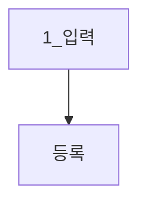
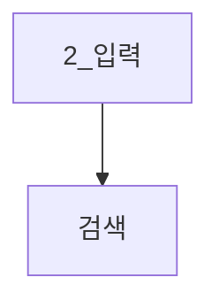
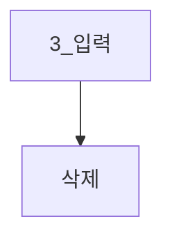

- 복습내용
```bash
#!/bin/bash

# ./a.sh -a -b -c
while [ -n "$(echo $1 | grep '-')" ]; do  #while ($1)
    case $1 in
        -a) echo "option a";;
        -b) echo "option b";;
        -c) echo "option c";;
        *) echo "usage: a.sh [-a] [-b] [-c]
        exit 1;;
    esac
    shift
done
```
|-출력!|
|-|
```s
linux@ubuntu:~$ ./a.sh -a
option a
```
> shift하는것은 너무 번거롭다
---
# man getopt (getoption)

SYNOPSIS

       getopt optstring parameters
       getopt [options] [--] optstring parameters
       getopt [options] -o|--options optstring [options] [--] parameters

DESCRIPTION

       getopt is used to break up (parse) options in command lines for easy parsing
       by shell procedures, and to check  for  legal  options.   It  uses  the  GNU
       getopt(3) routines to do this.

OPTIONS

       -a, --alternative
              Allow long options to start with a single '-'.

       -h, --help
              Display help text and exit.  No other output is generated.

       -l, --longoptions longopts
              The  long  (multi-character) options to be recognized.  More than one
              option name may be specified at once, by separating  the  names  with
              commas.   This  option  may be given more than once, the longopts are
              cumulative.  Each long option name in longopts may be followed by one
              colon  to  indicate  it has a required argument, and by two colons to
              indicate it has an optional argument.

       -n, --name progname
              The name that will be used by the getopt(3) routines when it  reports
              errors.   Note  that errors of getopt(1) are still reported as coming
              from getopt.

       -o, --options shortopts
              The short (one-character) options to be recognized.  If  this  option
              is  not found, the first parameter of getopt that does not start with
              a '-' (and is not an option argument) is used as  the  short  options
              string.   Each short option character in shortopts may be followed by
              one colon to indicate it has a required argument, and by  two  colons
              to  indicate  it  has  an  optional argument.  The first character of
              shortopts may be '+' or '-' to influence the way options  are  parsed
              and output is generated (see section SCANNING MODES for details).

       -q, --quiet
              Disable error reporting by getopt(3).

       -Q, --quiet-output
              Do  not  generate  normal  output.   Errors  are  still  reported  by
              getopt(3), unless you also use -q.

       -s, --shell shell
              Set quoting conventions to those of shell.  If the -s option  is  not
             given,  the BASH conventions are used.  Valid arguments are currently
              'sh' 'bash', 'csh', and 'tcsh'.

       -T, --test
              Test if your getopt(1) is this enhanced version or  an  old  version.
              This  generates  no  output,  and  sets the error status to 4.  Other
              implementations of getopt(1), and this  version  if  the  environment
              variable  GETOPT_COMPATIBLE is set, will return '--' and error status
              0.

       -u, --unquoted
              Do not quote the output.  Note that whitespace  and  special  (shell-
              dependent) characters can cause havoc in this mode (like they do with
              other getopt(1) implementations).

       -V, --version
              Display version information and exit.  No other output is generated.
---
|사용예제|
|-|
```bash
# ./a.sh -a -b -c
#getopts : 계속 처리해야할 옵션이 있으면 종료코드를 0으로 설정
#처리할 옵션이 없으면 종료코드를 1로 설정
while getopts "abc" opt; do
    case "$opt" in
        a) echo "option a";;
        b) echo "option b";;
        c) echo "option c";;
        #opt같은 경우는 잘못된 코드가 오게되면 '?' 가 들어오게된다
        #그러나 bash에서 ?로 들어오게되면 메타문자로 해석되기 때문에
        \?) echo "usage: a.sh [-a] [-b] [-c]" # 백슬래시로 처리해준다
            exit 1;;
        #opt에서 shift도 처리한다
done
```
|-출력!|
|-|
```s
linux@ubuntu:~/0616$ ./1_opt.sh -abc
option a
option b
option c
# 다양한 variation 사용가능.
```
> 그러나 opt에서도 오류처리를 하기 때문에 opt만의 오류 메세지가 따로 뜬다
---
|사용예제|
|-|
```bash
while getopts ":abc" opt; do
# (:)clone을 붙인다.
    #clone의 의미 : opt string에 없는 option 사용될 경우
    # 오류 출력 금지 문자
while getopts ":ab:c" opt; do
# 중간clone : 특정 옵션에 대한 인자를 처리하기 위한 문자
    case "$opt" in
            a) echo "option a";;
            b) echo "option b $OPTARG";; #b에 대한 부가 옵션
            c) echo "option c";;
            \?) echo "usage: a.sh [-a] [-b filename] [-c]"
```
|-출력!|
|-|
```s
linux@ubuntu:~/0616$ ./1_opt.sh -a -b -c
option a
option b -c
# b가 -c 를 option으로 인식해버렸다
linux@ubuntu:~/0616$ ./1_opt.sh -b a.txt -a -c
option b a.txt
option a
option c
# 이처럼 사용자가 일일히 패턴을 가져올 필요없이
# 제공되는 옵션을 사용하자
```
---
> 함수는 가급적 하나의 일만 처리하게 만들자
---
## 라인 단위 파일 출력방법
서로다른 명령어를 묶어주는 type를 사용해보자<br/>

|사용예제|
|-|
```bash
#!/bin/bash

# ./2.sh filename
# $0       $1

# 1. redirection 사용
while read line; do # 라인단위로 입력을 받는다
       echo "$line"
done < "$1" # while loop 전체에 대한 redirection
            #파일에 있는 내용이 while에 들어간다
```
|-출력!|
|-|
```s
linux@ubuntu:~/0616$ ./2_read.sh
```
---
|사용예제|
|-|
```bash
#!/bin/bash

# ./2.sh filename
# $0       $1
# 2. 파이프라인
cat "$1" | while read line; do
       echo "$line"
done
```
|-출력!|
|-|
```s
linux@ubuntu:~/0616$ ./2_read.sh
```
> 표준입력 뿐만아니라 타입으로 부터 읽어오고 싶을 때 사용된다.
---
## 컬럼을 나누어서 저장하는 경우

```bash
daniel 20
susan 30
andrew 40
monica 50
```

|사용예제|
|-|
```bash
while read name age; do
       echo "name : $name, age: $age"
done < person.txt
```
> 읽을 때 토큰단위로 쪼개져서 들어간다
> 
|-출력!|
|-|
```s
linux@ubuntu:~/0616$ ./2_read.sh
name : daniel, age: 20
name : susan, age: 30
name : andrew, age: 40
name : monica, age: 50
#남는 꼬투리 데이터는 마지막 변수에 들어간다
```
> 변수두개에 데이터를 3개가 들어간다면 마지막 데이터 출력에 데이터 두개가 같이 찍힌다
>> 즉 데이터 유실이 없다.
---
## 함수
### 함수 정의 및 호출
|사용예제|
|-|
```bash
#!/bin/bash
3_func.sh

# 함수의 정의 1
#function 함수명 {
# commands...
# }
function foo() {
       echo "foo()"
}
# 함수의 정의 2
#함수명() {
# commands...
#}
hoo() {
       echo "hoo()"
}
#함수 호출 방법 : 함수명
#함수도 일종의 스크립트이므로 스크립트를 실행하는 것처럼 호출
```
|-출력!|
|-|
```s
linux@ubuntu:~/0616$ ./func.sh
foo()
goo()
```


|-주의! 1|
|-|
|함수를 한줄로 작성하게되면 오류가 발생한다.|

|-주의! 2|
|-|
|함수 시그니처 라인에는 함수의 시그니처만 와야한다.|

|-주의! 3|
|-|
|함수 내부에 1개 이상의 명령어가 존재해야한다|

> bash interpreter의 한계
---
### 함수 내 지역변수
|사용예제|
|-|
```bash
#!/bin/bash

str="global"         # const char* str = "global"

func() {             # void func() {
       str="local"   #      str = "local"
                     #      그대로 받고 싶다면 새로이 변수를 생성해서 받는다
       echo $str     #      puts(str);
}                    # }

func() {             # void func() {}
       local str="local"   #      const char str = "local"
                     #      그대로 받고 싶다면 새로이 변수를 생성해서 받는다
       echo $str     #      puts(str);
}                    # }

read 
echo $str
#함수의 호출이 없기때문에 fnuc가 동작하지 않는다
func
read
echo $str
# 해당 코드처럼 함수를 호출 해 주어야한다.

# 최종 코드
str="global"         # const char* str = "global"

func() {          
       local str="local"
       echo $str
}

func
read
echo $str
```
|-출력!|
|-|
```s
local

global
```
---
|사용예제|
|-|
```bash
func() {
       #함수 내에서 local없이 생성된 변수는 전역변수로 취급
       str="local"
       echo $str
}

echo $str # 전역의 공간에 변수가 없다면 아무것도 호출하지 않음
func
read
echo $str #func의 str 사용.
```
|-출력!|
|-|
```s
local
```
---
```s
linux@ubuntu:~/0616$ name="dan"
linux@ubuntu:~/0616$ echo $name
dan
#이와 같은 현상
```
---
### 함수 인자 전달
|사용예제|
|-|
```bash
#!/bin/bash

#function foo() {
#       command
#}

#foo (x, y) { #bash의 함수는 진짜 함수가 아니기 때문에 매개변수를 가질수 없다
#       echo $x $y 
#}
foo() {
       echo $1
       echo $2
}
# 함수 호출 시 , 인자 전달은 명령행에서 인자를 전달하는 것과 동일 
#     $1     $2
foo hello world
# 위치 매개변수를 통해 인자를 가져와야한다
```
---
|사용예제|
|-|
```bash
#!/bin/bash

foo() {
       echo "매개변수 개수 : $#"
       for arg in $@; do
              echo "$arg"
       done
}

foo hello world goodbye

name1=daniel
name2=susan
foo $name1 $name2
```
|-출력!|
|-|
```s
매개변수 개수 : 3
hello
world
goodbye
매개변수 개수 : 2
daniel
susan
```
---
### 함수의 반환
|사용예제|
|-|
```bash
#!/bin/bash
foo() {
       #return 10
       #bash에 return 이라는 명령어가 존재하지만
       # 생각했던 기능대로 기능하지 않는다.
       # 함수가 끝나게되면 종료상태값 설정한다
       # 그냥 exit를 하게되면 함수를 나가게 되므로

       #return 을 이용 스크립트가 종료되지않고
       # 종료 상태값 설정이 가능하다.

       #표준출력을 통한 return
       #echo 10 
       #부동 소수점도 return 해보자
       #echo 3.14
       #문자열 return
       echo hello
}

#ret=foo
#echo $ret     #10
#foo
#echo $? #함수의 종료상태가 저장된다.
#return 은 종료상태를 설정하기 위한것이지 return을 위한 명령어가 아니다
# 또한 해당 값이 255이상이거나 음수면 값이 재대로 나오지 않는다

ret=$(foo) # 명령의 치환을 통해 변수에 저장
echo "ref: $ref" #return 값처럼 사용 할 수 있게된다.
                 # 모든걸 return 할 수 있다.
```
>표준출력을 통해 반환된 값은 모두 문자열이다
---
### 재귀호출
> 엄밀히 말해 재귀호출은 아니지만 해당 함수를 다시 실행

|사용예제|
|-|
```bash
#!/bin/bash
#int fact(int n){
#       if (n < = 1)
#          return 1;
#     // reutnr n * fact(n - 1)
#      int temp  = fact(n -1 )
#      return n * temp;
#}

fact() {             
       if (($1 <= 1)); then
              echo 1
       else 
              local temp=$(($1 - 1))
              local result=$((fact $temp))
              #스크립트 내부에서 자기자신 호출
              echo $((result * $1))
       fi

       
}

echo $(fact 5)
```
|-출력!|
|-|
```s

```
---
### trap
>특정 시그널에 대한 처리를 위한 매커니즘

       일반적으로 함수를 사용하여 처리를 수행한다.
- sleep

       NAME
       sleep - delay for a specified amount of time

SYNOPSIS

       sleep NUMBER[SUFFIX]...
       sleep OPTION

DESCRIPTION

       Pause  for  NUMBER seconds.  SUFFIX may be 's' for seconds (the
       default), 'm' for minutes, 'h'  for  hours  or  'd'  for  days.
       Unlike  most implementations that require NUMBER be an integer,
       here NUMBER may be an arbitrary floating point  number.   Given
       two  or  more arguments, pause for the amount of time specified
       by the sum of their values.

       --help display this help and exit

       --version
              output version information and exit
---
>현재 진형중인 흐름을 잠깐 멈출 때 사용
---
git의 commit중에 branch를 따는것을 fork라고도 한다

>손잡이가 부모고 파생된 line을 fork라고 생각하자
- ps
- kill
---

>특정키가 들어왔을 때 interrupt 를 운영체제로 보내어 운영체제가 프로그램 제어

|사용예제|
|-|
```bash
#!/bin/bash

#trap commands signal [signals...]
#trap "echo 'CTRL+C'" SIGINT  #^C # 하드코딩

#SIGNAL_handler() {
#       echo "CTRL + C"
#}
#trap SIGNAL_handler SIGINT

#하나의 handler에 다수의 trap 사용
sig_handler() {
       echo "sig_handler()"
}

trap sig_handler SIGINT SIGQUIT
for (( i=0; i<10; i++)) ; do
       echo "."
       sleep 1
done
```
|-출력!|
|-|
```s
#ctrl+c 를 눌러도 종료가 되지 않는다
.
^CCTRL + C
.
^CCTRL + C
.
^CCTRL + C
.
^CCTRL + C
.
.
.
```
> 해당하는 SIGNAL에 대해서 동작 수행 설정

> #stty -a로 지정되어있는 SIGNAL을 확인 할 수 있다.
---
- 혹은 각각의 SIGNAL에 대한 handler를 설정해 줄 수 있다.

|사용예제|
|-|
```bash
#for SIGINT
SIGINT_handler() {
       echo "CTRL + C"
}
#for SIGQUIT
SIGQUIT_handler() {
       echo "CTRL + \\"
}
trap SIGINT_handler SIGINT
trap SIGQUIT_handler SIGQUIT
for (( i=0; i<10; i++)) ; do
       echo "."
       sleep 1
done
```
|-출력!|
|-|
```s
.
.
^\Quit (core dumped)
CTRL + \
.
^CCTRL + C
.
.
.
.
.
.
.

Interrupt: Press ENTER or type command to continue
```

#### SIGNAL 삭제
> trap -- SIGNAL_CODE

|사용예제|
|-|
```bash
#for SIGINT
SIGINT_handler() {
       echo "CTRL + C"
}
trap SIGINT_handler SIGINT

for (( i=0; i<10; i++)) ; do
       echo "."
       sleep 1
done
echo ----------------------------------------------
# usage : trap -- signal
trap -- SIGINT # 해당 시그널을 삭제
for (( i=0; i<10; i++)) ; do
       echo "."
       sleep 1
done
echo ----------------------------------------------
```
-출력!
```s
.
.
.
^CCTRL + C
.
^CCTRL + C
.
^CCTRL + C
.
.
.
.
.
----------------------------------------------
.
.
^C # SIGNAL에 설정된 값이 삭제되면서
   # 종료되는 SIGNAL인 Ctrl + C 가 발동되어 프로그램이 종료된다.
Command terminated

Interrupt: Press ENTER or type command to continue

```
> 삭제시에는 한번에 하나의 시그널만 삭제 가능하다.

---
|사용예제|
|-|
```bash
#for SIGINT
SIGINT_handler() {
       echo "CTRL + C"
       trap -- SIGINT # 핸들러 내부에서 trap 사용가능
                      # 핸들러 한번 동작 후 SIGNAL 삭제됨
}
trap SIGINT_handler SIGINT

for (( i=0; i<10; i++)) ; do
       echo "."
       sleep 1
done
```
|-출력!|
|-|
```s
.
.
^CCTRL + C # 첫번째 handler 실행 후
.
^C         # SIGNAL이 삭제되어 interupt를 보내 종료
Command terminated

Interrupt: Press ENTER or type command to continue
```
---
>SIGKILL에 설정값을 주게되면 해당 설정값이 오기전엔 절대
프로그램이 죽지않는 현상이 발생!

>> LINUX는 해당 SIGNAL이 와도 프로그램을 죽게 설정해두었다

|사용예제|
|-|
```bash
#for SIGINT
SIGINT_handler() {
       echo "SIGKILL"
}
trap SIGINT_handler SIGKILL

for (( i=0; i<20; i++)) ; do
       echo "."
       sleep 1
done
```
|-출력!|
|-|
```s
해당 코드를 실행하고
다른 창에서 kill -9 PPID 를 하게되면 잘 죽는다.
```
> 이말인 즉 모든 SIGNAL에 대해서 트랩을 수행 할 수 없다는 뜻
>> SIGKILL, SIGSTOP ...
---
Shell을 이용한 전화번호부 관리 프로그램
```
프로그램 종료시에도 데이터 유지
```
- 화면
```
# 전화번호부 관리 스크립트 #
1. 등록
2. 검색
3. 삭제
입력(0. 종료)
```

```
# 전화번호부 등록 #
이름 입력 : Daniel
전화번호 입력 : 010-0000-0000
> 정상등록완료
```

```
# 전화번호부 검색 #
이름 입력 : Daniel

case 1. 전화번호는 010-0000-0000입니다
case 2. 그런 이름은 없습니다.
```

```
# 전화번호부 삭제 #
이름 입력 : Daniel

case 1. 삭제가 완료되었습니다.
case 2. 그런 이름은 없습니다.
```
```bash
#!/bin/bash

#전화번호부를 저장하기 위한 파일 생성
touch ~/.phonebook

register() {
       clear
       echo "# 전화번호 등록 #"
       read -p "이름 입력 : " name
       if [ -z "$name" ]; then
              echo "이름을 입력하지 않았습니다(엔터)"
              read
              return 1
       fi

       result=$(grep "$name" ~/.phonebook)
       if [ -n "$result" ]; then
              echo " 이미 등록된 이름입니다(엔터)"
              read
              return 1
       fi

       read -p "전화번호 입력 : " tel
       echo "$name $tel" >> ~/.phonebook
       echo "정상 등록 되었습니다(엔터)"
       read
       return 0
}

search() {
       clear
       echo "# 전화번호 검색 #"
       read -p "이름 입력 : " name
       if [ -z "$name" ]; then
              echo "이름을 입력하지 않았습니다(엔터)"
              read
              return 1
       fi

       result=$(grep "$name" ~/.phonebook)
       if [ -z "$result" ]; then
              echo "등록된 이름이 없습니다(엔터)"
              read 
              return 1
       fi
       echo "결과 : $result (엔터)"
       read
       return 0
}

delete() {
        clear
       echo "# 전화번호 삭제 #"
       read -p "이름 입력 : " name
       if [ -z "$name" ]; then
              echo "이름을 입력하지 않았습니다(엔터)"
              read
              return 1
       fi

       result=$(grep "$name" ~/.phonebook)
       if [ -z "$result" ]; then
              echo "등록된 이름이 없습니다(엔터)"
              read 
              return 1
       fi
       echo "$name 이 삭제되었습니다.(엔터)"
       grep -v "$name" ~/.phonebook > ~/.phonebook_new
#  이미열고있는 파일에 대해서 수정하려고하니 error
       rm ~/.phonebook
       mv ~/.phonebook_new ~/.phonebook

       read
       return 0
}
#메뉴출력함수
display_menu() {
       clear
       echo "# 전화번호부 프로그램 #"
       echo "--------------------"
       echo "1. 등록"
       echo "2. 검색"
       echo "3. 삭제"
       echo "--------------------"
       echo -n "입력( 0. 종료 ) : "
       read
       echo "$REPLY"
}
while true; do
       case $REPLY  in
       0) echo "프로그램을 종료합니다"
              exit 0;;
       1) register;;
       2) search;;
       3) delete;;
       *) echo "잘못 입력하셨습니다.!"; read;;
       esac
done
```
- 도전과제
```
만년달력 만들기
```

