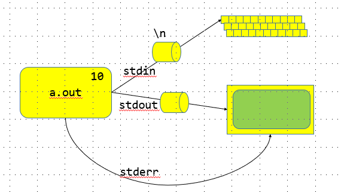
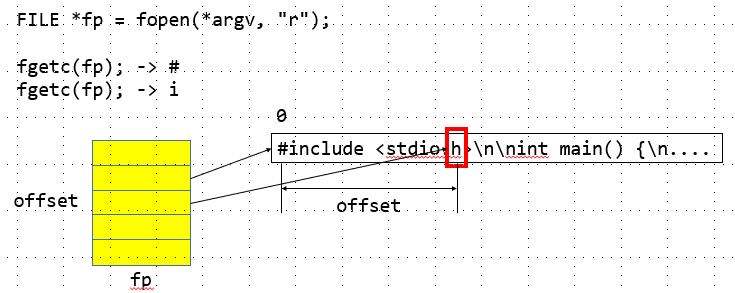

# 리눅스 시스템 프로그래밍
>리눅스가 제공하는 함수(Syscall)를 활용, 프로그래밍<br/>

    printf와 같은 함수는 리눅스 제공함수가 아니라 제공함수를 래핑하여 만든 라이브러리다

---
## 개발 환경설정
> 리눅스가 제공하는 함수는 C언어로 구현되어있다<br/>

```c
//hello.c
#include <stdio.h>

int main() {
    printf("hello world\n");
    return 0;
}
```
컴파일러는 기본적으로 제공되어있지않고 gcc를 깔아야한다<br/>
1. C컴파일러 설치 : sudo apt install gcc
---
## GNU
>

    GNU는 "GNU는 유닉스가 아니다."란 의미를 갖는 영어 문장 "GNU's Not UNIX"의 약자로, 원래의 문장 안에 자신이 이미 들어 있는 재귀 약자 
    스톨만의 제안으로 GNU는 그누라고 읽힌다. GNU 시스템은 유닉스의 아키텍처는 기술적으로 믿을만 한 것으로 증명되어 있어, 유닉스와 호환될 수 있도록 만들어졌다. 
    유닉스 아키텍처는 개별적인 요소들이 따로 따로 작성되는 것을 허용
---
## GCC
>GNU 컴파일러 모음


```
Usage: gcc [options] file...
Options:
  -pass-exit-codes         Exit with highest error code from a phase.
  --help                   Display this information.
  --target-help            Display target specific command line options.
  --help={common|optimizers|params|target|warnings|[^]{joined|separate|u                           ndocumented}}[,...].
                           Display specific types of command line option                           s.
  (Use '-v --help' to display command line options of sub-processes).
  --version                Display compiler version information.
  -dumpspecs               Display all of the built in spec strings.
  -dumpversion             Display the version of the compiler.
  -dumpmachine             Display the compiler's target processor.
  -print-search-dirs       Display the directories in the compiler's sea                           rch path.
  -print-libgcc-file-name  Display the name of the compiler's companion                            library.
  -print-file-name=<lib>   Display the full path to library <lib>.
  -print-prog-name=<prog>  Display the full path to compiler component <                           prog>.
  -print-multiarch         Display the target's normalized GNU triplet,                            used as
                           a component in the library path.
  -print-multi-directory   Display the root directory for versions of li                           bgcc.
  -print-multi-lib         Display the mapping between command line opti                           ons and
                           multiple library search directories.
  -print-multi-os-directory Display the relative path to OS libraries.
  -print-sysroot           Display the target libraries directory.
  -print-sysroot-headers-suffix Display the sysroot suffix used to find                            headers.
  -Wa,<options>            Pass comma-separated <options> on to the asse                           mbler.
  -Wp,<options>            Pass comma-separated <options> on to the prep                           rocessor.
  -Wl,<options>            Pass comma-separated <options> on to the link                           er.
  -Xassembler <arg>        Pass <arg> on to the assembler.
  -Xpreprocessor <arg>     Pass <arg> on to the preprocessor.
  -Xlinker <arg>           Pass <arg> on to the linker.
  -save-temps              Do not delete intermediate files.
  -save-temps=<arg>        Do not delete intermediate files.
  -no-canonical-prefixes   Do not canonicalize paths when building relat                           ive
                           prefixes to other gcc components.
  -pipe                    Use pipes rather than intermediate files.
  -time                    Time the execution of each subprocess.
  -specs=<file>            Override built-in specs with the contents of                            <file>.
  -std=<standard>          Assume that the input sources are for <standa                           rd>.
  --sysroot=<directory>    Use <directory> as the root directory for hea                           ders
                           and libraries.
  -B <directory>           Add <directory> to the compiler's search path                           s.
  -v                       Display the programs invoked by the compiler.
  -###                     Like -v but options quoted and commands not e                           xecuted.
  -E                       Preprocess only; do not compile, assemble or                            link.
  -S                       Compile only; do not assemble or link.
  -c                       Compile and assemble, but do not link.
  -o <file>                Place the output into <file>.
  -pie                     Create a position independent executable.
  -shared                  Create a shared library.
  -x <language>            Specify the language of the following input f                           iles.
                           Permissible languages include: c c++ assemble                           r none
                           'none' means revert to the default behavior o                           f
                           guessing the language based on the file's ext                           ension.

Options starting with -g, -f, -m, -O, -W, or --param are automatically
 passed on to the various sub-processes invoked by gcc.  In order to pas                           s
 other options on to these processes the -W<letter> options must be used                           .

For bug reporting instructions, please see:
<file:///usr/share/doc/gcc-7/README.Bugs>.
linux@ubuntu:~/0617$ gcc --help
Usage: gcc [options] file...
Options:
  -pass-exit-codes         Exit with highest error code from a phase.
  --help                   Display this information.
  --target-help            Display target specific command line options.
  --help={common|optimizers|params|target|warnings|[^]{joined|separate|undocumented}}[,...].
                           Display specific types of command line options.
  (Use '-v --help' to display command line options of sub-processes).
  --version                Display compiler version information.
  -dumpspecs               Display all of the built in spec strings.
  -dumpversion             Display the version of the compiler.
  -dumpmachine             Display the compiler's target processor.
  -print-search-dirs       Display the directories in the compiler's search path.
  -print-libgcc-file-name  Display the name of the compiler's companion library.
  -print-file-name=<lib>   Display the full path to library <lib>.
  -print-prog-name=<prog>  Display the full path to compiler component <prog>.
  -print-multiarch         Display the target's normalized GNU triplet, used as
                           a component in the library path.
  -print-multi-directory   Display the root directory for versions of libgcc.
  -print-multi-lib         Display the mapping between command line options and
                           multiple library search directories.
  -print-multi-os-directory Display the relative path to OS libraries.
  -print-sysroot           Display the target libraries directory.
  -print-sysroot-headers-suffix Display the sysroot suffix used to find headers.
  -Wa,<options>            Pass comma-separated <options> on to the assembler.
  -Wp,<options>            Pass comma-separated <options> on to the preprocessor.
  -Wl,<options>            Pass comma-separated <options> on to the linker.
  -Xassembler <arg>        Pass <arg> on to the assembler.
  -Xpreprocessor <arg>     Pass <arg> on to the preprocessor.
  -Xlinker <arg>           Pass <arg> on to the linker.
  -save-temps              Do not delete intermediate files.
  -save-temps=<arg>        Do not delete intermediate files.
  -no-canonical-prefixes   Do not canonicalize paths when building relative
                           prefixes to other gcc components.
  -pipe                    Use pipes rather than intermediate files.
  -time                    Time the execution of each subprocess.
  -specs=<file>            Override built-in specs with the contents of <file>.
  -std=<standard>          Assume that the input sources are for <standard>.
  --sysroot=<directory>    Use <directory> as the root directory for headers
                           and libraries.
  -B <directory>           Add <directory> to the compiler's search paths.
  -v                       Display the programs invoked by the compiler.
  -###                     Like -v but options quoted and commands not executed.
  -E                       Preprocess only; do not compile, assemble or link.
  -S                       Compile only; do not assemble or link.
  -c                       Compile and assemble, but do not link.
  -o <file>                Place the output into <file>.
  -pie                     Create a position independent executable.
  -shared                  Create a shared library.
  -x <language>            Specify the language of the following input files.
                           Permissible languages include: c c++ assembler none
                           'none' means revert to the default behavior of
                           guessing the language based on the file's extension.

```
어셈블러에서 출력에 기본적으로 만들어주는 파일명이 a.out이였는데<br/>
gcc에서는 관례적으로 이것을 따라 a.out의 출력을 만든다.<br/>
> a.out을 바꾸자.
```s
linux@ubuntu:~/0617$ gcc -o hello hello.c #hello.c에 대한 out 파일
linux@ubuntu:~/0617$ ls
a.out  hello  hello.c # hello 라는 out 파일이 생겼다.
```
>gcc 파일명.c [파일명.c]
gcc -o 실행파일명 파일명.c [파일명.c]
```
$ gcc a.c b.c c.c -> a.out
$ gcc -o a.out a.c b.c c.c
```
---
```c
  1 #include <unistd.h>
  2 #include <stdio.h>
  3
  4 int main() {
  5     printf("hello, world");
  6     sleep(); //bash의 trap sleep과 같다.
  7           //대신 c언어에서 bash 명령어는 함수이기 때문에 소괄호를 붙여주어야한다.
  8     return 0;
  9 
```
---
### 도움말 보는 방법
>printf(C언어 라이브러리)에 대한 도움말 : 순차적으로 3, K

>>3번 섹션에 저장되어있는 도움말 (초록은 커서위치)
---
## GCC 프로그램 구동
>표준입력과 출력은 버퍼가 있는데
해당 버퍼에있는 내용은 개행을 만나면 flush를 하게된다
개행을 만나지 않으면 버퍼에 내용이 쌓이게된다.

- 버퍼의 종류
    - fully buffered : 버퍼가 가득 찬 경우, 데이터를 flush
    - line buffered : 개행을 만났을때 데이터를 flush
    - non-buffered : 버퍼없이 바로보냄
<br/>
표준 라이브러리는 버퍼를 사용한다<br/>

<br/>

```c
#include <unistd.h>
#include <stdio.h>

int main() {
    printf("hello, world");
    fflush(stdout); //line buffered를 사용한다
    sleep(); //bash의 trap sleep과 같다.
            //대신 c언어에서 bash 명령어는 함수이기 때문에 소괄호를 붙여주어야한다.
    return 0;
}
```
| -출력! |
| ------ |
```s
linux@ubuntu:~/0617$ gcc 1_buffer.c
linux@ubuntu:~/0617$ ./a.out
hello, worldlinux@ubuntu:~/0617$

```
---
```c
#if 0
#include <unistd.h>
#include <stdio.h>

int main() {
    printf("hello, world");
    fflush(stdout); //line buffered를 사용한다
    sleep(); //bash의 trap sleep과 같다.
            //대신 c언어에서 bash 명령어는 함수이기 때문에 소괄호를 붙여주어야한다.
    return 0;
}
#endif

#include <stdio.h>

int main() {
    int i; scanf("%d", &i);
    char c; scanf("%c", &c);

    printf("%d, %c\n", i , c);
    return 0;
}
```
>gcc의 buffer는 line buffered이다.

| -출력! |
| ------ |
```s
# line buffer가 입력 후 바로 출력해버린 모습.

linux@ubuntu:~/0617$ gcc 1_buffer.c
linux@ubuntu:~/0617$ ./a.out
10
10,
```
---
>systemcall 을 이용한 출력을 하려면 직접 buffer를 flush 해주어야한다.
```c
#if 0
#endif

#include <stdio.h>

void flush_stdin() {
    int ch;
    do {
        ch = getchar();
    } while(ch != EOF &&ch != '\n' );
    //개행을만나지 않고 파일의 끝을 만나지 않았을 때
}
int main() {
    int i; scanf("%d", &i);
    //fflush(stdin); //gcc에서 제공하는 flush

    flush_stdin();
    char c; scanf("%c", &c);

    printf("%d, %c\n", i , c);
    return 0;
}
```
| -출력! |
| ------ |
```s
# gcc 기본제공 flush는 개행에 대한 처리가 없다.
# 그러므로 사용자 입력에서 10\n을 했을때
# 10을 읽고 개행을 읽어서
# 아래처럼 10만 찍힌다.

linux@ubuntu:~/0617$ gcc 1_buffer.c
linux@ubuntu:~/0617$ ./a.out
10 # 사용자입력 10\n
10, # 바로나온 출력

# 사용자 flush를 만들어서 개행처리까지 해준모습

linux@ubuntu:~/0617$ vi 1_buffer.c
linux@ubuntu:~/0617$ gcc 1_buffer.c
linux@ubuntu:~/0617$ ./a.out
10 #10입력 \n
10 #10입력 \n
10, 1 #int 10과 char 10이 잘 찍혔다.
```
---
### 버퍼를 사용한 제어
---
```c
  1 #include <unistd.h>
  2 #include <stdio.h>
  3 int main(int argc, char **argv) {
  4     for (int i = 0 ; i < argc; i++ ) {
  5         printf("%d : %s\n",i, argv[i]);
  6     }
  7
  8     return 0;
  9 }

```
|-출력!|
|-|
```s
linux@ubuntu:~/0617-1$ ./a.out test1.txt test2.txt test3.txt
0 : ./a.out
1 : test1.txt
2 : test2.txt
3 : test3.txt

```
> main으로 인자를 받는 모습<br/>
>> 해당 기능을 이용하여 Linux의 파일들을 받아온다<br/>
---
```s
linux@ubuntu:~/0617$ cp 1_buffer.c 2_buffer.c
linux@ubuntu:~/0617$ vi 2_buffer.c
```
```c
  1 // a.out a.c == cat
  2 #include <stdio.h>
  3
  4 int main(int argc, char **argv) {
  5     if ( argc != 2 ) {
  6         fprintf(stderr, "usage: %s FILENAME\n", *argv);
  7         return -1;
  8     }
  9     --argc, ++argv;
 10     //파일명을 재끼기 위한 코드
 11
 12     FILE *fp = fopen(*argv, "r");
 13     if (fp==NULL) {
 14         perror("fopen");
 15         return -1;
 16     }
 17     while(1) {
 18         int ch = fgetc(fp);
 19         if (ch==EOF)
 20             break;
 21
 22         fputc(ch, stdout);
 23         fflush(stdout);
 24     }
 25     fclose(fp);
 26     return 0;
 27 }

```
---
>line 9의 코드 동작원리<br/>

<br/>

| -출력! |
| ------ |
```s
linux@ubuntu:~/0617$ ./a.out hello.c
//hello.c
#include <stdio.h>

int main() {
    printf("hello world\n");
    return 0;
}
```
>하지만 1byte씩 읽어오고 있으므로 그 성능이 많이 떨어진다

```c
  1 // a.out a.c == cat
  2 #include <stdio.h>
  3 #include <unistd.h> //usleep 쓰기위한 헤더
  4 int main(int argc, char **argv) {
  5     if ( argc != 2 ) {
  6         fprintf(stderr, "usage: %s FILENAME\n", *argv);
  7         return -1;
  8     }
  9     --argc, ++argv;
 10     //파일명을 재끼기 위한 코드
 11
 12     FILE *fp = fopen(*argv, "r");
 13     if (fp==NULL) {
 14         perror("fopen");
 15         return -1;
 16     }
 17     while(1) {
 18         int ch = fgetc(fp);
 19         if (ch==EOF)
 20             break;
 21
 22         usleep(100000);
 23         fputc(ch, stdout);
 24         fflush(stdout);
 25     }
 26     fclose(fp);
 27     return 0;
 28 }
```
| -출력! |
| ------ |
```s
linux@ubuntu:~/0617$ ./a.out hello.c
# 바이트 단위로 한글자씩 나온다
//hello.c
#include <stdio.h>

int main() {
    printf("hello world\n");
    return 0;
}
```
>바이트 단위로 입출력 수행을 해결하기위해 버퍼를 도입.
---
```c
  // a.out a.c == cat
  #include <stdio.h>
  #include <unistd.h> //usleep 쓰기위한 헤더
  int main(int argc, char **argv) {
      if ( argc != 2 ) {
          fprintf(stderr, "usage: %s FILENAME\n", *argv);
          return -1;
      }
      --argc, ++argv;
      //파일명을 재끼기 위한 코드
 
      FILE *fp = fopen(*argv, "r");
      if (fp==NULL) {
          perror("fopen");
          return -1;
      }

        char buf[4096]; //4KB
      while(1) {
            if (fgets(buf, sizeof(buf), fp) == NULL)  //int ch  = fgetc(fp);
                    break;

          int ch = fgetc(fp);
          if (ch==EOF)
              break;
 
          usleep(100000);
          //fputc(ch, stdout);
          fputs(buf, stdout);
          fflush(stdout);
      }
      fclose(fp);
     return 0;
  }
```
>method chaining을 제공

| -출력! |
| ------ |
```s
linux@ubuntu:~/0617$ gcc 2_buffer.c
linux@ubuntu:~/0617$ ./a.out hello.c
//hello.c
include <stdio.h>
int main() {
   printf("hello world\n");
   return 0;
```
>해당 코드는 line buffered를 사용하므로 다소 빠르게동작한다<br/>
>하지만 버퍼 전체를 온전히 사용하는 것이 아니므로<br/>
> 성능상의 이슈는 여전히 존재한다<br/>

>> 해결하기위해 fully buffered를 사용한다.
---
### fread
```
NAME
       fread, fwrite - binary stream input/output

SYNOPSIS
       #include <stdio.h>

       size_t fread(void *ptr, size_t size, size_t nmemb, FILE *stream);

       size_t fwrite(const void *ptr, size_t size, size_t nmemb,
                     FILE *stream);

DESCRIPTION
       The  function  fread()  reads  nmemb items of data, each size bytes long, from the stream
       pointed to by stream, storing them at the location given by ptr.

       The function fwrite() writes nmemb items of data, each size bytes  long,  to  the  stream
       pointed to by stream, obtaining them from the location given by ptr.

       For nonlocking counterparts, see unlocked_stdio(3).

RETURN VALUE
       On success, fread() and fwrite() return the number of items read or written.  This number
       equals the number of bytes transferred only when size is 1.  If an error occurs,  or  the
       end of the file is reached, the return value is a short item count (or zero).

       fread()  does not distinguish between end-of-file and error, and callers must use feof(3)
       and ferror(3) to determine which occurred.

ATTRIBUTES
       For an explanation of the terms used in this section, see attributes(7).
       ┌──────────────────┬───────────────┬─────────┐
       │Interface         │ Attribute     │ Value   │
       ├──────────────────┼───────────────┼─────────┤
       │fread(), fwrite() │ Thread safety │ MT-Safe │
       └──────────────────┴───────────────┴─────────┘
CONFORMING TO
       POSIX.1-2001, POSIX.1-2008, C89.

SEE ALSO
       read(2), write(2), feof(3), ferror(3), unlocked_stdio(3)

```
```c
  // a.out a.c == cat
  #include <stdio.h>
  #include <unistd.h> //usleep 쓰기위한 헤더
  int main(int argc, char **argv) {
      if ( argc != 2 ) {
          fprintf(stderr, "usage: %s FILENAME\n", *argv);
          return -1;
      }
      --argc, ++argv;
      //파일명을 재끼기 위한 코드
 
      FILE *fp = fopen(*argv, "r");
      if (fp==NULL) {
          perror("fopen");
          return -1;
      }

        char buf[4096]; //4KB
      while(1) {
        int nRead = fread(buf, sizeof(char), sizeof(buf), fp);
        if (nRead) {
            usleep(100000);
            //fputc(ch, stdout);
            //fputs(buf, stdout);
            fwrite(buf, sizeof(char), nRead, stdout);
            fflush(stdout);
        }
      }
      fclose(fp);
     return 0;
  }
```
>4KB 단위의 버퍼로 읽는다.<br/>
---
    fread(buf, sizeof(char), sizeof(buf), fp);


4KB 단위로 쪼개진 hello.c<br/>
 <br/>
<br/>
<br/>
마지막 공간은 3KB이다... <br/>
미예약영역에 대한 write <br/>

>fwrite(buf, sizeof(char), nRead, stdout)<br/>
<br/>


> 내가 읽은 바이트 수가 4KB보다 작을때<br/>
fwrite할때 읽은 바이트 수만 찍게 만들어야한다.<br/>

쓰지않는 공간을 읽을 때 옳지 못한 값이 나온다.

---
|-출력!|
|-|
```s
linux@ubuntu:~/0617$ gcc 2_buffer.c
linux@ubuntu:~/0617$ ./a.out hello.c
//hello.c
#include <stdio.h>

int main() {
    printf("hello world\n");
    return 0;
}
```
---
>파일의 크기를 알아오는 코드
```c
  1 #include <stdio.h>
  2
  3 int main(int argc, char **argv) {
  4    if(argc != 2){
  5         fprintf(stderr, "usage: %s FILENAME\n", *argv);
  6         return -1;
  7     }
  8    --argv, ++argv;
  9
 10    FILE *fp = fopen(*argv, "r");
 11    if(fp ==NULL) {
 12        perror("fopen");
 13        return -1;
 14    }
 15    size_t fsize = 0;
 16    while(1) {
 17        if (fgetc(fp) == EOF)
 18            break;
 19        ++fsize;
 20    }
 21    printf("%lu\n", fsize);
 22
 23    fclose(fp);
 24    return 0;
 25 }
```
>fully buffered를 써도 loop를 써야한다는 점이있다.<br/>
loop로 인한 성능저하

|-출력!|
|-|
```s
linux@ubuntu:~/0617$ gcc 3_offset.c
linux@ubuntu:~/0617$ ./a.out 3_offset.c
8552

```

    FILE *fp = fopen(*argv, "r");
---
> offset : 파일의 시작을 0번지라고 했을 때 0번지로부터 떨어진 거리


    내부 파일 구조체안에 다음정보에 대한 offset정보를 가지고 있기 때문에
    정확히 다음 위치에 대한 정보를 읽어올 수 있다.
    파일의 정보를 읽어오기 위해서 syscall로 읽어올 수 있지만
    sysprogram을 하기위한 사전지식...

>필요하다면 offset정보를 직접 제어할 수 도 있다<br/>
C표준 라이브러리 제공함수

---
### fseek
>해당 파일의 옵셋 정보를 처리하는 함수

```
NAME
       fgetpos, fseek, fsetpos, ftell, rewind - reposition a stream

SYNOPSIS
       #include <stdio.h>

       int fseek(FILE *stream, long offset, int whence);

       long ftell(FILE *stream);

       void rewind(FILE *stream);

       int fgetpos(FILE *stream, fpos_t *pos);

       int fsetpos(FILE *stream, const fpos_t *pos);

DESCRIPTION
       The  fseek()  function  sets  the  file position indicator for the stream pointed to by
       stream.  The new position, measured in bytes, is obtained by adding offset bytes to the
       position specified by whence.  If whence is set to SEEK_SET, SEEK_CUR, or SEEK_END, the
       offset is relative to the start of the file, the current position indicator, or end-of-
       file,  respectively.   A successful call to the fseek() function clears the end-of-file
       indicator for the stream and undoes any effects of the ungetc(3) function on  the  same
       stream.

       The  ftell()  function obtains the current value of the file position indicator for the
       stream pointed to by stream.

       The rewind() function sets the file position indicator for the  stream  pointed  to  by
       stream to the beginning of the file.  It is equivalent to:

              (void) fseek(stream, 0L, SEEK_SET)
       except that the error indicator for the stream is also cleared (see clearerr(3)).

       The  fgetpos()  and  fsetpos() functions are alternate interfaces equivalent to ftell()
       and fseek() (with whence set to SEEK_SET), setting and storing the current value of the
       file  offset  into  or from the object referenced by pos.  On some non-UNIX systems, an
       fpos_t object may be a complex object and  these  routines  may  be  the  only  way  to
       portably reposition a text stream.

RETURN VALUE
       The  rewind()  function  returns  no  value.   Upon  successful  completion, fgetpos(),
       fseek(), fsetpos() return 0, and ftell() returns the current offset.  Otherwise, -1  is
       returned and errno is set to indicate the error.

ERRORS
       EBADF  The stream specified is not a seekable stream.

       EINVAL The whence argument to fseek() was not SEEK_SET, SEEK_END, or SEEK_CUR.  Or: the
              resulting file offset would be negative.

       The functions fgetpos(), fseek(), fsetpos(), and ftell() may also fail  and  set  errno
       for  any  of  the  errors specified for the routines fflush(3), fstat(2), lseek(2), and 
       malloc(3).

ATTRIBUTES
       For an explanation of the terms used in this section, see attributes(7).

       ┌────────────────────────────┬───────────────┬─────────┐
       │Interface                   │ Attribute     │ Value   │
       ├────────────────────────────┼───────────────┼─────────┤
       │fseek(), ftell(), rewind(), │ Thread safety │ MT-Safe │
       │fgetpos(), fsetpos()        │               │         │
       └────────────────────────────┴───────────────┴─────────┘

CONFORMING TO
       POSIX.1-2001, POSIX.1-2008, C89, C99.

SEE ALSO
       lseek(2), fseeko(3)

```
---
>int fseek(FILE *stream, long offset, int whence);<br/>
>현재 offset에 대한 값 return<br/>
<br/>

    fseek(), fsetpos() return 0, and ftell() returns the current offset.  Otherwise, -1  is
    If whence is set to SEEK_SET, SEEK_CUR, or SEEK_END-

- ftell

        ftell() returns the current offset.

```c
  1 #include <stdio.h>
  2
  3 int main(int argc, char **argv) {
  4    if(argc != 2){
  5         fprintf(stderr, "usage: %s FILENAME\n", *argv);
  6         return -1;
  7     }
  8    --argv, ++argv;
  9
 10    FILE *fp = fopen(*argv, "r");
 11    if(fp ==NULL) {
 12        perror("fopen");
 13        return -1;
 14    }
 15    size_t fsize = 0;
 16    while(1) {
 17        if (fgetc(fp) == EOF)
 18            break;
 19        ++fsize;
 20    }
 21    if(fseek(fp, 0,SEEK_END) == -1) {
 22        perror("fseek");
 23        return -1;
 24    }
 25    long fsize = ftell(fp);
 26    if (fsize == -1) {
 27        perror("ftell");
 28        return -1;
 29    }
 30
 31    printf("%ld\n", fsize);
 32    fclose(fp);
 33    return 0;
 34 }
```
```s
linux@ubuntu:~/0617$ gcc 3_offset.c
linux@ubuntu:~/0617$ ./a.out 3_offset.c
8592
```
---
- 연습문제
  
    파일의 크기와 내용을 출력하는 프로그램 구현
```c
./a.out hello.c
*FILE SIZE : 84
#include <stdio.h>

int main() ...
```
---
> c언어 컴파일 주석 코드<br/>
<br/>

---
>강사님 코드
```c
#include <stdio.h>
#include <stdlib.h>
#include <unistd.h>

long getFilesize(FILE *fp) {
    if (fp ==NULL) {
        return -1;
    }
    // 1. 현재 파일 옵셋을 저장
    long oldPos = ftell(fp);
    if(oldPos== -1) {
        perror("ftell");
        return -1;
    }
    //2. 옵셋 끝까지 이동하여 파일의 크기 계산
    if(fseek(fp, 0,  SEEK_END) == -1) {
        perror("fseek");
        return -1;
    }
    long fsize = ftell(fp);
    if (fsize == -1 ) {

        perror ("ftell");
        return -1;
    }

    //3. 이전 파일 옵셋으로 복원
    if (fseek(fp, oldPos, SEEK_SET) == -1) {
        perror("fseek");
        exit(-1);
        //파일의 옵셋을 복원할 수 없으므로 종료.
    }
    return fsize;
}

int main(int argc, char **argv) {
    --argc;
    ++argv;
    FILE *fp = fopen(*argv, "r");
    printf("FILE SIZE : %ld", getFilesize(fp));

    char buf[4096]; //4KB
    while(1) {
        int nRead = fread(buf, sizeof(char), sizeof(buf), fp);
        if (nRead) {
            usleep(100000);
            //fputc(ch, stdout);
            //fputs(buf, stdout);
            fwrite(buf, sizeof(char), nRead, stdout);
            fflush(stdout);
        }
    }
    fclose(fp);
    return 0;
}

```
---
>내코드
```c
  1 #include <stdio.h>
  2 #include <unistd.h>
  3
  4 int main(int argc, char **argv) {
  5    if(argc != 2){
  6         fprintf(stderr, "usage: %s FILENAME\n", *argv);
  7         return -1;
  8     }
  9
 10    --argc, ++argv;
 11    FILE *fp = fopen(*argv, "r");
 12
 13    if(fp ==NULL) {
 14        perror("fopen");
 15        return -1;
 16    }
 17        if(fseek(fp, 0,SEEK_END) == -1) {
 18        perror("fseek");
 19        return -1;
 20    }
 21    long fsize = ftell(fp);
 22    if (fsize == -1) {
 23        perror("ftell");
 24        return -1;
 25    }
 26    printf("%ld\n", fsize);
 27
 28    fseek(fp, 0, SEEK_SET);
 29    //rewind(fp);
 30    char buf[4096]; //4KB
 31       while(1) {
 32         int nRead = fread(buf, sizeof(char), sizeof(buf), fp);
 33         if (nRead) {
 34             fwrite(buf, sizeof(char), nRead, stdout);
 35             fflush(stdout);
 36         }
 37    }
 38    fclose(fp);
 39    return 0;
 40 }

```
---
- 연습문제
    - mytar

        파일을 read하여 외부 파일에 write하기

```c
 1 #include <stdio.h>
  2 #include <stdlib.h>
  3 #include <string.h>
  4
  5 typedef struct File{
  6     char name[32];
  7     int size;
  8 }File;
  9 //  1       2           3
 10 // ./mytar hello.txt result.mytar
 11 // argv[0]  argv[1]     argv[2]
 12 //          argv[0]     argv[1]
 13
 14 long getFilesize(FILE *fp) {
 15     if (fp ==NULL) {
 16         return -1;
 17     }
 18     // 1. 현재 파일 옵셋을 저장
 19     long oldPos = ftell(fp);
 20     if(oldPos== -1) {
 21         perror("ftell");
 22         return -1;
 23     }
 24     //2. 옵셋 끝까지 이동하여 파일의 크기 계산
 25     if(fseek(fp, 0,  SEEK_END) == -1) {
 26         perror("fseek");
 27         return -1;
 28     }
 29     long fsize = ftell(fp);
 30     if (fsize == -1 ) {
 31
 32         perror ("ftell");
 33         return -1;
 34     }
 35
 36     //3. 이전 파일 옵셋으로 복원
 37     if (fseek(fp, oldPos, SEEK_SET) == -1) {
 38         perror("fseek");
 39         exit(-1);
 40         //파일의 옵셋을 복원할 수 없으므로 종료.
 41     }
 42     return fsize;
 43 }
 44 int main(int argc, char **argv) {
 45     if(argc < 3) {
 46         fprintf(stderr, "usage : %s FILE1 [FILE2] TARGET\n", *argv);
 47         return -1;
 48     }
 49     --argc, ++argv;
 50
 51     FILE *target = fopen(argv[argc -1], "w");
 52     if (target == NULL) {
 53         perror("fopen");
 54         return -1;
 55     }
 56     for( int i = 0 ; i < (argc-1) ; i++) {
 57         FILE *srcFile = fopen(argv[i], "r");
 58         if (srcFile == NULL) {
 59             perror("fopen");
 60             return -1;
 61         }
 62         File file = {0,};
 63         strcpy(file.name, argv[i]);
 64         file.size = getFilesize(srcFile);
 65
 66         size_t nWritten = fwrite(&file, 1, sizeof(File), target);
 67         //시스템의 상황에 따라서 요청한 10바이트를 다 못쓸 수 있다
 68         //원칙적으로 10바이트를 요구하여 사용했으면 write할때 10바이트가 다 사용
 69         if(nWritten != sizeof(File)) {
 70             perror("fwrite");
 71             return -1;
 72         }
 73
 74         char buf[4096];
 75         while(1) {
 76             size_t nRead = fread(buf, 1, sizeof(buf), srcFile);
 77             if(nRead) {
 78                 nWritten = fwrite(buf, 1, nRead, target);
 79                 if(nWritten != nRead) {
 80                     perror("fwrite");
 81                     return -1;
 82                 }
 83             }
 84             else {
 85                 if(ferror(srcFile)) {
 86                     perror("fread");
 87                     return -1;
 88                 }
 89                 else if(feof(srcFile)) {
 90                     break;
 91                 }
 92             }
 93         }
 94         fclose(srcFile);
 95     }
 96     fclose(target);
 97     return 0;
 98 }
 99
```
>code 동작원리


---
```c
```
> code 동작원리 myextract

---
>cat 코드구현
```c
  1 #include <stdio.h>
  2
  3 //표준입력으로 부터 받은 데이터를 표준출력으로 전송하는 프로그램 구현
  4 int main (int argc, char **argv) {
  5     char buf[4096];
  6     while(1) {
  7         if(fgets(buf, sizeof(buf), stdin)) {
  8             fputs(buf, stdout);
  9         }
 10         else { // NULL
 11             if(ferror(stdin)) {
 12                 perror("fgets");
 13                 return -1;
 14             }
 15             else if (feof(stdin)) {
 16                 break;
 17             }
 18         }
 19     }
 20     return 0;
 21 }
```
|-출력!|
|-|
```s
linux@ubuntu:~/0617$ gcc 7_syscall.c
linux@ubuntu:~/0617$ ./a.out
hello
hello
world
world
kkk
kkk
asdfasdf
asdfasdf
```
---
### Descriptor
>암묵적으로 커널영역의 디바이스를 줄때 해당 디바이스의 주소를 직접주면 해킹의 위험이 따른다

    그러므로 임의의 번호를 부여받아 디바이스를 할당해준다
    0 - stdin 
    1 - stdout

    와 같이 정수형 상수값을 부여
    해당값 변조 불가능
<br/>

>descriptor<br/>
<br/>
>bash 리다이렉션의 경우<br/>
        키보드 0
        모니터 1
        표준에러 2
<br/>

    아무런 의미없는 정수형 상수를 썻던 이유가 
    bash에서 잘못된주소의 접근을 방지하기위해
    모든 프로세스의 하드웨어에 0이상의 양의 정수를 부여한다

>이것을 file descriptor 라고한다.

    windows에서는 하드웨어객체를 식별하기위해 handler 이라는 개념으로 쓰인다

> file descriptor == handler


---

```c
  1 #include <stdio.h>
  2 #include <stdlib.h>
  3 #include <unistd.h>
  4
  5 //표준입력으로 부터 받은 데이터를 표준출력으로 전송하는 프로그램 구현
  6 int main (int argc, char **argv) {
  7     char buf[4096];
  8     while(1) {
  9         ssize_t nRead = read(0, buf, sizeof(buf));
 10         if(nRead < 0) {
 11             perror("read");
 12             return -1;
 13         }
 14         else if(nRead==0) { //EOF
 15             break;
 16         }
 17         else {
 18             ssize_t nWritten = write(1, buf, nRead); //모니터라는 하드웨어 대해서 사용함에 있어서 sizeof    buf를 활용한다면
 19             //쓰레기 값과 같이 찍힌다. buf 4KB를 꽉채웠다면 상관없겠지만
 20             if (nWritten < 0) {
 21                 perror("write");
 22                 return -1;
 23             }
 24             else if(nWritten != nRead) {
 25                 fprintf(stderr, "write error : nWritten / nRead\n");
 26                 return -1;
 27             }
 28         }
 29         //오류코드에 해당하는 정수값을 지정한다면
 30         //외부에서 perror를 활용하여 메세지를 볼 수 있다.
 31     }
 32     return 0;
 33 }
 34 //read와 write를 활용함에 있어서 대상체를 설정해준다
```
```s
linux@ubuntu:~/0617$ gcc 8_syscall_RW.c
linux@ubuntu:~/0617$ ./a.out
sdaf
sdaf
ewr
ewr
qwe
qwe
cxzv
cxzv
```
---
```c
  1 #include <stdio.h>
  2 #include <stdlib.h>
  3 #include <unistd.h>
  4 enum{ STDIN_FILENO = 0, STDOUT, STDERR}
  5
  6 //표준입력으로 부터 받은 데이터를 표준출력으로 전송하는 프로그램 구현
  7 int main (int argc, char **argv) {
  8     char buf[4096];
  9     while(1) {
 10         ssize_t nRead = read(STDIN_FILENO, buf, sizeof(buf));
 11         if(nRead < 0) {
 12             perror("read");
 13             return -1;
 14         }
 15         else if(nRead==0) { //EOF
 16             break;
 17         }
 18         else {
 19             ssize_t nWritten = write(STDOUT, buf, nRead); //모니터라는 하드웨어 대해서 사용함에 있어서 s    izeofbuf를 활용한다면
 20             //쓰레기 값과 같이 찍힌다. buf 4KB를 꽉채웠다면 상관없겠지만
 21             if (nWritten < 0) {
 22                 perror("write");
 23                 return -1;
 24             }
 25             else if(nWritten != nRead) {
 26                 fprintf(stderr, "write error : %d / %d",  nWritten, nRead);
 27                 return -1;
 28             }
 29         }
 30         //오류코드에 해당하는 정수값을 지정한다면
 31         //외부에서 perror를 활용하여 메세지를 볼 수 있다.
 32     }
 33     return 0;
 34 }
 35 //read와 write를 활용함에 있어서 대상체를 설정해준다
```
---
### open
```
NAME
       open, openat, creat - open and possibly create a file

SYNOPSIS
       #include <sys/types.h>
       #include <sys/stat.h>
       #include <fcntl.h>

       int open(const char *pathname, int flags);
       int open(const char *pathname, int flags, mode_t mode);

       int creat(const char *pathname, mode_t mode);

       int openat(int dirfd, const char *pathname, int flags);
       int openat(int dirfd, const char *pathname, int flags, mode_t mode);

   Feature Test Macro Requirements for glibc (see feature_test_macros(7)):

       openat():
           Since glibc 2.10:
               _POSIX_C_SOURCE >= 200809L
           Before glibc 2.10:
               _ATFILE_SOURCE
RETURN VALUE
       open(), openat(), and creat() return the new file descriptor, or -1 if an error occurred (in which
       case, errno is set appropriately).


```
---
```
사용자 키보드로 부터 입력 받은 내용을 파일에 저장하는 프로그램 구현하기
단 입출력은 표준 라이브러리를 사용하는것이 아닌 시스템 콜을 사용해야 한다.

ex) ./myapp hello.txt -- cat > hello.txt
```
```c
  1 #include <stdio.h>
  2 #include <sys/types.h>
  3 #include <fcntl.h>
  4 #include <unistd.h>
  5
  6 int main(int argc, char **argv) {
  7     if(argc != 2) {
  8         fprintf(stderr, "usage : %s FILENAME\n", *argv);
  9         return -1;
 10     }
 11     --argc, ++argv;
 12
 13     int fd = open(*argv, O_RDONLY); //FILE *fp = fopen(*argv, "r");
 14     if (fd < 0) {                   //if (fp == NULL)
 15         perror("open");         //  perror("fopen");
 16         return -1;                  //  return -1;
 17     }                               //}
 18
 19     char buf[4096];
 20     while(1) {
 21         int nRead = read(fd, buf, sizeof(buf));
 22         if (nRead <0 ) {
 23             perror("read");
 24             return -1;
 25         }
 26         else if(nRead ==0 ) {
 27             break;
 28         }
 29         else {
 30             write(1, buf, nRead);
 31         }
 32     }
 33     close(fd);//fclose descript가 정수이므로 close로 닫아준다
 34     return 0;
 35 }
```
|-출력!|
|-|
```s
linux@ubuntu:~/0617$ gcc 8_mycat.c
linux@ubuntu:~/0617$ ./a.out hello.c
//hello.c
#include <stdio.h>

int main() {
    printf("hello world\n");
    return 0;
}

```
---