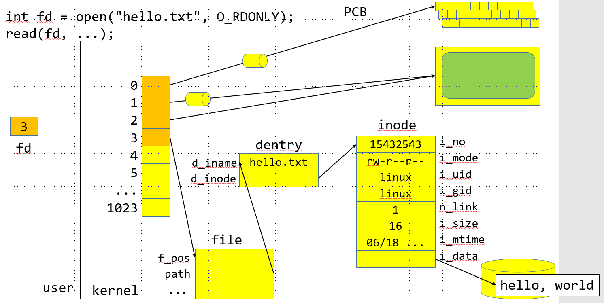
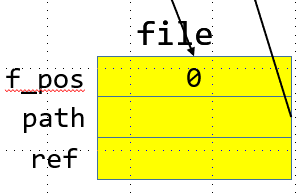
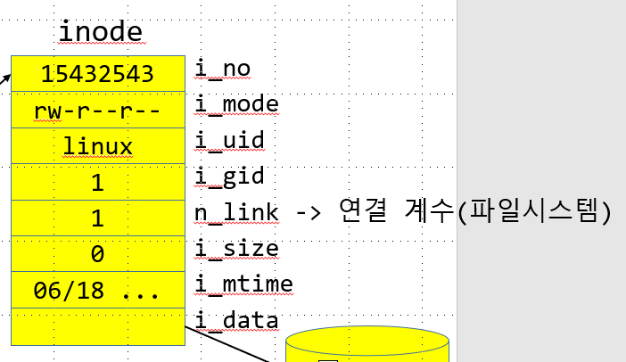
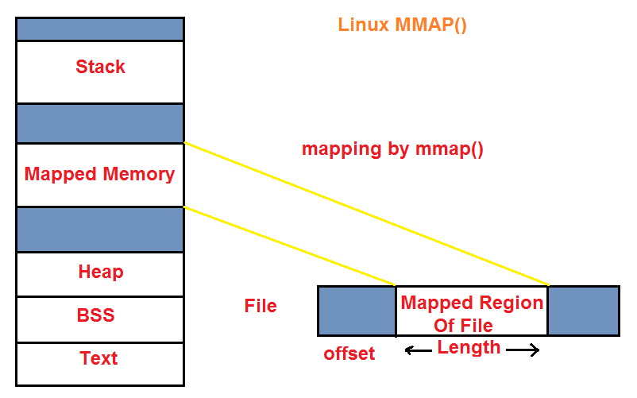
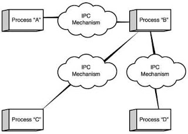
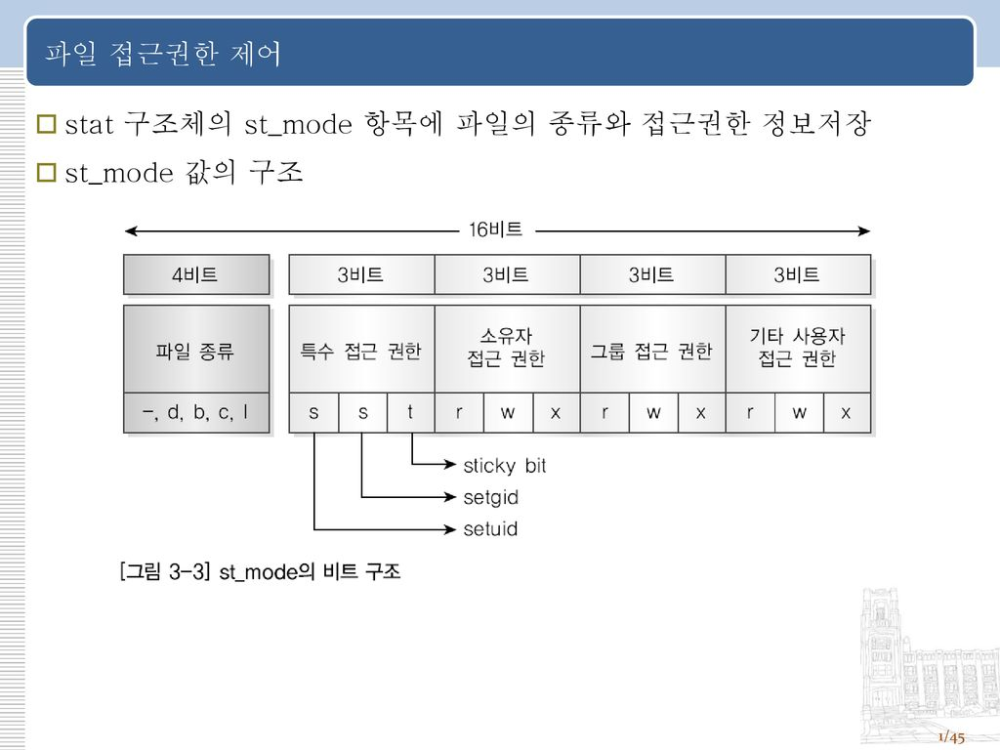

- 복습내용
```c
  1 #include <stdio.h>
  2 #include <sys/types.h>
  3 #include <sys/stat.h>
  4 #include <fcntl.h>
  5 #include <stdlib.h>
  6 #include <unistd.h>
  7 // ./a.out hello.txt
  8
  9 int main(int argc, char ** argv) {
 10     if(argc != 2) {
 11         fprintf(stderr, "usage : %s FILE\n", *argv);
 12         return -1;
 13     }
 14     --argc, ++argv;
 15
 16     //open(*argv, O_CREAT, S_IRUSR | S_IWUSR | S_IRGRP | S_IROTH );
 17
 18     int fd = open(*argv, O_CREAT | O_WRONLY | O_TRUNC, 0644);
 19     if(fd < 0) { //파일 생성 실패 시
 20         perror("open");
 21         return -1;
 22     }
 23
 24     //char buf[4096]; //application buffer
 25                     //64bit MAX == 8KB
 26                     //최적화된 버퍼의 크기를 라이브러리에서 제공해줌
 27                     //BUFSIZ : 효율적인 버퍼의 크기가 정의된 매크로(STL)
 28     char buf[BUFSIZ];
 29     while(1) {
 30         int nRead = read(0, buf, sizeof(buf));//0번은 키보드
 31         if (nRead < 0) {
 32             perror("read");
 33             return -1;
 34         }
 35         else if(nRead ==0){
 36             break;
 37         }
 38         else {
 39             write(fd, buf, nRead);
 40         }
 41     }
 42     if (close(fd) == -1) { //return value int
 43         perror("close"); //닫히지 않으면 자원누수발생
 44         exit(-1); //자원누수 방지
 45     }
 46     //또한 열어두면 다른 프로그램에서 접근할 수 없다.
 47     return 0;
 48 }
 49
```
|-출력!|
|-|
```s
linux@ubuntu:~/0618$ gcc 1_print.c
linux@ubuntu:~/0618$ ./a.out
usage : ./a.out FILE
linux@ubuntu:~/0618$ ./a.out output.txt
helloc
world
goodbye
linux@ubuntu:~/0618$ cat output.txt
helloc
world
goodbye 
```
---
- 연습문제
    
        표준 라이브러리가 아닌 시스템콜을 사용하여 cp 명령어 구현

        ex) ./mycp hello.txt hello_copy.txt
        복사할 이름의 파일이 존재할 경우, 기존 파일의 내용을 삭제

        O_TRUNC
        읽기전용 open , 쓰기전용 open

```c
  1 #include <stdio.h>
  2 #include <sys/types.h>
  3 #include <sys/stat.h>
  4 #include <fcntl.h>
  5 #include <stdlib.h>
  6 #include <unistd.h>
  7 // ./a.out hello.txt
  8
  9 int main(int argc, char **argv) {
 10     if (argc != 3) {
 11         fprintf(stderr, "usage: %s FILE1 FILE2\n", *argv);
 12         return -1;
 13     }
 14     --argc, ++argv;
 15
 16     int srcFile = open(argv[0], O_RDONLY);
 17     if (srcFile < 0) {
 18         perror("open");
 19         return -1;
 20     }
 21
 22     int dstFile = open(argv[1], O_WRONLY | O_CREAT | O_TRUNC, 0644);
 23     if (dstFile < 0) {
 24         perror("open");
 25         return -1;
 26     }
 27
 28     char buf[BUFSIZ];
 29     while (1) {
 30         ssize_t nRead = read(srcFile, buf, sizeof(buf));
 31         if (nRead < 0) {
 32             perror("read");
 33             return -1;
 34         }
 35         else if (nRead == 0) {
 36             break;
 37         }
 38         else {
 39             write(dstFile, buf, nRead);
 40         }
 41     }
 42
 43     close(dstFile);
```
|-출력!|
|-|
```s
linux@ubuntu:~/0618$ ./a.out output.txt output2.txt
linux@ubuntu:~/0618$ head output2.txt
helloc
world
goodbye
```
---

>int fd = open("hello.txt", O_RDONLY);

- inode를 통해 할당되어있는 정보

        http://www.ktword.co.kr/abbr_view.php?m_temp1=1701

파일에 해당하는 고유넘버가 inode 구조체를 참조, 설정되어있다

    inode는 메모리로 올라가고
    파일의 정보는 커널상에 남게된다


- file정보 구조체

        typedef struct file 
            f_pos
            path
            ...

>user 사용 - > 3 <br/>

<br/>

>커널내부에 있는 특정정수값 키보드와 같은 디바이스가 할당되어 있음<br/>
 <br/>

>3번에 대한 file 구조체 사용<br/>
<br/>

>저장되어 있는 물리 데이터에 대해서 inode 값으로 저장되어 있다.<br/>
><br/>

>임의로 만든 사용자의 자료에대해 inode 연동<br/>
<br/>

>전체적인 모습<br/>
<br/>

3번값이 운영체제로 넘어가고 운영체제는 메모리에 올라와있는
inode의 값을 참조하여 해당 정수에 해당하는 디바이스를 사용자에게 return 해준다.

---
## open
>리눅스 제공 파일오픈 함수
```
NAME
       open, openat, creat - open and possibly create a file

SYNOPSIS
       #include <sys/types.h>
       #include <sys/stat.h>
       #include <fcntl.h>

       int open(const char *pathname, int flags);
       int open(const char *pathname, int flags, mode_t mode);

       int creat(const char *pathname, mode_t mode);

       int openat(int dirfd, const char *pathname, int flags);
       int openat(int dirfd, const char *pathname, int flags, mode_t mode);

   Feature Test Macro Requirements for glibc (see feature_test_macros(7)):

       openat():
           Since glibc 2.10:
               _POSIX_C_SOURCE >= 200809L
           Before glibc 2.10:
               _ATFILE_SOURCE
RETURN VALUE
       open(), openat(), and creat() return the new file descriptor, or -1 if an error occurred (in which
       case, errno is set appropriately).
```
---
>자주사용되는 옵션 항목들<br/>

---
```
사용자 키보드로 부터 입력 받은 내용을 파일에 저장하는 프로그램 구현하기
단 입출력은 표준 라이브러리를 사용하는것이 아닌 시스템 콜을 사용해야 한다.

ex) ./myapp hello.txt -- cat > hello.txt
```
```c
  1 #include <stdio.h>
  2 #include <sys/types.h>
  3 #include <fcntl.h>
  4 #include <unistd.h>
  5
  6 int main(int argc, char **argv) {
  7     if(argc != 2) {
  8         fprintf(stderr, "usage : %s FILENAME\n", *argv);
  9         return -1;
 10     }
 11     --argc, ++argv;
 12
 13     int fd = open(*argv, O_RDONLY); //FILE *fp = fopen(*argv, "r");
 14     if (fd < 0) {                   //if (fp == NULL)
 15         perror("open");         //  perror("fopen");
 16         return -1;                  //  return -1;
 17     }                               //}
 18
 19     char buf[4096];
 20     while(1) {
 21         int nRead = read(fd, buf, sizeof(buf));
 22         if (nRead <0 ) {
 23             perror("read");
 24             return -1;
 25         }
 26         else if(nRead ==0 ) {
 27             break;
 28         }
 29         else {
 30             write(1, buf, nRead);
 31         }
 32     }
 33     close(fd);//fclose descript가 정수이므로 close로 닫아준다
 34     return 0;
 35 }
```
|-출력!|
|-|
```s
linux@ubuntu:~/0617$ gcc 8_mycat.c
linux@ubuntu:~/0617$ ./a.out hello.c
//hello.c
#include <stdio.h>

int main() {
    printf("hello world\n");
    return 0;
}

```
---

### File offset
> 해당의 내용은 LinuxSystemProg_vs1.md 에도 있다.<br/>

> 리눅스 커널은 열려있는 각 파일마다 파일 옵셋을 각각 기록한다<br/>
> 파일 옵셋은 파일에서 다음 읽기나 쓰기가 시작될 위치를 의미<br/>

- 파일의 시작에서 떨어진 거리를 의미하기도 한다
  
        파일의 첫 바이트에 대한 옵셋은 0이다
        파일 옵셋은 파일이 열렸을 때 파일의 시작을 가리키도록 설정
        read나 write 함수가 호출될 때 마다 방금 읽거나쓴 바이트의 다음 바이트를
        가리키도록 자동으로 조정된다.

    - fseek(c) - > lseek(linux)
  
                        리눅스 제공 offset 함수
> 제공되는 리눅스 함수로 파일의 사이즈를 가져오는 함수 작성
```c
  1 #include <stdio.h>
  2 #include <stdlib.h>
  3 #include <sys/types.h>
  4 #include <unistd.h>
  5 #include <sys/stat.h>
  6 #include <fcntl.h>
  7
  8
  9 long getFileSize(int fd) { //FILE *fp) {
 10     if (fd < 0) {
 11         fprintf(stderr, "getFileSize : fd is wrong \n");
 12         return -1;
 13     }
 14     // 1. 현재 파일 옵셋을 저장
 15     off_t oldPos = lseek(fd, 0, SEEK_CUR); //현재위치에서부터 0번까지
 16     if(oldPos== -1) {                     // 첫시작은 0이므로 시작위치를 반환하겠다는 뜻
 17         perror("lseek");
 18         return -1;
 19     }
 20     //2. 옵셋 끝까지 이동하여 파일의 크기 계산
 21     off_t fsize = lseek(fd, 0, SEEK_END);
 22     if(fsize == -1 ) {
 23     //if(lseek(fp, 0,  SEEK_END) == -1) {
 24         perror("lseek");
 25         return -1;
 26     }
 27     //long fsize = ftell(fp);
 28     //if (fsize == -1 ) {
 29
 30     //    perror ("ftell");
 31     //    return -1;
 32     //}
 33
 34     //3. 이전 파일 옵셋으로 복원
 35     if (lseek(fd, oldPos, SEEK_SET) == -1) {
 36         perror("lseek");
 37         exit(-1);
 38         //파일의 옵셋을 복원할 수 없으므로 종료.
 39     }
 40     return fsize;
 41 }
 42 int main(int argc, char ** argv) {
 43     if (argc != 2) {
 44         fprintf(stderr, "usage : %s FILE\n", *argv);
 45         return -1;
 46     }
 47     --argc, ++argv;
 48
 49     int fd = open(*argv, O_RDONLY);
 50     if(fd < 0) {
 51         perror("open");
 52         return -1;
 53     }
 54
 55     long fsize = getFileSize(fd);
 56     printf("%ld\n", fsize);
 57     return 0;
 58 }
```
|-출력!|
|-|
```s
linux@ubuntu:~/0618$ ./a.out b.c
0
linux@ubuntu:~/0618$ ./a.out output2.txt
21
```
---
>offset 사용하고 다시 0으로 돌려<br/>
다시한번 offset 사용하기

```c
  1 #include <stdio.h>
  2 #include <stdlib.h>
  3 #include <sys/types.h>
  4 #include <unistd.h>
  5 #include <sys/stat.h>
  6 #include <fcntl.h>
  7
  8
  9 long getFileSize(int fd) { //FILE *fp) {
 10     if (fd < 0) {
 11         fprintf(stderr, "getFileSize : fd is wrong \n");
 12         return -1;
 13     }
 14     // 1. 현재 파일 옵셋을 저장
 15     off_t oldPos = lseek(fd, 0, SEEK_CUR); //현재위치에서부터 0번까지
 16     if(oldPos== -1) {                     // 첫시작은 0이므로 시작위치를 반환하겠다는 뜻
 17         perror("lseek");
 18         return -1;
 19     }
 20     //2. 옵셋 끝까지 이동하여 파일의 크기 계산
 21     off_t fsize = lseek(fd, 0, SEEK_END);
 22     if(fsize == -1 ) {
 23     //if(lseek(fp, 0,  SEEK_END) == -1) {
 24         perror("lseek");
 25         return -1;
 26     }
 27     //long fsize = ftell(fp);
 28     //if (fsize == -1 ) {
 29
 30     //    perror ("ftell");
 31     //    return -1;
 32     //}
 33
 34     //3. 이전 파일 옵셋으로 복원
 35     if (lseek(fd, oldPos, SEEK_SET) == -1) {
 36         perror("lseek");
 37         exit(-1);
 38         //파일의 옵셋을 복원할 수 없으므로 종료.
 39     }
 40     return fsize;
 41 }
 42 int main(int argc, char ** argv) {
 43     if (argc != 2) {
 44         fprintf(stderr, "usage : %s FILE\n", *argv);
 45         return -1;
 46     }
 47     --argc, ++argv;
 48
 49     int fd = open(*argv, O_RDONLY);
 50     if(fd < 0) {
 51         perror("open");
 52         return -1;
 53     }
 54
 55     long fsize = getFileSize(fd);
 56     printf("%ld\n", fsize);
 57     char buf[BUFSIZ];
 58     while(1){
 59         ssize_t nRead = read(fd, buf, sizeof(buf));
 60         if (nRead < 0 ) {
 61             perror("read");
 62             return -1;
 63         }
 64         else if (nRead ==0 ) {
 65             break;
 66         }
 67         else {
 68             write(1, buf, nRead);
 69         }
 70     }
 71     close(fd);
 72     return 0;
 73 }
```
```s
linux@ubuntu:~/0618$ ./a.out output.txt
21 # offset을 끝으로 이동하여 파일의 크기를 알아내고
helloc #offset위치를 다시 파일의 첫부분으로 초기화시켜
world # 파일의 내용을 출력한다
goodbye
```
---
### lseek
>Linux 제공 라이브러리 offset 함수
```
NAME
       lseek - reposition read/write file offset

SYNOPSIS
       #include <sys/types.h>
       #include <unistd.h>

       off_t lseek(int fd, off_t offset, int whence);

DESCRIPTION
       lseek()  repositions  the  file  offset  of the open file description
       associated with the file descriptor fd to the argument offset accord‐
       ing to the directive whence as follows:

       SEEK_SET
              The file offset is set to offset bytes.

       SEEK_CUR
              The  file  offset  is  set to its current location plus offset
              bytes.

       SEEK_END
              The file offset is set to the size of  the  file  plus  offset
              bytes.

       lseek()  allows  the file offset to be set beyond the end of the file
       (but this does not change the size of the file).  If  data  is  later
       written  at  this  point,  subsequent reads of the data in the gap (a
       "hole") return null bytes ('\0') until data is actually written  into
       the gap.

    ...

RETURN VALUE
       Upon successful completion,  lseek()  returns  the  resulting  offset
       location  as  measured  in  bytes from the beginning of the file.  On
       error, the value (off_t) -1 is returned and errno is set to  indicate
       the error.

```

>off_t lseek(int fd, off_t offset, int whence);<br/>

    성공할 경우 파일 옵셋이 반환되고 에러 발생시 -1 반환
    offset의 값은 양수와 음수 모두 사용가능하다.


whence로 기준점을 설정하고 offset으로 기준점으로 떨어진 위치를 설정

- lseek 사용 예
>lseek(fd, 0, SEEK_CUR) : 현재 파일의 위치 <br/>
lseek(fd, 0, SEEK_SET) : 파일의 시작으로 설정 <br/>
lseek(fd, 0, SEEK_END) : 파일의 끝으로 설정 <br/>
lseek(fd, -1, SEEK_END) : 파일의 마지막 바이트 위치 <br/>
lseek(fd, -10, SEEK_CUR) : 현재 위치에서 10바이트 앞으로 설정 <br/>

---
>하나의 파일에 대해 동시에 작업하는 코드
```c
  1 // 5_offset.c
  2 #include <stdio.h>
  3 #include <stdlib.h>
  4 #include <unistd.h>
  5 #include <sys/types.h>
  6 #include <sys/stat.h>
  7 #include <fcntl.h>
  8
  9
 10
 11 int main(int argc, char **argv) {
 12     if(argc != 2) {
 13         fprintf(stderr, "usage : %s FILE\n", *argv);
 14         return -1;
 15     }
 16     --argc, ++argv;
 17
 18     int fd1 = open(*argv, O_RDONLY); 
 19     if(fd1 < 0) {
 20         perror("open");
 21         return -1;
 22     }
 23
 24
 25     int fd2 = open(*argv, O_RDONLY);
 26     if(fd2 < 0) {
 27         perror("open");
 28         return -1;
 29     }
 30     //fd1과 fd2가 argv +1 을 똑같이 open 했다.
 31     char buf1[32]={0,};
 32     char buf2[32]={0,};
 33
 34     read(fd1, buf1, 5);
 35     read(fd2, buf2, 5);
 36
 37     printf("%s\n", buf1);
 38     printf("%s\n", buf2);
 39
 40     close(fd1);
 41     close(fd2);
 42     return 0;
 43 }

```
```s
linux@ubuntu:~/0618$ ./a.out 5_offset.c
// 5_
// 5_
```
>같은 파일을 open시에 개별적으로 다루는 모습

    같은 파일에 대해서 다른 file 구조체를 가지고있으니
    offset의 값도 다르고
    파일의 상세정보도 다 다르다

- 결론 
  <br/>

<br/>
    
        파일을 열 때 마다 파일 정보 구조체는 개별적으로 생성된다.
---
>fd_table에서 file구조체의 순차적으로 넘버를 할당한다<br/>

그렇다면 앞 번호에 대해서 descriptor 복사는 어떠한 의미를 가지고있는지 알아보자

---
### dup (duplicate)
>인자로 전달된 파일 descriptor의 값을 비어 있는 가장 작은 descriptor table에 <br/>복제하는 함수

    출력을 a.txt > result.txt로 보낸다면
    모니터출력이 아니라 파일에 저장된다

    이렇게 입출력이 재지정될 때 dup가 사용된다.
    입출력 재지정 : 리다이렉션, 파이프 등등

---
>표준출력 일반파일로 리다이렉션
```c
  1 //표준출력을 일반 파일로 리다이렉션하는 코드
  2 #include <stdio.h>
  3 #include <unistd.h>
  4 #include <sys/types.h>
  5 #include <sys/stat.h>
  6 #include <fcntl.h>
  7
  8 int main (int argc, char **argv) {
  9
 10     if(argc != 2) {
 11         fprintf(stderr, "usage : %s FILE\n", *argv);
 12         return -1;
 13     }
 14     --argc, ++argv;
 15
 16     //파일출력을 위한 파일생성
 17     int fd = open(*argv, O_WRONLY | O_CREAT| O_TRUNC, 0644);
 18     //파일을 오픈하는데 없으면 0644권한으로 만들고 기존파일을 삭제
 19
 20     if(fd < 0) {
 21         perror("open");
 22         return -1;
 23     }
 24
 25     //표준출력 -> fd
 26     printf("hello, world\n");
 27
 28     close(fd);
 29     return 0;
 30 }

```
```s
linux@ubuntu:~/0618$ ll
total 52
drwxrwxr-x  2 linux linux 4096 Jun 17 20:21 ./
drwxr-xr-x 24 linux linux 4096 Jun 17 20:21 ../
-rw-rw-r--  1 linux linux  774 Jun 17 18:25 1_mycp.c
-rw-rw-r--  1 linux linux 1144 Jun 17 18:01 1_print.c
-rw-rw-r--  1 linux linux  768 Jun 17 18:22 2_mycp.c
-rw-rw-r--  1 linux linux 1592 Jun 17 19:52 4_offset.c
-rw-rw-r--  1 linux linux  615 Jun 17 20:08 5_offset.c
-rw-rw-r--  1 linux linux  614 Jun 17 20:21 6_dup.c
-rwxrwxr-x  1 linux linux 8520 Jun 17 20:21 a.out*
-rw-r--r--  1 linux linux    0 Jun 17 19:06 b.c
-rw-r--r--  1 linux linux   21 Jun 17 18:26 output2.txt
-rw-r--r--  1 linux linux   21 Jun 17 18:01 output.txt
linux@ubuntu:~/0618$ ./a.out hello.txt 
hello, world

linux@ubuntu:~/0618$ ll
total 52
drwxrwxr-x  2 linux linux 4096 Jun 17 20:22 ./
drwxr-xr-x 24 linux linux 4096 Jun 17 20:21 ../
-rw-rw-r--  1 linux linux  774 Jun 17 18:25 1_mycp.c
-rw-rw-r--  1 linux linux 1144 Jun 17 18:01 1_print.c
-rw-rw-r--  1 linux linux  768 Jun 17 18:22 2_mycp.c
-rw-rw-r--  1 linux linux 1592 Jun 17 19:52 4_offset.c
-rw-rw-r--  1 linux linux  615 Jun 17 20:08 5_offset.c
-rw-rw-r--  1 linux linux  614 Jun 17 20:21 6_dup.c
-rwxrwxr-x  1 linux linux 8520 Jun 17 20:21 a.out*
-rw-r--r--  1 linux linux    0 Jun 17 19:06 b.c
-rw-r--r--  1 linux linux    0 Jun 17 20:22 hello.txt
-rw-r--r--  1 linux linux   21 Jun 17 18:26 output2.txt
-rw-r--r--  1 linux linux   21 Jun 17 18:01 output.txt
#hello.txt가 생성된 모습
```
---
> printf는 fd table 1번(모니터)를 통해 출력<br/>
> 이제 fd table 1번에 file 출력을 덮어쓰기
```c
int fd = open("hello.txt", O_RDONLY);
printf("hello, world\n"); == fprintf(stdout, "hello world");
close(1); //기존의 1번에 있는 디바이스를 닫고
dup(fd); //1번에 대해서 fd로 대신한다.
```
```s
linux@ubuntu:~/0618$ gcc 6_dup.c
linux@ubuntu:~/0618$ ./a.out hello.txt # 정보가 모니터로 출력되지 않았다.
linux@ubuntu:~/0618$ cat hello.txt
hello, world # 출력이 hello.txt에 리다이렉션된 모습
```
---
>하나의 프로세스에서 동일한 파일을 두번 open하게 되면 

    서로다른 파일구조체가 생성된다
    여기서 우리가 dup를 하게되면
    서로다른 descriptor가 같은 출력을 바라보는지
    파일구조체가 복제되는지 확인.

>파일정보 구조체 공유 or 파일정보 구조체 복제
```c
  1 //표준출력을 일반 파일로 리다이렉션하는 코드
  2 //dup함수로 복제된 파일 descriptor와 기존 파일 descriptor에 대하여
  3 //읽기를 수행
  4 #include <stdio.h>
  5 #include <unistd.h>
  6 #include <sys/types.h>
  7 #include <sys/stat.h>
  8 #include <fcntl.h>
  9
 10 int main (int argc, char **argv) {
 11
 12     if(argc != 2) {
 13         fprintf(stderr, "usage : %s FILE\n", *argv);
 14         return -1;
 15     }
 16     --argc, ++argv;
 17
 18     int fd = open(*argv, O_RDONLY); //
 19
 20     if(fd < 0) {
 21         perror("open");
 22         return -1;
 23     }
 24
 25     close(0); //읽기 수행을 위한 키보드 닫기
 26     dup(fd); // 현재 파일정보를 fd_table에서 비어있는 가장 작은곳에 복제
 27
 28     char buf1[32] ={0, };
 29     read(0, buf1, 5); //fd로 부터 5바이트를 읽는 코드
 30     char buf2[32] ={0, };
 31     read(fd, buf2, 5); //fd로 부터 5바이트를 읽는 코드
 32
 33
 34
 35
 36     printf("0 : %s\n", buf1);
 37     printf("fd: %s\n", buf2);

 40
 41     close(fd);
 42     return 0;
 43 }
```
```s
linux@ubuntu:~/0618$ cat hello.txt
hello, world


linux@ubuntu:~/0618$ ./a.out hello.txt
0 : hello
fd: , wor
```
>동일한 파일을 같이 open하면 파일정보 구조체가 복제가되는데<br/>
>dup를 이용하여 같은 파일에대해서 출력을 받는다면<br/>
파일구조체를 공유하여 사용한다<br/>
<br/>
0과 3이 같은 파일구조체를 공유하는 그림<br/>

- dup하고 있는곳에 대하여 close가 되어지는 상황의 동작여부
```c
  1 # //표준출력을 일반 파일로 리다이렉션하는 코드
  2 //dup함수로 복제된 파일 descriptor와 기존 파일 descriptor에 대하여
  3 //읽기를 수행
  4 #include <stdio.h>
  5 #include <unistd.h>
  6 #include <sys/types.h>
  7 #include <sys/stat.h>
  8 #include <fcntl.h>
  9
 10 int main (int argc, char **argv) {
 11
 12     if(argc != 2) {
 13         fprintf(stderr, "usage : %s FILE\n", *argv);
 14         return -1;
 15     }
 16     --argc, ++argv;
 17
 18     int fd = open(*argv, O_RDONLY); //
 19
 20     if(fd < 0) {
 21         perror("open");
 22         return -1;
 23     }
 24
 25     close(0); //읽기 수행을 위한 키보드 닫기
 26     dup(fd); // 현재 파일정보를 fd_table에서 비어있는 가장 작은곳에 복제
 27     close(fd);
 28     //fd_table을 지웠을때 연결된 파일구조체도 같이 지워지는지 확인
 29
 30
 31     char buf1[32] ={0, };
 32     read(0, buf1, 5); //fd로 부터 5바이트를 읽는 코드
 33
 34
 35     printf("0: %s\n", buf1);
 36     // 5바이트 읽은것이 중복되어 읽히면 공유되지않는것
 37     //0부터 fd까지 연결되어 찍히면 공유
 38
 39     close(fd);
 40     return 0;
 41 }
```
>분명 fd_table을 지웠지만 <br/>
파일 구조체는 지워지지 않았다
```s
linux@ubuntu:~/0618$ ./a.out hello.txt
0: hello # 정상적으로 출력된 모습
```
---

>close(0); <br/>
dup(fd); 0번자리에 fd 복제 0번이 fd구조체를 가리킨다.<br/>
close(fd); fd를 지워버리게 된다면<br/>
            0번으로 읽어와쓰게된다면 NULL 이돌아와 비정상종료<br/>
하지만 파일구조체정보가 살아있다<br/>
왜 살아있을까<br/>

>inode의 n_link 변수와 File 구조체의 ref 변수 있다<br/>
<br/>
>파일구조체 내부의 참조계수 변수<br/>
<br/>
>inode 내부의 연결계수 변수 <br/>


>n_link : 연결계수<br/>
ref : 프로세스 내에서 나를 참조하는 계수 저장 ( 참조 개수 )<br/>
<br/>

>open 을하게되면 ref 개수 하나증가<br/>
<br/>

>dup를 하게되면 0번도 참조하기 때문에 ref 가 2로 증분<br/>
<br/>

    여기서 close fd 를 하게되면
    ref 가 1로 바뀐다

    close를 한다고해서 파일구조체가 삭제되는게아니라
    ref값이 0이 되었을 때 삭제된다


>결론 : 원본을 지운다고 하더라도 ref가 0이 되지 않는이상 지워지지않기 때문에<br/>
해당 파일구조체로 연결된 입출력이 정상적으로 이루어진다.
```c
 18     int fd = open(*argv, O_RDONLY); //참조 계수 : 1
 19
 20     if(fd < 0) {
 21         perror("open");
 22         return -1;
 23     }
 24
 25     close(0); //읽기 수행을 위한 키보드 닫기
 26     dup(fd);// 참조 계수 : 2
 27     close(fd); // 참조 계수 : 1
```
---
```s
linux@ubuntu:~/0618$ ls -l hello.txt
-rw-r--r-- 1 linux linux 13 Jun 17 22:11 hello.txt
#       연결되어있는 계수 1 
#       현재 디렉토리가 참조하고있기때문
linux@ubuntu:~/0618$ mkdir mysub
linux@ubuntu:~/0618$ ls -ld mysub
drwxrwxr-x 2 linux linux 4096 Jun 17 22:13 mysub
#       연결되어있는 계수 2
#       현재 디렉토리와 자기자신을 참조하기 때문

```
하드링크 : 상대경로를 지원

---
### 파일삭제(unlink)
>인자로 전달된 파일의 연결 계수를 1 감소시키는 함수
```
NAME
       unlink, unlinkat - delete a name and possibly the file it refers to

SYNOPSIS
       #include <unistd.h>

       int unlink(const char *pathname);

       #include <fcntl.h>           /* Definition of AT_* constants */
       #include <unistd.h>

       int unlinkat(int dirfd, const char *pathname, int flags);

   Feature Test Macro Requirements for glibc (see feature_test_macros(7)):

       unlinkat():
           Since glibc 2.10:
               _POSIX_C_SOURCE >= 200809L
           Before glibc 2.10:
               _ATFILE_SOURCE
RETURN VALUE
       On success, zero is returned.  On error, -1 is returned, and errno is set appropri‐
       ately.
```
---
>연결계수와 참조계수에 따른 프로세스 접근
```c
  1  #include <stdio.h>
  2  #include <unistd.h>
  3  #include <sys/types.h>
  4  #include <sys/stat.h>
  5  #include <fcntl.h>
  6
  7 // ls -l hello.txt 연결 계수 : 1
  8 // 프로세스가 생성되지 않았으므로 참조 계수는 존재하지 않음
  9 int main() {
 10     int fd = open("hello.txt", O_RDONLY);// 연결 계수 : 1, 참조 계수 : 1
 11     if(fd < 0) {
 12         perror("open");
 13         return -1;
 14     }
 15     //파일삭제 : unlink
 16     if(unlink("hello.txt") < 0 ) {// 연결 계수 : 0, 참조 계수 : 1
 17         perror("unlink");
 18         return -1;
 19     }
        getchar();  //만약 참조 계수가 1이상인 상황에서 연결 계수가 0인 경우
                    //해당 파일은 더이상 파일시스템에서 보이지 않는다.

 20     char buf[BUFSIZ];
 21     while(1) {
 22         ssize_t nRead = read(fd, buf, sizeof(buf));
 23         if(nRead <0) {
 24             perror("read");
 25             return -1;
 26         }
 27         else if (nRead == 0){
 28             break;
 29         }
 30         else {
 31             write(1, buf, nRead);
 32         }
 33     }
 34     close(fd); //연결 계수 : 0, 참조 계수 : 0
 35     return 0;
 36 }
```
|-출력!|
|-|
```s
linux@ubuntu:~/0618$ gcc 9_unlink.c
linux@ubuntu:~/0618$ ./a.out

hello world # 아직 참조계수가 1이므로 여전히 참조 가능하다
goodbye
#close(fd);
linux@ubuntu:~/0618$ ./a.out  #다음에 실행하려면 연결계수 0 참조계수 0 이므로
                              # 실행할 수 없다.
open: No such file or directory

```
>unlink를 수행한다고 해서 바로 파일이 삭제되는 것이 아님

    프로세스 내에서 파일을 참조하는 횟수를 관리하는 참조 계수와
    파일시스템에서 해당 파일을 참조하는 횟수를 관리하는 연결 계수가
    모두 0일 때 자동 삭제된다

>Android Source
```c
685 void open_devnull_stdio(void)
686 {
687    int fd;
688    static const char *name = "/dev/__null__"; //파일생성
689    if (mknod(name, S_IFCHR | 0600, (1 << 8) | 3) == 0) {
690        fd = open(name, O_RDWR);
691        unlink(name); //프로세스에서만 사용하겠다는 의미
692        if (fd >= 0) {
693            dup2(fd, 0); //0과
694            dup2(fd, 1); // 1
695            dup2(fd, 2); // 2를 다 fd로 묶음
                            //현재 상황에서 모든 입출력을 다막는것.
696            if (fd > 2) {
697                close(fd); //모든 stdio를 삭제
698            }
699            return;
700        }
701    }
702
703    exit(1);
704}
```
---
### 메모리 매핑(nmap)
>파일의 일부분을 프로세스의 가상 메모리 매핑하는 기능<br/>
<br/>

```
void *mmap (void *addr, size_t length, int prot, int flags, int fd, off_t offset);
```

- addr 파일을 프로세스의 특정 주소에 매핑하도록하는 매개변수
    -   이는 일종의 힌트일 뿐, 반드시 그 주소에 매핑된다는 보장이 없음 0을 전달하면 운영체제가 적절한 위치에 매핑을 수행

- length, offset : 이전 그림참조
- prot(protection) 보호모드 : 매핑될 메모리의 보호 정책을 의미, 4가지 정책이 있음
    - PROT_READ : 읽기전용
    - PROT_WRITE : 쓰기전용

protection 모드는 매핑하고있는 파일과 모드가 일치해야한다
즉 읽기전용으로 열린파일에 대하여 쓰기 전용으로 보호모드를 설정할 경우 실패


- flags : 매핑된 메모리에 대하여 공유 유무를 설정
  - MAP_PRIVATE : 일정 프로세스만 사용
  - MAP_SHARED : 모든 프로세스와 공유


>입출력을 향상시키기위해 메모리에 올리는 것이지만 <br/>
서로의 입출력을 볼 수 있으므로 IPC용도로 사용 가능하다.

>> 참고로 파일에 대하여 메모리 매핑을 수행하면 파일에 대한 참조 계수가 1 증가<br/>
>> 해당파일을 닫는다고 해도 프로세스는 매핑된 메모리에 접근할 수 있다.

>>파일을 전부 가져오려면 offset뿐만 아니라 length도 가져와야하는데
>>lseek를 활용하여 전체길이를 구해오자

RETURN VALUE

    On success, mmap() returns a pointer to the  mapped  area.   On  error,  the  value
       MAP_FAILED  (that  is,  (void *) -1)  is returned, and errno is set to indicate the
       cause of the error.

       On success, munmap() returns 0.  On failure, it returns -1, and  errno  is  set  to
       indicate the cause of the error (probably to EINVAL).


```c
 79 //현재 코드의 단점은 파일 입출력에 대하여 버퍼 입출력과 빈번한 함수 호출로 인해
 80 //성능이 떨어진다는 단점이 존재
 81 #endif
 82
 83 #if 1
 84 #include <sys/types.h>
 85 #include <sys/stat.h>
 86 #include <fcntl.h>
 87 #include <stdio.h>
 88 #include <unistd.h>
 89 #include <stdlib.h>
 90 #include <sys/mman.h>
 91 //이전 코드는 파일 입출력을 계속하므로 자원을 낭비함.
 92 typedef struct Person {
 93     char name[32];
 94     int age;
 95 }Person;
 96
 97 long getFileSize(int fd) { //FILE *fp) {
 98     if (fd < 0) {
 99         fprintf(stderr, "getFileSize : fd is wrong \n");
100         return -1;
101     }
102     // 1. 현재 파일 옵셋을 저장
103     off_t oldPos = lseek(fd, 0, SEEK_CUR); //현재위치에서부터 0번까지
104     if(oldPos== -1) {                     // 첫시작은 0이므로 시작위치를 반환하겠다는 뜻
105         perror("lseek");
106         return -1;
107     }
108     //2. 옵셋 끝까지 이동하여 파일의 크기 계산
109     off_t fsize = lseek(fd, 0, SEEK_END);
110     if(fsize == -1 ) {
111     //if(lseek(fp, 0,  SEEK_END) == -1) {
112         perror("lseek");
113         return -1;
114     }
115     //long fsize = ftell(fp);
116     //if (fsize == -1 ) {
117
118     //    perror ("ftell");
119     //    return -1;
120     //}
121
122     //3. 이전 파일 옵셋으로 복원
123     if (lseek(fd, oldPos, SEEK_SET) == -1) {
124         perror("lseek");
125         exit(-1);
126         //파일의 옵셋을 복원할 수 없으므로 종료.
127     }
128     return fsize;
129 }
130 int writePerson(const char *fname, Person *person) {
131     if(fname ==NULL || person == NULL) {
132         fprintf(stderr, "writePerson : argument is null\n");
133         return -1;
134     }
135
136     int fd = open(fname, O_WRONLY | O_APPEND | O_CREAT, 0644);
137     if(fd < 0 ) {
138         perror("open");
139         return -1;
140     }
141
142
143
144     int nWritten =write(fd, person, sizeof(Person));
145     if(nWritten < 0 ) {
146         perror("write");
147         close(fd);
148         return -1;
149     }
150     close(fd);
151     return 0;
152 }
153 int dumpFile(const char *fname) {
154     if(fname ==NULL ) {
155         fprintf(stderr, "writePerson : argument is null\n");
156         return -1;
157     }
158     int fd =open(fname, O_RDONLY);
159         if(fd <0) {
160             perror("open");
161             return -1;
162         }
163
164     long fsize = getFileSize(fd);
165     if (fsize < 0 ) {
166         close(fd);
167         return -1;
168     }
169     //void *mmap (void *addr, size_t length, int prot, int flags, int fd, off_t offset);
170     Person* p =mmap(NULL, fsize, PROT_READ, MAP_PRIVATE,fd, 0);
171    if(p == MAP_FAILED){
172        perror("mmap");
173        close(fd);
174        return -1;
175    }
176
177    for (int i =0 ;i < (fsize/sizeof(Person)) ; i++ ) {
178         printf("name :%s. age : %d\n", p[i].name, p[i].age);
179    }
180
181    //int munmap(void *addr, size_t length);
182    //성공 시0 실패 시 -1
183    if(munmap(p, fsize)==-1){
184        perror("munmap");
185        exit(-1);
186    }
187
188
189    close(fd);
190    return 0;
191 }
192 int main(int argc, char **argv) {
193     if(argc != 2) {
194     fprintf(stderr, "usage: %s FILE\n", *argv);
195     return -1;
196     }
197     --argc, ++argv;
198
199     Person arr[] = {
200         {"daniel", 20}, {"susan", 30}, {"cc", 40}, {"bb", 50}
201     };
202
203     for(int i =0; i < 4; i++ ) {
204         writePerson(*argv, &arr[i]);
205         dumpFile(*argv);
206     }
207
208     return 0;
209 }
212 #endif
```
>성능향상을 위해 메모리에 파일을 올려사용한 뒤<br/> 
사용이 끝난 파일에 대해 메모리를 해제해준다.<br/>
---
#### 장점 
>1. 불필요한 복사가 발생하지 않는다

>2 .포인터의 조작만으로 파일 탐색이 가능

>3. IPC(Inter-Process Communication)로 사용 가능<br/>
<br/>

#### 단점
>1. 메모리 매핑은 페이지 단위(메모리 입출력을 위한 최소 단위)로 처리되므로<br/>
> 작은 파일에 대하여 매핑할 경우 메모리 낭비가 발생

>2. 메모리 매핑 시 크기를 크게 잡을 경우 메모리 부족이 발생할 수 있음<br/>
단 64비트 시스템에서는 이것이 문제되지 않는다

>3. 메모리 매핑과 관련된 정보를 생성 및 유지하는 오버헤드가 발생


---
```s
linux@ubuntu:~/0618$ ls -l output.txt
-rw-r--r-- 1 linux linux 21 Jun 17 18:01 output.txt
```

|타입의 종류|연결계수|소유자|소유자가 속한 그룹|파일의 크기|수정날짜|파일이름|
|-|-|-|-|-|-|-|
|-rw-r--r--|1|linux|linux|21|Jun 17 18:01|output.txt|
---
### lstat
>파일의 정보를 보여주는 구조체
```s
자주쓰는 정보 ! 으로 표시
 struct stat {
   !            dev_t     st_dev;         /* ID of device containing file */
   !            ino_t     st_ino;         /* Inode number */
   !            mode_t    st_mode;        /* File type and mode */
   !            nlink_t   st_nlink;       /* Number of hard links */
   !            uid_t     st_uid;         /* User ID of owner */
   !            gid_t     st_gid;         /* Group ID of owner */
   !            dev_t     st_rdev;        /* Device ID (if special !file) */
   !            off_t     st_size;        /* Total size, in bytes */
               blksize_t st_blksize;     /* Block size for filesystem I/O */
               blkcnt_t  st_blocks;      /* Number of 512B blocks allocated */

               /* Since Linux 2.6, the kernel supports nanosecond
                  precision for the following timestamp fields.
                  For the details before Linux 2.6, see NOTES. */

               struct timespec st_atim;  /* Time of last access */
               struct timespec st_mtim;  /* Time of last modification */
               struct timespec st_ctim;  /* Time of last status change */

           #define st_atime st_atim.tv_sec      /* Backward compatibility */
           #define st_mtime st_mtim.tv_sec
           #define st_ctime st_ctim.tv_sec
           };
```
- lstat
```
NAME
       stat, fstat, lstat, fstatat - get file status

SYNOPSIS
       #include <sys/types.h>
       #include <sys/stat.h>
       #include <unistd.h>

       int stat(const char *pathname, struct stat *statbuf);
       int fstat(int fd, struct stat *statbuf);
       int lstat(const char *pathname, struct stat *statbuf);

       #include <fcntl.h>           /* Definition of AT_* constants */
       #include <sys/stat.h>

       int fstatat(int dirfd, const char *pathname, struct stat *statbuf,
                   int flags);

   Feature Test Macro Requirements for glibc (see feature_test_macros(7)):

       lstat():
           /* glibc 2.19 and earlier */ _BSD_SOURCE
               || /* Since glibc 2.20 */ _DEFAULT_SOURCE
               || _XOPEN_SOURCE >= 500
               || /* Since glibc 2.10: */ _POSIX_C_SOURCE >= 200112L

       fstatat():
           Since glibc 2.10:
               _POSIX_C_SOURCE >= 200809L
           Before glibc 2.10:
               _ATFILE_SOURCE
    RETURN VALUE
       On success, zero is returned.  On error, -1 is returned, and errno is set appropriately.
```
---
```c
  1 // 8.ftype.c
  2
  3 #include <stdio.h>
  4 #include <sys/types.h>
  5 #include <sys/stat.h>
  6 #include <unistd.h>
  7
  8 //usage: ./a.out hello.txt
  9
 10 int main(int argc, char ** argv) {
 11     if(argc != 2) {
 12         fprintf(stderr, "usage : %s FILE\n", *argv);
 13         return -1;
 14     }
 15
 16     --argc, ++argv;
 17     //int lstat(const char *pathname, struct stat *statbuf);
 18     struct stat sb = {0, };
 19     if(lstat(*argv, &sb) == -1) {
 20         perror("lstat");
 21         return -1;
 22     }
 23
 24     printf("%d, %X\n", sb.st_mode, sb.st_mode);
 25
 26     return 0;
 27 }
```
```s
linux@ubuntu:~/0618$ ./a.out output.txt
33188, 81A4
# umask
```
- 파일의 타입 출력
```c
  1 // 8.ftype.c
  2
  3 #include <stdio.h>
  4 #include <sys/types.h>
  5 #include <sys/stat.h>
  6 #include <unistd.h>
  7
  8 //usage: ./a.out hello.txt
  9
 10 int main(int argc, char ** argv) {
 11     if(argc != 2) {
 12         fprintf(stderr, "usage : %s FILE\n", *argv);
 13         return -1;
 14     }
 15
 16     --argc, ++argv;
 17     //int lstat(const char *pathname, struct stat *statbuf);
 18     struct stat sb = {0, };
 19     if(lstat(*argv, &sb) == -1) {
 20         perror("lstat");
 21         return -1;
 22     }
 23     //printf("%d, %X\n", sb.st_mode, sb.st_mode);
 24      switch (sb.st_mode & S_IFMT) {
 25          case S_IFBLK:  printf("b: block device\n");            break;
 26          case S_IFCHR:  printf("c: character device\n");        break;
 27          case S_IFDIR:  printf("d: directory\n");               break;
 28          case S_IFIFO:  printf("p: FIFO/pipe\n");               break;
 29          case S_IFLNK:  printf("l :symlink\n");                 break;
 30          case S_IFREG:  printf("- :regular file\n");            break;
 31          case S_IFSOCK: printf("s :socket\n");                  break;
 32            default:       printf("unknown?\n");                break;
 33      }
 34
 35
 36     return 0;
 37 }

```
|-출력!|
|-|
```s
linux@ubuntu:~/0618$ ls -ld mysub/
drwxrwxr-x 2 linux linux 4096 Jun 17 22:13 mysub/
linux@ubuntu:~/0618$ ./a.out mysub/
d: directory

linux@ubuntu:~/0618$ ls -l output.txt
-rw-r--r-- 1 linux linux 21 Jun 17 18:01 output.txt
linux@ubuntu:~/0618$ ./a.out output.txt
- :regular file

linux@ubuntu:~/0618$ ls -l myfifo
prw-rw-r-- 1 linux linux 0 Jun 18 00:38 myfifo
linux@ubuntu:~/0618$ ./a.out myfifo
p: FIFO/pipe
```
>파일의 타입에 맞게 출력<br/>

<br/>


```c
 2 #include <stdio.h>
  3 #include <sys/types.h>
  4 #include <sys/stat.h>
  5 #include <unistd.h>
  6
  7 int main(int argc, char ** argv) {
  8     if(argc != 2) {
  9         fprintf(stderr, "usage : %s FILE\n", *argv);
 10         return -1;
 11     }
 12
 13     --argc, ++argv;
 14
 15     struct stat sb = {0, };
 16     if(lstat(*argv, &sb) == -1) {
 17         perror("lstat");
 18         return -1;
 19     }
 20
 21     //01234567891011
 22     //Trwxrwxrwx+\0
 23     char perm[11];
 24     perm[0] =' '; //file type
 25
 26     //user
 27     perm[1] = (sb.st_mode & S_IRUSR) ?  'r' : '-';
 28     perm[2] = (sb.st_mode & S_IWUSR) ?  'w' : '-';
 29     perm[3] = (sb.st_mode & S_IXUSR) ?  'x' : '-';
 30
 31     //group
 32     perm[4] = (sb.st_mode & S_IRGRP) ?  'r' : '-';
 33     perm[5] = (sb.st_mode & S_IWGRP) ?  'w' : '-';
 34     perm[6] = (sb.st_mode & S_IXGRP) ?  'x' : '-';
 35
 36     // other
 37     perm[7] = (sb.st_mode & S_IROTH) ?  'r' : '-';
 38     perm[8] = (sb.st_mode & S_IWOTH) ?  'w' : '-';
 39     perm[9] = (sb.st_mode & S_IXOTH) ?  'x' : '-';
 40
 41     printf("%s %s\n", perm, *argv);
 42     return 0;
 43 }
```
```s
linux@ubuntu:~/0618$ gcc 8_commit.c
linux@ubuntu:~/0618$ ./a.out output.txt
 rw-r--r-- output.txt
```
- 연습문제 : 코드를 개선하여 간단하게 구현
```c

```
```s
```
- nlink 출력
```c
  2 #include <stdio.h>
  3 #include <sys/types.h>
  4 #include <sys/stat.h>
  5 #include <unistd.h>
  6
  7 int main(int argc, char ** argv) {
  8     if(argc != 2) {
  9         fprintf(stderr, "usage : %s FILE\n", *argv);
 10         return -1;
 11     }
 12
 13     --argc, ++argv;
 14
 15     struct stat sb = {0, };
 16     if(lstat(*argv, &sb) == -1) {
 17         perror("lstat");
 18         return -1;
 19     }
 20
 21     printf("%ld %s\n", sb.st_nlink, *argv);
 22     return 0;
 23 }
```
```s
linux@ubuntu:~/0618$ ls -l 8_permit.c
-rw-rw-r-- 1 linux linux 367 Jun 18 01:40 8_permit.c

linux@ubuntu:~/0618$ ./a.out 8_permit.c
1 8_permit.c
```