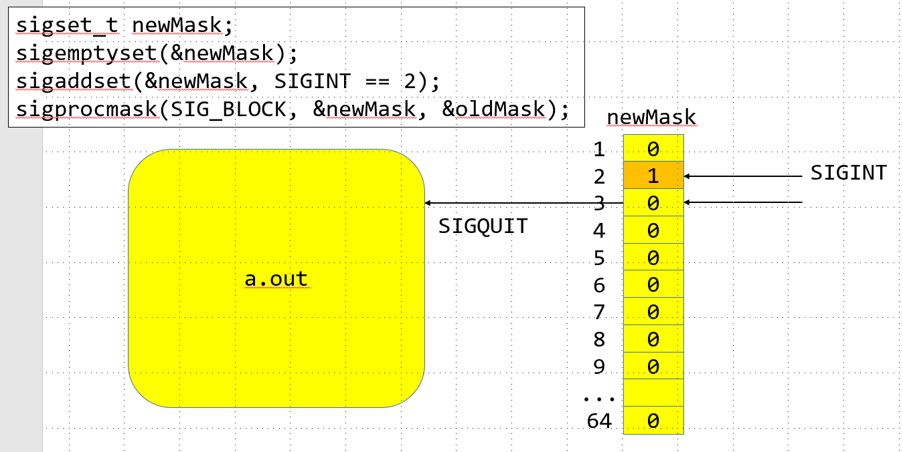
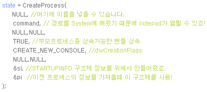
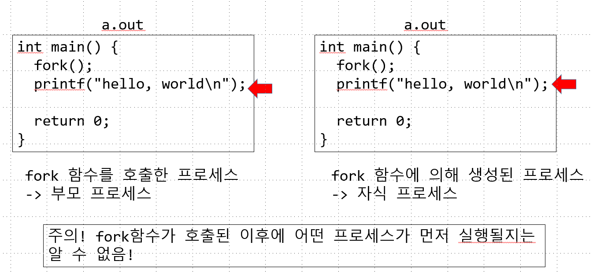

# SIGNAL의 등록 및 해제
<br/>
```c
  1 // 5_signal.c
  2
  3 #include <stdio.h>
  4 #include <unistd.h>
  5 #include <signal.h>
  6
  7
  8 void sigHandler(int signo) {
  9     if (signo == SIGINT) {
 10         printf("cought SIGINT\n");
 11         if(signal(SIGINT, SIG_DFL)== SIG_ERR) {//SIGINT를 SIG DEFAULT와
 12             perror("signal");
 13             exit(1); //signal에서 오류는 해결 할 수 없으므로 exit
 14         }
 15     }
 16 }
 17
 18 //시그널 펜딩 (보류)
 19 //1. 차단과 해제
 20 void showMask() {
 21     sigset_t curMask;
 22     if(sigprocmask(0, NULL, &curMask) == -1) {
 23         perror("sigprocmask");
 24         return;
 25     }
 26
 27     printf("blocked signal list: \n");
 28     if(sigismember(&curMask, SIGINT)) printf("SIGINT");
 29     if(sigismember(&curMask, SIGQUIT)) printf("SIGQUIT");
 30     if(sigismember(&curMask, SIGALRM)) printf("SIGALRM");
 31     printf("\n");
 32 }
 33 int main (){
 34     // SIGINT에 대한 핸들러를 등록
 35     if (signal(SIGINT, sigHandler)== SIG_ERR ) {
 36         perror("signal");
 37         return -1;
 38     }
 39
 40     // 시그널 마스크 데이터 생성 및 초기화
 41     sigset_t newMask; // struct
 42     if(sigemptyset(&newMask) == -1) {
 43         perror("sigemptyset");
 44         return -1;
 45     }
 46
 47     //차단할 시그널 설정
 48     if(sigaddset(&newMask, SIGINT)== -1) {
 49         perror("sigaddset");
 50         return -1;
 51     }
 52     sigset_t oldMask;
 53     if(sigprocmask(SIG_BLOCK, &newMask, &oldMask) == -1) {
 54         perror("sigprocmask");
 55         return -1;
 56     }
 57     //차단할 시그널 등록
 58     printf("press CTRL + C\n");
 59     sleep(10);
 60
 61     // 블록된 시그널이 있는지 확인
 62     sigset_t pendingMask;
 63     if(sigpending(&pendingMask) == -1) {
 64         perror("sugpending");
 65         return -1;
 66     }
 67
 68     int ret = sigismember(&pendingMask, SIGINT); //SIGINT가 있는지 확인
 69     if(ret == -1 ) {
 70         perror("sigismember");
 71         return -1;
 72     }
 73     else if(ret == 1) {
 74         printf("\nSIGINT is pending...\n");
 75     }
 76     if(sigprocmask(SIG_SETMASK, &oldMask, NULL)== -1) {
 77         perror("sigporcmask");
 78         return -1;
 79     }
 80
 81     printf("SIGINT unblocked\n");
 82     printf("press CTRL +C \n");
 83     sleep(10);
 84
 85     return 0;
~

```
```s
linux@ubuntu:~/0622$ gcc 2_signal.c
linux@ubuntu:~/0622$ ./a.out
press CTRL + C #signal 등록
^C

SIGINT is pending...
cought SIGINT  #signal 받기
SIGINT unblocked #signal 해제
press CTRL +C
^C #SIGINT의 등록이 해제 되었기 때문에 ctrl +c 했을 때 종료
```
> 해당하는 SIGNAL을 무시하지 못하는 경우.
---
# Process
1. 개념 
    - 프로그램 : 바이너리 또는 프로그램은 물리적인 저장장치에 컴파일되어 기록된 코드
    - 프로세스 : 실행중인 프로그램, 프로세스는 로드된 바이너리 코드와 가상화된 메모리의 인스턴, 커널 리소스, 기타 사용자 관련 정보와 하나 이상의 쓰레드를 포함한 것.<br/>

>window 같은 경우의 createProcess 코드<br/>


상당히 복잡하다.

---
## Process id
리눅스에서 프로세스를 식별하기 위해 사용되는 값
- 보통 0~32768 사이의 값을 사용(하위 호환성 보장을 위해 해당 값을 default로 두고 사용한다.)
---
### getpid
```
NAME
       getpid, getppid - get process identification

SYNOPSIS
       #include <sys/types.h>
       #include <unistd.h>

       pid_t getpid(void);
       pid_t getppid(void);

DESCRIPTION
       getpid()  returns the process ID (PID) of the calling process.  (This is often used by routines that gener‐
       ate unique temporary filenames.)

       getppid() returns the process ID of the parent of the calling process.  This will be either the ID  of  the
       process  that  created this process using fork(), or, if that process has already terminated, the ID of the
       process to which this process has been reparented (either init(1) or a "subreaper" process defined via  the
       prctl(2) PR_SET_CHILD_SUBREAPER operation).

ERRORS
       These functions are always successful.

CONFORMING TO
       POSIX.1-2001, POSIX.1-2008, 4.3BSD, SVr4.
```
```c
  1 #if 0
  2 // 3_process.c
  3 #include <stdio.h>
  4 #include <sys/types.h>
  5 #include <unistd.h>
  6
  7
  8 int main() {
  9     pid_t pid = getpid(); //process id를 받아 오는 코드
 10     printf("pid = %d\n", pid); //ps -ef명령어로 동일한 값 출력가능.
 11
 12     return 0;
 13 }
 14 #endif

```
```s
linux@ubuntu:~/0622$ ./a.out
pid = 2528

linux@ubuntu:~/0622$ ps -ef
linux      2442   2328  0 18:34 pts/1    00:00:00 vi 3_process.c
linux      2500   1828  0 18:40 pts/0    00:00:00 ps -ef
```
---
### fork
코드 실행 중 fork() 라는 함수를 만나는 순간<br/>
코드가 복제되어 코드가 두번 실행되게 된다.<br/>

```c
 15 #if 1
 16 #include <stdio.h>
 17 #include <sys/types.h>
 18 #include <unistd.h>
 19
 20
 21 int main() {
 22     fork(); //process를 복제생성하는 코드
 23     printf("hello world\n");
 24     return 0;
 25 }
 26 #endif
```
```s
linux@ubuntu:~/0622$ gcc 3_process.c
linux@ubuntu:~/0622$ ./a.out
hello world
hello world # 복제되어 두번실행되었다
```

fork 함수를 호출한 프로세스 : 부모 프로세스<br/>
fork 함수에 의해 생성된 프로세스 : 자식 프로세스 <br/>
 <br/>


복제된 프로세스 코드 구분
```
NAME
       fork - create a child process
# fork를 생성한 쪽이 부모 프로세스이기 때문에 자식 프로세스를
생성한다고 표현한다

RETURN VALUE
       On success, the PID of the child process is returned in the parent, and 0 is returned  in  the  child.   On
       failure, -1 is returned in the parent, no child process is created, and errno is set appropriately.

# fork의 함수가 성공적으로 실행 시 child 내부에서 0을 return 아니면 1을 return 한다
```
fork 함수가 호출된 이후에 어떤 프로세스가 먼저 실행될지 알수 없다.<br/>

- 리눅스는 윈도우즈와 달리 프로세스의 복제를 통해 새로운 프로세스 생성
    - 해당 프로세스 복제시 부모 프로세스가 가진 속성들은 그대로 복제가 된다.
  
부모의 프로세스중 복제가 되지않는 속성
1. 자식 프로세스의 아이디(PID) 새롭게 할당.
2. 자식 프로세스의 부모아이디는 부모프로세스의 아이디가 됨
3. 자식 프로세스의 리소스 통계 값은 모두 0으로 초기화 됨
4. 파일 락(거의 사용되지 않음) 상속되지 않는다.
5. 부모 프로세스의 시그널 처리 동작은 자식에게 상속되지만 대기(pending)중인 시그널은 사라짐

***

## Process 종료
* 정상종료
1. exit 사용 or main함수의 반환(exit( main() )); - 정상 종료
2. _exit 사용(exit내부에서 호출되는 syscall) - 정상종료

* 비정상종료
1. abort 함수 호출(SIGABRT 시그널) ex) assert();
2. 커널이 발생한 시그널에 의해서 종료 ex) 0으로 나눈 경우, 잘못된 메모리 참조
---
### Process의 종료처리
1. 프로세스가 연 파일을 모두 닫는다
2. 프로세스가 사용한 메모리를 모두 가용 메모리 풀(pool)로 변환
    - 프로세스는 사용가능한 메모리를 가지고있다 
    - 해당 메모리 사용 후 가용한 메모리 풀에 집어넣는다.
    - 프로세스가 종료될 때 메모리 풀에 반환하지 않는다면 메모리 누수가 발생한다
3. exit 함수는 표준 입출력 정리 루틴을 실행하고 _exit를 호출.
    - 열린 파일 스트림에 대해 fclose 함수를 버퍼에 남은 데이터 flush
```c
#include <stdio.h>
int main() {
    printf("hello world"); 
    return 0;
}
```
4. _exit 함수는 종료 상태 값을 부모에게 전달
    - ex) exit(1); -> 1에 대한 값이 부모에게 전달됨.
---
global, local, heap 영역에 대해 변수를 생성하고<br/>
부모로 부터 자식프로세스가 복제를 하는지 확인.
```c
  2 #include <stdio.h>
  3 #include <sys/types.h>
  4 #include <unistd.h>
  5 #include <stdlib.h>
  6
  7 const char *global = "global"; //data area
  8
  9 int main() {
 10     const char *local = "local"; //stack area
 11
 12     char **str = malloc(sizeof(char**)); //heap area
 13     if(str == NULL) {
 14         perror("malloc");
 15         return -1;
 16     }
 17     *str = "heap";
 18
 19     pid_t pid = fork(); //process를 복제생성하는 코드
 20
 21     if(pid > 0 ) {
 22
 23         printf("[parent] %s %s %s\n", global, local, *str);
 24     }
 25     else if(pid == 0) {
 26         printf("[child] %s %s %s\n", global, local, *str);
 27                                         //순서에 의해 코드를 짤때 부모가 먼저 실행된다고 가정하면 안된다.
 28     }
 29     else {
 30         perror("fork");
 31         return -1;
 32     }
 33
 34     return 0;
 35 }
```
```s
linux@ubuntu:~/0622$ ./a.out
[parent] global local heap
[child] global local heap
```

잘 복제하는것 같으나 사실 아니다<br/>
그렇다면 자식의 프로세스에서 값을 수정해도 자식 프로세스에 영향이 없어야한다
```c
  2 #include <stdio.h>
  3 #include <sys/types.h>
  4 #include <unistd.h>
  5 #include <stdlib.h>
  6
  7 const char *global = "global"; //data area
  8
  9 int main() {
 10     const char *local = "local"; //stack area
 11
 12     char **str = malloc(sizeof(char**)); //heap area
 13     if(str == NULL) {
 14         perror("malloc");
 15         return -1;
 16     }
 17     *str = "heap";
 18
 19     pid_t pid = fork(); //process를 복제생성하는 코드
 20
 21     if(pid > 0 ) {
 22         sleep(3);
 23         printf("[parent] %s %s %s\n", global, local, *str);
 24     }
 25     else if(pid == 0) { //자식의 process 값 변경
 26         global = "GLOBAL"; 
 27         local = "LOCAL";
 28         *str = "HEAP";
 29
 30         printf("[child] %s %s %s\n", global, local, *str);
 31                                         //순서에 의해 코드를 짤때 부모가 먼저 실행된다고 가정하면 안된다.
 32     }
 33     else {
 34         perror("fork");
 35         return -1;
 36     }
 37
 38     return 0;
 39 }
```
```s
linux@ubuntu:~/0622$ ./a.out
[child] GLOBAL LOCAL HEAP
[parent] global local heap
```

fork를 하면 프로세스가 복제가 안된다고 하는데 자식의 값만 바뀌고 <br/>
부모의 값은 바뀌지 않았다<br/>
만약 복제의 개념이 아니라면<br/>
child에서 값을 변환하여도 값이 변하면 안됬었다.<br/>

왜이럴까.

---
# 메모리의 복제
하나의 코드를 서로다른 프로세스가 공유한다.
실제로 fork를 실행하게되면 기계어코드는 복사되지 않는다.<br/>

운영체제 입장에서 프로세스 복사는 성능상의 이슈가 존재할 만큼 복잡하다<br/>

그래서 코드를 공유하고있다가<br/>

자식이나 부모에서 값의 변경이 일어나는 순간 메모리를 실질적으로 복제가 이루어진다. <br/>

>COW - copy write 기법