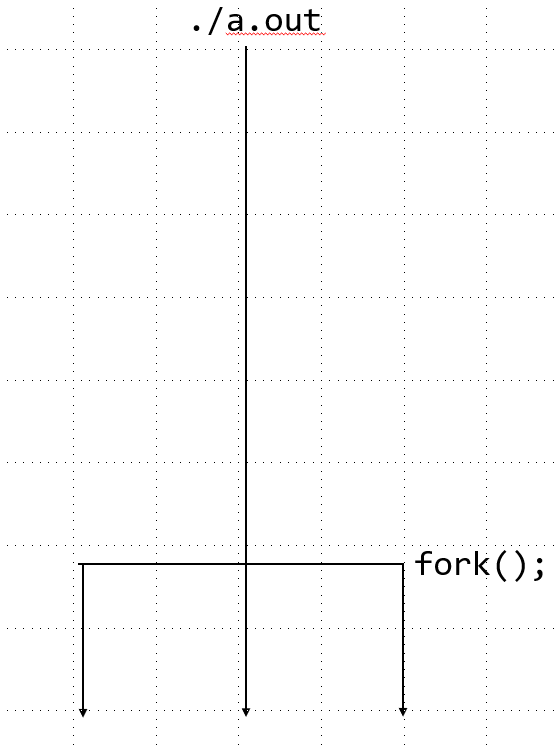
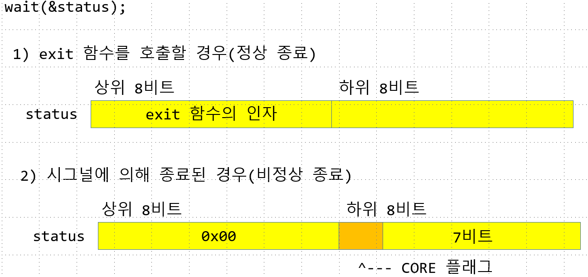
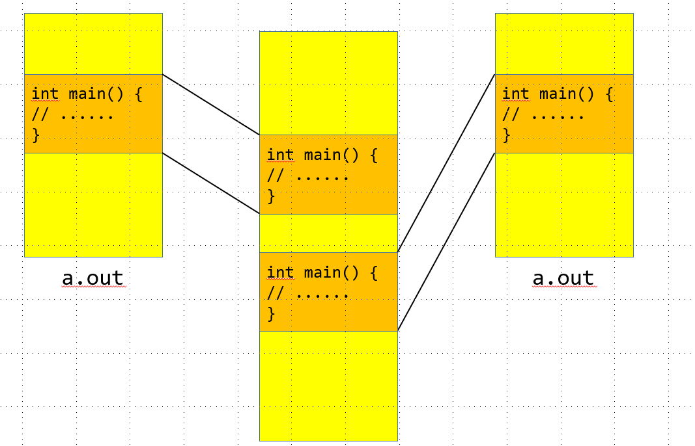
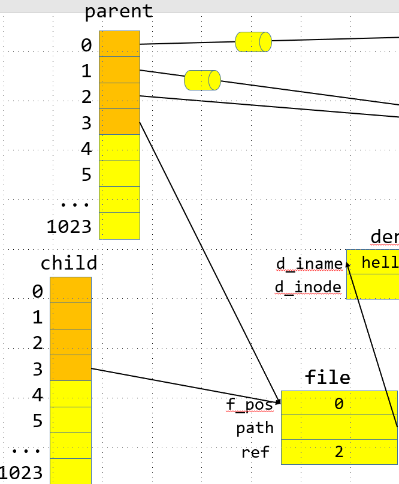
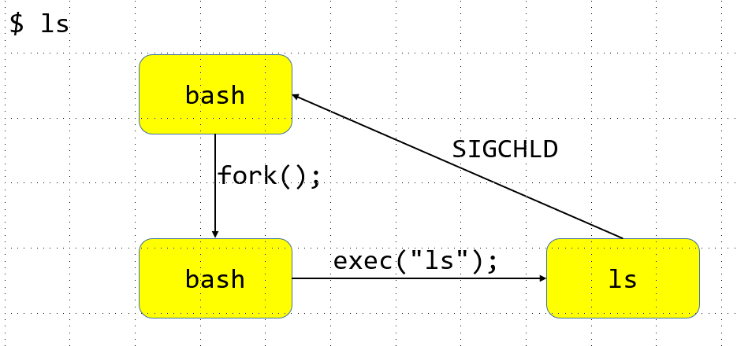

# SIGNAL의 등록 및 해제
<br/>
```c
  1 // 5_signal.c
  2
  3 #include <stdio.h>
  4 #include <unistd.h>
  5 #include <signal.h>
  6
  7
  8 void sigHandler(int signo) {
  9     if (signo == SIGINT) {
 10         printf("cought SIGINT\n");
 11         if(signal(SIGINT, SIG_DFL)== SIG_ERR) {//SIGINT를 SIG DEFAULT와
 12             perror("signal");
 13             exit(1); //signal에서 오류는 해결 할 수 없으므로 exit
 14         }
 15     }
 16 }
 17
 18 //시그널 펜딩 (보류)
 19 //1. 차단과 해제
 20 void showMask() {
 21     sigset_t curMask;
 22     if(sigprocmask(0, NULL, &curMask) == -1) {
 23         perror("sigprocmask");
 24         return;
 25     }
 26
 27     printf("blocked signal list: \n");
 28     if(sigismember(&curMask, SIGINT)) printf("SIGINT");
 29     if(sigismember(&curMask, SIGQUIT)) printf("SIGQUIT");
 30     if(sigismember(&curMask, SIGALRM)) printf("SIGALRM");
 31     printf("\n");
 32 }
 33 int main (){
 34     // SIGINT에 대한 핸들러를 등록
 35     if (signal(SIGINT, sigHandler)== SIG_ERR ) {
 36         perror("signal");
 37         return -1;
 38     }
 39
 40     // 시그널 마스크 데이터 생성 및 초기화
 41     sigset_t newMask; // struct
 42     if(sigemptyset(&newMask) == -1) {
 43         perror("sigemptyset");
 44         return -1;
 45     }
 46
 47     //차단할 시그널 설정
 48     if(sigaddset(&newMask, SIGINT)== -1) {
 49         perror("sigaddset");
 50         return -1;
 51     }
 52     sigset_t oldMask;
 53     if(sigprocmask(SIG_BLOCK, &newMask, &oldMask) == -1) {
 54         perror("sigprocmask");
 55         return -1;
 56     }
 57     //차단할 시그널 등록
 58     printf("press CTRL + C\n");
 59     sleep(10);
 60
 61     // 블록된 시그널이 있는지 확인
 62     sigset_t pendingMask;
 63     if(sigpending(&pendingMask) == -1) {
 64         perror("sugpending");
 65         return -1;
 66     }
 67
 68     int ret = sigismember(&pendingMask, SIGINT); //SIGINT가 있는지 확인
 69     if(ret == -1 ) {
 70         perror("sigismember");
 71         return -1;
 72     }
 73     else if(ret == 1) {
 74         printf("\nSIGINT is pending...\n");
 75     }
 76     if(sigprocmask(SIG_SETMASK, &oldMask, NULL)== -1) {
 77         perror("sigporcmask");
 78         return -1;
 79     }
 80
 81     printf("SIGINT unblocked\n");
 82     printf("press CTRL +C \n");
 83     sleep(10);
 84
 85     return 0;

```
```s
linux@ubuntu:~/0622$ gcc 2_signal.c
linux@ubuntu:~/0622$ ./a.out
press CTRL + C #signal 등록
^C

SIGINT is pending...
cought SIGINT  #signal 받기
SIGINT unblocked #signal 해제
press CTRL +C
^C #SIGINT의 등록이 해제 되었기 때문에 ctrl +c 했을 때 종료
```
> 해당하는 SIGNAL을 무시하지 못하는 경우.
---
# Process
1. 개념 
    - 프로그램 : 바이너리 또는 프로그램은 물리적인 저장장치에 컴파일되어 기록된 코드
    - 프로세스 : 실행중인 프로그램, 프로세스는 로드된 바이너리 코드와 가상화된 메모리의 인스턴스, 커널 리소스, 기타 사용자 관련 정보와 하나 이상의 쓰레드를 포함한 것.<br/>

>window 같은 경우의 createProcess 코드<br/>


상당히 복잡하다.

---
## Process id
리눅스에서 프로세스를 식별하기 위해 사용되는 값
- 보통 0~32768 사이의 값을 사용(하위 호환성 보장을 위해 해당 값을 default로 두고 사용한다.)
---
### getpid
```
NAME
       getpid, getppid - get process identification

SYNOPSIS
       #include <sys/types.h>
       #include <unistd.h>

       pid_t getpid(void);
       pid_t getppid(void);

DESCRIPTION
       getpid()  returns the process ID (PID) of the calling process.  (This is often used by routines that gener‐
       ate unique temporary filenames.)

       getppid() returns the process ID of the parent of the calling process.  This will be either the ID  of  the
       process  that  created this process using fork(), or, if that process has already terminated, the ID of the
       process to which this process has been reparented (either init(1) or a "subreaper" process defined via  the
       prctl(2) PR_SET_CHILD_SUBREAPER operation).

ERRORS
       These functions are always successful.

CONFORMING TO
       POSIX.1-2001, POSIX.1-2008, 4.3BSD, SVr4.
```
```c
  1 #if 0
  2 // 3_process.c
  3 #include <stdio.h>
  4 #include <sys/types.h>
  5 #include <unistd.h>
  6
  7
  8 int main() {
  9     pid_t pid = getpid(); //process id를 받아 오는 코드
 10     printf("pid = %d\n", pid); //ps -ef명령어로 동일한 값 출력가능.
 11
 12     return 0;
 13 }
 14 #endif

```
```s
linux@ubuntu:~/0622$ ./a.out
pid = 2528

linux@ubuntu:~/0622$ ps -ef
linux      2442   2328  0 18:34 pts/1    00:00:00 vi 3_process.c
linux      2500   1828  0 18:40 pts/0    00:00:00 ps -ef
#a.out과 다른 값
```
---
### fork
코드 실행 중 fork() 라는 함수를 만나는 순간<br/>
코드가 복제되어 코드가 두번 실행되게 된다.<br/>

```c
 15 #if 1
 16 #include <stdio.h>
 17 #include <sys/types.h>
 18 #include <unistd.h>
 19
 20
 21 int main() {
 22     fork(); //process를 복제생성하는 코드
 23     printf("hello world\n");
 24     return 0;
 25 }
 26 #endif
```
```s
linux@ubuntu:~/0622$ gcc 3_process.c
linux@ubuntu:~/0622$ ./a.out
hello world
hello world # 복제되어 두번실행되었다
```

fork 함수를 호출한 프로세스 : 부모 프로세스<br/>
fork 함수에 의해 생성된 프로세스 : 자식 프로세스 <br/>
 <br/>


복제된 프로세스 코드 구분
```
NAME
       fork - create a child process
# fork를 생성한 쪽이 부모 프로세스이기 때문에 자식 프로세스를
생성한다고 표현한다

RETURN VALUE
       On success, the PID of the child process is returned in the parent, and 0 is returned  in  the  child.   On
       failure, -1 is returned in the parent, no child process is created, and errno is set appropriately.

# fork의 함수가 성공적으로 실행 시 child 내부에서 0을 return 아니면 1을 return 한다
```
fork 함수가 호출된 이후에 어떤 프로세스가 먼저 실행될지 알수 없다.<br/>

- 리눅스는 윈도우즈와 달리 프로세스의 복제를 통해 새로운 프로세스 생성
    - 해당 프로세스 복제시 부모 프로세스가 가진 속성들은 그대로 복제가 된다.
  
부모의 프로세스중 복제가 되지않는 속성
1. 자식 프로세스의 아이디(PID) 새롭게 할당.
2. 자식 프로세스의 부모아이디는 부모프로세스의 아이디가 됨
3. 자식 프로세스의 리소스 통계 값은 모두 0으로 초기화 됨
4. 파일 락(거의 사용되지 않음) 상속되지 않는다.
5. 부모 프로세스의 시그널 처리 동작은 자식에게 상속되지만 대기(pending)중인 시그널은 사라짐

***

## Process 종료
* 정상종료
1. exit 사용 or main함수의 반환(exit( main() )); - 정상 종료
2. _exit 사용(exit내부에서 호출되는 syscall) - 정상종료<br/>

<br/>

* 비정상종료
1. abort 함수 호출(SIGABRT 시그널) ex) assert();
2. 커널이 발생한 시그널에 의해서 종료 ex) 0으로 나눈 경우, 잘못된 메모리 참조
---
### Process의 종료처리
1. 프로세스가 연 파일을 모두 닫는다
2. 프로세스가 사용한 메모리를 모두 가용 메모리 풀(pool)로 변환
    - 프로세스는 사용가능한 메모리를 가지고있다 
    - 해당 메모리 사용 후 가용한 메모리 풀에 집어넣는다.
    - 프로세스가 종료될 때 메모리 풀에 반환하지 않는다면 메모리 누수가 발생한다
3. exit 함수는 표준 입출력 정리 루틴을 실행하고 _exit를 호출.
    - 열린 파일 스트림에 대해 fclose 함수를 버퍼에 남은 데이터 flush
4. _exit 함수는 종료 상태 값을 부모에게 전달
    - ex) exit(1); -> 1에 대한 값이 부모에게 전달됨.
---
global, local, heap 영역에 대해 변수를 생성하고<br/>
부모로 부터 자식프로세스가 복제를 하는지 확인.
```c
  2 #include <stdio.h>
  3 #include <sys/types.h>
  4 #include <unistd.h>
  5 #include <stdlib.h>
  6
  7 const char *global = "global"; //data area
  8
  9 int main() {
 10     const char *local = "local"; //stack area
 11
 12     char **str = malloc(sizeof(char**)); //heap area
 13     if(str == NULL) {
 14         perror("malloc");
 15         return -1;
 16     }
 17     *str = "heap";
 18
 19     pid_t pid = fork(); //process를 복제생성하는 코드
 20
 21     if(pid > 0 ) {
 22
 23         printf("[parent] %s %s %s\n", global, local, *str);
 24     }
 25     else if(pid == 0) {
 26         printf("[child] %s %s %s\n", global, local, *str);
 27                                         //순서에 의해 코드를 짤때 부모가 먼저 실행된다고 가정하면 안된다.
 28     }
 29     else {
 30         perror("fork");
 31         return -1;
 32     }
 33
 34     return 0;
 35 }
```
```s
linux@ubuntu:~/0622$ ./a.out
[parent] global local heap
[child] global local heap
```

잘 복제하는것 같으나 사실 아니다<br/>
그렇다면 자식의 프로세스에서 값을 수정해도 자식 프로세스에 영향이 없어야한다
```c
  2 #include <stdio.h>
  3 #include <sys/types.h>
  4 #include <unistd.h>
  5 #include <stdlib.h>
  6
  7 const char *global = "global"; //data area
  8
  9 int main() {
 10     const char *local = "local"; //stack area
 11
 12     char **str = malloc(sizeof(char**)); //heap area
 13     if(str == NULL) {
 14         perror("malloc");
 15         return -1;
 16     }
 17     *str = "heap";
 18
 19     pid_t pid = fork(); //process를 복제생성하는 코드
 20
 21     if(pid > 0 ) {
 22         sleep(3);
 23         printf("[parent] %s %s %s\n", global, local, *str);
 24     }
 25     else if(pid == 0) { //자식의 process 값 변경
 26         global = "GLOBAL"; 
 27         local = "LOCAL";
 28         *str = "HEAP";
 29
 30         printf("[child] %s %s %s\n", global, local, *str);
 31                                         //순서에 의해 코드를 짤때 부모가 먼저 실행된다고 가정하면 안된다.
 32     }
 33     else {
 34         perror("fork");
 35         return -1;
 36     }
 37
 38     return 0;
 39 }
```
```s
linux@ubuntu:~/0622$ ./a.out
[child] GLOBAL LOCAL HEAP
[parent] global local heap
```

fork를 하면 프로세스가 복제가 안된다고 하는데 자식의 값만 바뀌고 <br/>
부모의 값은 바뀌지 않았다<br/>
만약 복제의 개념이 아니라면<br/>
child에서 값을 변환하여도 값이 변하면 안됬었다.<br/>

왜이럴까.

---
# 메모리의 복제
하나의 코드를 서로다른 프로세스가 공유한다.<br/>
실제로 fork를 실행하게되면 기계어코드는 복사되지 않는다.<br/>
운영체제 입장에서 프로세스 복사는 성능상의 이슈가 존재할 만큼 복잡하다.<br/>

그래서 코드를 공유하고있다가<br/>

자식이나 부모에서 값의 변경이 일어나는 순간 메모리를 실질적으로 복제가 이루어진다. <br/>

>COW - copy write 기법


---
```c
 42 #if 1
 43 #include <stdio.h>
 44 #include <sys/types.h>
 45 #include <unistd.h>
 46 #include <fcntl.h>
 47 #include <stdlib.h>
 48
 49
 50 int main(int argc, char **argv) {
 51     if(argc != 2) {
 52         fprintf(stderr, "usage : %s FILE\n", *argv);
 53         return -1;
 54     }
 55     --argc, ++argv;
 56
 57     int fd = open(*argv, O_RDONLY);
 58     if(fd < 0 ) {
 59         perror("open");
 60         return -1;
 61     }
 62     pid_t pid = fork();
 63     if(pid > 0 ) {
 64         sleep(3);
 65         printf("[parent] ");
 66
 67         char buf[10];
 68         int nRead = read(fd, buf, sizeof(buf));
 69         if(nRead < 0 ) {
 70             perror("read");
 71             return -1;
 72         }
 73
 74         buf[nRead] = '\0';
 75         printf("%s\n", buf);
 76     }
 77     else if (pid ==0 ) {
 78         close(fd); //부모의 파일 닫아버림
 79         return 0;
 80     }
 81     else {
 82         perror("fork()");
 83         return -1;
 84     }
 85     close(fd);
 86     return 0;
 87 }
 88 #endif
```
```s
linux@ubuntu:~/0622$ ./a.out 4_process.c
[parent] #if 0
#inc
```
fork 후 자식 프로세스는 부모 프로세스가 열고 있는 파일 식별자도 복사됨<br/>

하지만 자식 프로세스가 해당 파일을 닫는다 하더라도 부모에게 영향이 없음<br/>


자식 프로세스에서도 10byte를 읽게된다면
```c
 else if (pid ==0 ) {
125         printf("[child] ");
126
127         char buf[10];//마찬가지로 10byte를 읽고 닫았다.
128         int nRead = read(fd, buf, sizeof(buf));
129         if(nRead < 0 ) {
130             perror("read");
131             return -1;
132         }
133
134         buf[nRead] = '\0';
135         printf("%s\n", buf);
136
137         close(fd); //부모의 파일 닫아버림
138         return 0;
139     }
```
```s
linux@ubuntu:~/0622$ ./a.out 4_process.c
[parent] #if 0
#inc
linux@ubuntu:~/0622$ [child] lude <stdi
```
파일의 offset을 공유하여 사용하기 때문에<br/>
부모프로세스가 10byte를 읽고난 다음의 offset위치에서<br/>
자식프로세스가 10byte를 읽게된다.<br/>

>같은 offset을 공유하는 모습.<br/>



따라서 부모로부터 물려 받은 파일 descriptor에 대하여 필요하지 않는 것들은 모두 닫아 주는 것이 좋다.<br/>

---
```c
  1 //5_child.c
  2 #include <sys/types.h>
  3 #include <unistd.h>
  4 #include <stdio.h>
  5
  6 int main () {
  7     pid_t pid = fork();
  8     if(pid < 0 ) {
  9         perror("fork");
 10         return -1;
 11     }
 12     else if(pid ==0 ) { //child
 13         for(int i = 0 ; i < 5; i++ ) {
 14             sleep(1);
 15             printf("[child] do something...\n");
 16         }
 17         return 0;
 18     }
 19     while(1) { //부모에서도 똑같이 실행되는 printf
 20         sleep(1);
 21         printf("[parent] do something...\n");
 22     }
 23     return 0;
 24 }
```
```s
linux@ubuntu:~/0622$ gcc 5_child.c
linux@ubuntu:~/0622$ ./a.out
[parent] do something...
[child] do something...
[parent] do something...
[child] do something...
[parent] do something...
[child] do something...
[child] do something...
[parent] do something...
[child] do something...
[parent] do something...
[parent] do something...
[parent] do something...
[parent] do something...
[parent] do something...
[parent] do something...
[parent] do something...

# 실행되는 동안에 ps -ef 실행 시
linux@ubuntu:~/0622$ ps -ef
linux      2923   1828  0 20:04 pts/0    00:00:00 ./a.out
linux      2924   2923  0 20:04 pts/0    00:00:00 [a.out] <defunct>


# 2923으로 부모 프로세스의 PID가 만들어져있고
# 자식프로세스가 2924로 PID를 받아 PPID를 부모의 프로세스인 2923을 받고있다.

#defunct = 정신은 없는데 육체만 돌아다니는 : 좀비프로세스

```
자식입장에서 부모에게 자신이 왜 종료되는지 알려주어야한다

우리가 main함수를 작성하고 마지막에 return 하여 상수값을 반환할 때 
main함수가 종료 될 때 프로세스가 종료되는데 이 때의 return 값은 자신이 어떻게 죽었는지 부모에게 알려주는 종료코드이다.
>shell에서는 $? 으로 종료코드를 읽을 수 있다

부모프로세스가 자식프로세스를 해제할때 종료코드가 저장되어있는 정보를 메모리에 남기는데 이것이 바로 좀비프로세스이다

좀비프로세스가 양산되지 않으려면 자식의 종료코드를 반드시 읽어야한다

종료코드를 읽기위해 제공되는 함수

---
## wait
 ```
 NAME
       wait, waitpid, waitid - wait for process to change state

SYNOPSIS
       #include <sys/types.h>
       #include <sys/wait.h>

       pid_t wait(int *wstatus); 
       상대방의 종료코드를 읽어옴

       pid_t waitpid(pid_t pid, int *wstatus, int options);

       int waitid(idtype_t idtype, id_t id, siginfo_t *infop, int options);
                       /* This is the glibc and POSIX interface; see
                          NOTES for information on the raw system call. */

   Feature Test Macro Requirements for glibc (see feature_test_macros(7)):
 ```
 ```c
  28 //5_child.c
 29 #include <sys/types.h>
 30 #include <unistd.h>
 31 #include <stdio.h>
 32 #include <sys/wait.h>
 33
 34
 35 int main () {
 36     pid_t pid = fork();
 37     if(pid < 0 ) {
 38         perror("fork");
 39         return -1;
 40     }
 41     else if(pid ==0 ) { //child
 42         for(int i = 0 ; i < 5; i++ ) {
 43             sleep(1);
 44             printf("[child] do something...\n");
 45         }
 46         return 0;
 47     }
 48     int exit_code; //자식의 프로세스에서 종료코드를 읽어온다.
 49     wait(&exit_code);
 50     printf("exit code from child:%d\n", exit_code);
 51     while(1) { //부모에서도 똑같이 실행되는 printf
 52         sleep(1);
 53         printf("[parent] do something...\n");
 54     }
 55     return 0;
 56 }
 ```
 ```s
 linux@ubuntu:~/0622$ gcc 5_child.c
linux@ubuntu:~/0622$ ./a.out
[child] do something...
[child] do something...
[child] do something...
[child] do something...
[child] do something...
exit code from child:0
[parent] do something...
[parent] do something...
[parent] do something...
[parent] do something...
[parent] do something...
[parent] do something...
[parent] do something...
[parent] do something...


linux      2984   1828  0 20:15 pts/0    00:00:00 ./a.out
linux      2986   2328  0 20:16 pts/1    00:00:00 ps -ef
 ```
 ---
 ```c
 else if(pid ==0 ) { //child
 42         for(int i = 0 ; i < 5; i++ ) {
 43             sleep(1);
 44             printf("[child] do something...\n");
 45         }
 46         return 100; //자식의 return 값이 100인데
 47     }
 ```
 ```s
 linux@ubuntu:~/0622$ gcc 5_child.c
linux@ubuntu:~/0622$ ./a.out
[child] do something...
[child] do something...
[child] do something...
[child] do something...
[child] do something...
exit code from child:25600 #25600을 가져온다..
[parent] do something...
[parent] do something...
[parent] do something...
[parent] do something...
 ```
 >exit_code는 int로 선언되었지만
 linux에서는 정상종료와 비정상종료를 구별하기위해
 상위 비트에는 정상종료를
 하위 비트에는 비정상종료를 저장한다.
 즉 정상종료만 bit연산이 수행되고 비정상종료는 그렇지 않다.
 
 100을 left shift 8로 밀게되면 25600 이 나온다.

 제대로된 값을 보기 위해선
 ```c
printf("exit code from child:%d\n", (exit_code >> 8) & 0xFF);
//비트연산해준다
 ```
 ```s
 linux@ubuntu:~/0622$ ./a.out
[child] do something...
[child] do something...
[child] do something...
[child] do something...
[child] do something...
exit code from child:100
[parent] do something...
[parent] do something...
 ```
표준 방법 
- exit에서 제공해주는 macro 함수 사용.
 ```c
printf("exit code from child:%d\n", WEXITSTATUS(exit_code));
 ```
---
## 자식프로세스의 종료 코드
 정상종료를 하게된다면 (exit) 상위 8bit를 사용하게 되지만
 비정상종료(signal)을 하게된다면 상위 8bit를 사용하지 않는다.
비정상종료는 ctrl + q(QUIT) 를 사용하는데
QUIT는 core dump를 생성한다.하위 8비트 내부의 최상위 1비트는 core flag를 가지게 된다.


```c
 62 #include <sys/types.h>
 63 #include <unistd.h>
 64 #include <stdio.h>
 65 #include <sys/wait.h>
 66 #include <stdlib.h>
 67
 68 int main () {
 69     pid_t pid = fork();
 70     if(pid < 0 ) {
 71         perror("fork");
 72         return -1;
 73     }
 74     else if(pid ==0 ) { //child
 75         for(int i = 0 ; i < 5; i++ ) {
 76             sleep(1);
 77             printf("[child] do something...\n");
 78         }
 79         abort(); //비정상종료시
 80         //return 100;
 81     }
 82     int exit_code; //자식의 프로세스에서 종료코드를 읽어온다.
 83     wait(&exit_code);
 84
 85     if ((exit_code & 0xFF) == 0 ) { //정상 종료 모든 값들이 상위 8bit에 세팅 되므로.
 86         printf("exit_a code :%d\n", WEXITSTATUS(exit_code));
 87     }
 88     else { // 비정상종료
 89         printf("exit_s code :%d\n", WTERMSIG(exit_code));
 90
 91     }
 92     while(1) { //부모에서도 똑같이 실행되는 printf
 93         sleep(1);
 94         printf("[parent] do something...\n");
 95     }
 96     return 0;
 97 }
```
```s
linux@ubuntu:~/0622$ ./a.out
[child] do something...
[child] do something...
[child] do something...
[child] do something...
[child] do something...
exit_s code :6
[parent] do something...
[parent] do something...
```
비정상 종료시 SIGABRT의 값(6)을 return 한다.

그러나 해당 코드는 멀티프로세스를 이용하는 의미가없어져있다.
```s
linux@ubuntu:~/0622$ ./a.out
[child] do something...
[child] do something...
[child] do something...
[child] do something...
[child] do something...
exit_s code :6
[parent] do something...
[parent] do something...

#자식의 프로세스가 모두다 실행되어야 부모의 프로세스가 실행된다.
# 즉 wait는 부모의 프로세스가 자식의 프로세스의 return 값이 오기전까지
# 멈춰있게된다 -> 코드가 병행성으로 동작하지 않는다는 문제가 생긴다

```
자식의 종료코드도 읽고(좀비프로세스 억제) <br/>
부모와 자식이 병행성으로 동작할 수 있게 코드 작성.

---

## SIGNAL을 이용한 프로세스 병행처리
```s
[parent] do something...
[child] do something...
[parent] do something...
[child] do something...
[parent] do something...
[child] do something...
[child] do something...
[parent] do something...
[child] do something...
```
동시에 수행되는것이 아니지만 동시수행처럼 보이는것을 병행성이라고 말한다

자식의 프로세스 끝나는 시점을 알 수 없어서 부모프로세스는 wait를 사용 시 자식프로세스가 종료될 때까지 기달려야한다.

부모는 wait로 기다리고 있다가 SIGNAL로 SIGCHLD(17)이 오게되면 자식의 종료코드를 읽게 되고 다시 부모프로세스를 수행한다.

```c
  1 //5_child.c
  2 #include <sys/types.h>
  3 #include <unistd.h>
  4 #include <stdio.h>
  5 #include <sys/wait.h>
  6 #include <stdlib.h>
  7 void sigHandler(int signo) {
  8         if(signo == SIGCHLD) {
  9         int exit_code; //자식의 프로세스에서 종료코드를 읽어온다.
 10         wait(&exit_code);
 11         printf("status : %d \n", WEXITSTATUS(exit_code));
 12
 13     }
 14 }
 15 int main () {
 16     //자식의 종료코드를 읽어오기위해 핸들러 설치
 17     if (signal(SIGCHLD, sigHandler) == SIG_ERR) {
 18         perror("signal");
 19         return -1;
 20     }
 21     pid_t pid = fork();
 22     if(pid < 0 ) {
 23         perror("fork");
 24         return -1;
 25     }
 26     else if(pid ==0 ) { //child
 27         for(int i = 0 ; i < 5; i++ ) {
 28             sleep(1);
 29             printf("[child] do something...\n");
 30         }
 31         return 10;
 32     }
 33     while(1) { //부모에서도 똑같이 실행되는 printf
 34         sleep(1);
 35         printf("[parent] do something...\n");
 36     }
 37     return 0;
 38 }
```
```s
linux@ubuntu:~/0622$ gcc 6_child.c
linux@ubuntu:~/0622$ ./a.out
[parent] do something...
[child] do something...
[parent] do something...
[child] do something...
[parent] do something...
[child] do something...
[parent] do something...
[child] do something...
[parent] do something...
[child] do something...
status : 10
[parent] do something...
[parent] do something...
```
위의 코드는 두개 이상의 자식에대해서 종료코드를 읽어올 수 없다.
```c
 44 #include <sys/types.h>
 45 #include <unistd.h>
 46 #include <stdio.h>
 47 #include <sys/wait.h>
 48 #include <stdlib.h>
 49 #include <signal.h>
 50 void sigHandler(int signo) {
 51         if(signo == SIGCHLD) {
 52         int exit_code; //자식의 프로세스에서 종료코드를 읽어온다.
 53         wait(&exit_code);
 54         printf("status : %d \n", WEXITSTATUS(exit_code));
 55
 56     }
 57 }
 58 int main () {
 59     //자식의 종료코드를 읽어오기위해 핸들러 설치
 60     if (signal(SIGCHLD, sigHandler) == SIG_ERR) {
 61         perror("signal");
 62         return -1;
 63     }
 64
 65     for(int i = 0 ; i < 10; i++ ) { //child를 10개 생성
 66         pid_t pid = fork();
 67         if(pid < 0 ) {
 68             perror("fork");
 69             return -1;
 70         }
 71         else if(pid ==0 ) { //child
 72             printf("\t\t created child : %d\n", i+1);
 73             sleep(5);
 74             return i+1;
 75         }
 76     }
 77     while(1) { //부모에서도 똑같이 실행되는 printf
 78         sleep(1);
 79         printf("[parent] do something...\n");
 80     }
 81     return 0;
 82 }

```
```s
linux@ubuntu:~/0622$ ./a.out
                 created child : 1
                 created child : 6
                 created child : 5
                 created child : 8
                 created child : 7
                 created child : 10
                 created child : 9
                 created child : 4
                 created child : 3
                 created child : 2
[parent] do something...
[parent] do something...
[parent] do something...
[parent] do something...
status : 1
status : 6
status : 4
status : 2
[parent] do something...
[parent] do something...
[parent] do something...
^C
```
child가 4개만 종료되고 나머지는 좀비프로세스가 되었다.
하나의 공간에 SIG_CHLD의 flag가 설정되어 fork되어질 때 마다 flag가 새로이 설정되어
그전의 child의 sigHandler를 처리하지 못하게된다.

```c
 50 void sigHandler(int signo) {
 51         if(signo == SIGCHLD) {
 52         int exit_code; //자식의 프로세스에서 종료코드를 읽어온다.
 53
 54         while (wait(&exit_code) > 0)//자식의 종료코드를 여러번 읽는 코드
 55         printf("status : %d \n", WEXITSTATUS(exit_code));
 56
 57     }
 58 }
```
자식이 동시에 죽는 경우에는 while문으로 연속적으로 종료코드를 읽어올수 있었지만
자식이 동시에 죽지 않는 경우에는 해당 while문으로 연속적으로 들어오지않아 올바르게 동작되어지지 않는다.  
```c
 87 #include <sys/types.h>
 88 #include <unistd.h>
 89 #include <stdio.h>
 90 #include <sys/wait.h>
 91 #include <stdlib.h>
 92 #include <signal.h>
 93 void sigHandler(int signo) {
 94         if(signo == SIGCHLD) {
 95         int exit_code; //자식의 프로세스에서 종료코드를 읽어온다.
 96
 97         while (wait(&exit_code) > 0)
 98         printf("status : %d \n", WEXITSTATUS(exit_code));
 99
100     }
101 }
102 int main () {
103     //자식의 종료코드를 읽어오기위해 핸들러 설치
104     if (signal(SIGCHLD, sigHandler) == SIG_ERR) {
105         perror("signal");
106         return -1;
107     }
108
109     for(int i = 0 ; i < 10; i++ ) {
110         pid_t pid = fork();
111         if(pid < 0 ) {
112             perror("fork");
113             return -1;
114         }
115         else if(pid ==0 ) { //child
116             printf("\t\t created child : %d\n", i+1);
117             sleep(i + 1); //1번째 자식 1초, 2번째자식 2초
118             return i+1;
119         }
120     }
121     while(1) { //부모에서도 똑같이 실행되는 printf
122         sleep(1);
123         printf("[parent] do something...\n");
124     }
125     return 0;
126 }
```
```s
linux@ubuntu:~/0622$ ./a.out
                 created child : 1
                 created child : 8
                 created child : 10
                 created child : 3
                 created child : 2
                 created child : 9
                 created child : 7
                 created child : 6
                 created child : 5
                 created child : 4
[parent] do something...
status : 1
status : 2
status : 3
status : 4
status : 5
status : 6
status : 7
status : 8
status : 9
status : 10
[parent] do something...
[parent] do something...
[parent] do something...
[parent] do something...
```
자식을 순차적으로 종료시킬수 있었지만 부모의 프로세스가 병행실행이 되지 않는다..

while문안의 wait는 자식의 종료코드가 와야하기 때문에 실행되지 않았다
자식의 프로세스가 종료코드를 보내지 않는이상 wait하지 않게 만든다.

---
### waitpid
```
 pid_t waitpid(pid_t pid, int *wstatus, int options);
```
기존의 wait에서 특정한 pid에 대해 option을 사용할 수 있는 함수.
```c
 93 void sigHandler(int signo) {
 94         if(signo == SIGCHLD) {
 95         int exit_code; //자식의 프로세스에서 종료코드를 읽어온다.
 96
 97         while (waitpid(-1, &exit_code, WNOHANG) > 0)
              //unsigned int의 -1은 42억이므로 모든 자식 프로세스를 말한다.
              //WNOHANG은 종료하는 자식코드가 없다면 바로 return하는 option
 98         printf("status : %d \n", WEXITSTATUS(exit_code));
 99
100     }
101 }
```
```s
linux@ubuntu:~/0622$ gcc 6_child.c
linux@ubuntu:~/0622$ ./a.out
                 created child : 1
                 created child : 10
                 created child : 7
                 created child : 4
                 created child : 3
                 created child : 8
                 created child : 5
                 created child : 2
                 created child : 6
                 created child : 9
[parent] do something...
[parent] do something...
status : 1
[parent] do something...
[parent] do something...
status : 2
status : 3
[parent] do something...
status : 4
[parent] do something...
status : 5
[parent] do something...
status : 6
[parent] do something...
status : 7
[parent] do something...
status : 8
[parent] do something...
[parent] do something...
status : 9
[parent] do something...
```
병행실행도 잘되고 자식프로세스의 종료코드도 완벽하게 읽어온다.

---
자식의 부모 프로세서또한 어떤 프로세스의 자식 프로세스이므로
부모의 프로세스가 잘못된 수행으로 인해 부모 프로세스가 종료될 시 

남는 자식 프로세스를 고아 프로세스라고 한다.

모든 프로세스는 init에서 파생되기 때문에
linux에서는 모든 고아프로세스를 init에 입양시킨다.

---
# 프로그램의 실행
리눅스는 프로그램을 실행할 때 , 기존 프로세스를 복제한 다음 실행할 프로그램의 기계어 코드를 고체하여 수행한다
```s
linux@ubuntu:~/0622$ ls # 해당코드의 동작여부.
1_signal.c  2_signal.c  3_process.c  4_process.c  5_child.c  6_child.c  a.out
```

- exec의 동작과정
## exec
```
NAME
       execl, execlp, execle, execv, execvp, execvpe - execute a file

SYNOPSIS
       #include <unistd.h>


       extern char **environ;

       int execl(const char *path, const char *arg, ...
                       /* (char  *) NULL */);
       int execlp(const char *file, const char *arg, ...
                       /* (char  *) NULL */);
       int execle(const char *path, const char *arg, ...
                       /*, (char *) NULL, char * const envp[] */);
       int execv(const char *path, char *const argv[]);
       int execvp(const char *file, char *const argv[]);
       int execvpe(const char *file, char *const argv[],
                       char *const envp[]);

   Feature Test Macro Requirements for glibc (see feature_test_macros(7)):

       execvpe(): _GNU_SOURCE
```
---
```c
  1 //text.c
  2 #include <stdio.h>
  3
  4 int main(int argc, char** argv) {
  5     for(int i = 0 ; i < argc; i++ ) {
  6         printf("argv[%d] = %s\n", i , argv[i]);
  7     }
  8     return 0;
  9 }
```
출력할 text.c out파일 text를 만들어둔다.

execl의 함수를 사용 text 프로그램을 실행한다.
실행할 명령행의 인자를 리스트로 받아 실행한다.
받는 경로는 상대경로 또는 절대경로를 반드시 사용.

마지막인자는 가변인자로 NULL값을 주어 외부로부터 받아온다.
```c
  6 #include <stdio.h>
  7 #include <unistd.h>
  8
  9
 10 int main() {
 11     execl("./text", "text", "hello", "world", (char*)NULL);
 12     printf("dead code...\n"); //dead code, unrachable code
 13     return 0;
 14 }
```
```s
linux@ubuntu:~/0622$ gcc 7_exec.c
linux@ubuntu:~/0622$ ./a.out
argv[0] = text
argv[1] = hello
argv[2] = world
```
execv
명령행을 벡터, 배열형태로 전달
경로는 상대경로 또는 절대 경로를 반드시 사용
```c
 17 #include <stdio.h>
 18 #include <unistd.h>
 19
 20
 21 int main() {
 22     //int execv(const char *path, char *const argv[]);
 23     char *args[] = {"text", "hello", "world", (char*)NULL};
 24     if(execv("./text", args)== -1) {
 25         printf("dead code...\n"); //dead code, unrachable code
 26         return 0;
 27     }
 28 }
```
```s
linux@ubuntu:~/0622$ gcc 7_exec.c
linux@ubuntu:~/0622$ ./a.out
argv[0] = text
argv[1] = hello
argv[2] = world
```
---
execlp
execvp
execl과 execv와 동일한데 다만 path로부터 명령어를 찾는다.
```c
 31 #include <unistd.h>
 32
 33 int main() {
 34     //execlp("vim", "vim", "./text.c", (char*)NULL); 
 35
 36
 37     char* args[] = {"vim", "./text.c", (char*)NULL};
 38     execvp("vim", args); // 해당변수 전달인자를 vim으로 연다.
 39     return 0;
 40 }
```
---
- 연습문제
   - System 함수와 동일한 기능을하는 mysystem함수 구현
   - 프롬프트가 %%인 셀을 구현
```s
%% ls
a.c b.c c.c a.out
%%
```
---
### pipe
```
NAME
       pipe, pipe2 - create pipe

SYNOPSIS
       #include <unistd.h>

       int pipe(int pipefd[2]);

       #define _GNU_SOURCE             /* See feature_test_macros(7) */
       #include <fcntl.h>              /* Obtain O_* constant definitions */
       #include <unistd.h>

       int pipe2(int pipefd[2], int flags);

```
```c
  2 #include <fcntl.h>
  3 #include <unistd.h>
  4 #include <stdio.h>
  5
  6 enum {READ, WRITE};
  7 int main() {
  8     int pfd[2]; //int pipe(int pipefd[2]);
  9     if(pipe(pfd) == -1) {
 10         perror("pipe");
 11         return -1;
 12     }
 13     write(pfd[WRITE], "hello", 5);
 14
 15     char buf[BUFSIZ] = {0, };
 16     int nRead = read(pfd[READ], buf, sizeof(buf));
 17     if(nRead < 0) {
 18             perror("read");
 19             return -1;
 20     }
 21     buf[nRead] = '\0';
 22     printf("%s\n", buf);
 23
 24     return 0;
 25 }
```
---
```s
linux@ubuntu:~/0622$ ./a.out
hello
```
그러나 해당코드는 단일 프로세스에서 의미가 없다.

서로다른 프로세스끼리 동일한 pipe를 쓰려면?
fork 사용 부모의 파일 descriptor를 상속받기 때문에
부모와 동일한 pipe를 쓸 수 있다.