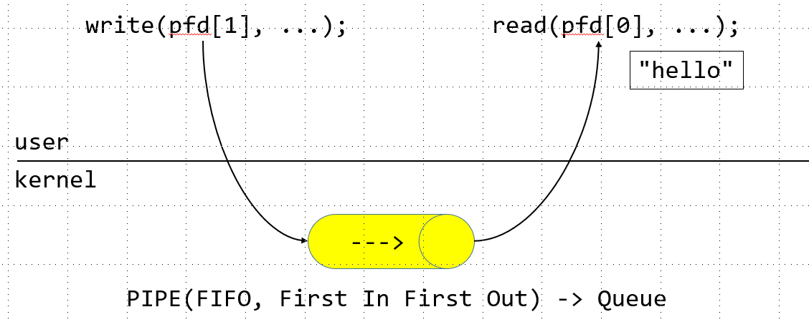
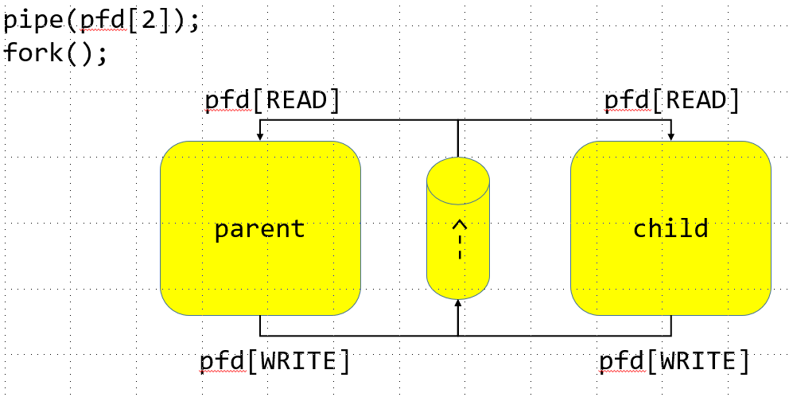
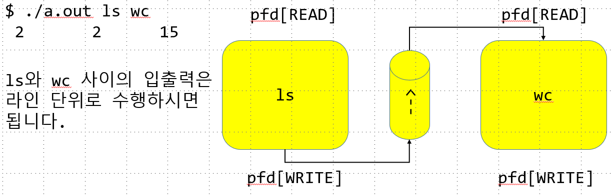
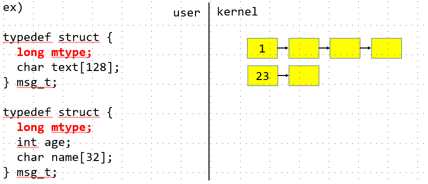
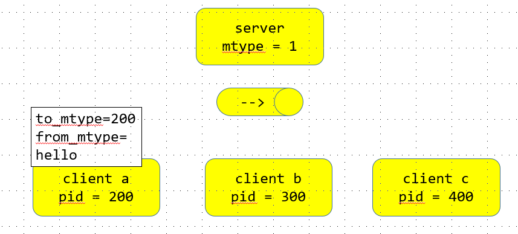

# pipe
```
The following program creates a pipe, and then fork(2)s to create a child  process;
the child inherits a duplicate set of file descriptors that refer to the same pipe.
After the fork(2), each process closes the file descriptors that  it  doesn't  need
for  the  pipe  (see  pipe(7)).  The parent then writes the string contained in the
program's command-line argument to the pipe, and the child reads this string a byte
at a time from the pipe and echoes it on standard output.
```
<br/>
부모와 자식 모두 descriptor를 통해 READ WRITE를 할수 있게 된다.<br/>

```c
  2 #include <unistd.h>
  3 #include <sys/types.h>
  4 #include <stdio.h>
  5 #include <errno.h>
  6 enum { READ, WRITE };
  7 int main() {
  8     int pfd[2];
  9     if(pipe(pfd) == -1) {
 10         perror("pipe");
 11         return -1;
 12     }
 13
 14     char buf[BUFSIZ];
 15     pid_t pid = fork();
 16     if (pid > 0) {
 17         //부모는 키보드로부터 입력 받은 데이터를 자식에게 전송할 것이므로
 18         //파이프의 읽기 디스크립터는 필요없음
 19         //필요없는 디스크립터는 닫아주는것이 좋다.
 20         close(pfd[READ]);//부모의 읽기 디스크립터를 닫아주었다
 21
 22
 23         while(1) {
 24             //키보드로부터 데이터를 읽는다.
 25             int nRead = read(0, buf, sizeof(buf));
 26             if (nRead < 0 ) {
 27                 perror("read");
 28                 return -1;
 29             }
 30             else if( nRead == 0 ) {//EOF
 31                 break;
 32             }
 33             //읽은 데이터를 파이프에 쓴다.
 34             write(pfd[WRITE], buf, nRead);
 35         }
 36         close(pfd[WRITE]);
 37
 38     }
 39     else if(pid ==0) {
 40         close(pfd[WRITE]);
 41
 42         while(1) {
 43             //파이프로부터 데이터를 읽어온다
 44             int nRead = read(pfd[READ], buf, sizeof(buf));
 45             if(nRead < 0 ) {
 46                 perror("read");
 47                 return -1;
 48             }
 49             else if (nRead ==0) {
 50                 break;
 51             }
 52             buf[nRead-1] = 0; //개행을 전에 널
 53             printf("%s\n", buf);
 54         }
 55         close(pfd[READ]);
 56     }
 57     else {
 58         perror("fork");
 59         return -1;
 60     }
 61     return 0;
 62 }
```
```s
```

```c
  2 #include <stdio.h>
  3 #include <unistd.h>
  4 #include <sys/types.h>
  5 #include <errno.h>
  6 enum { READ, WRITE };
  7 int main (int argc, char **argv) {
  8
  9     int pfd[2];
 10     if(pipe(pfd) == -1 ) {
 11         perror("pipe");
 12         return -1;
 13     }
 14     char buf[BUFSIZ];
 15     pid_t pid = fork();
 16     if( pid > 0 ) {
 17         close(pfd[READ]);
 18         while(1) {
 19         int nRead = read(0, buf, sizeof(buf));
 20         execlp("ls", "ls", "|", "wc", (char*)NULL );
 21         if(nRead < 0 ) {
 22             perror("read");
 23             return -1;
 24         }
 25         else if(nRead == 0) {
 26             break;
 27         }
 28             write(pfd[WRITE], buf, args);
 29         }
 30         close(pfd[WRITE]);
 31     }
 32
 33     else if(pid ==0 ) {
 34         close(pfd[WRITE]);
 35         while(1) {
 36             int nRead =read(pfd[READ], buf, sizeof(buf));
 37             if(nRead < 0 ) {
 38                 perror("read");
 39                 return -1;
 40             }
 41             else if( nRead == 0 ) {
 42                 break;
 43             }
 44             buf[nRead-1] = 0;
 45             printf("%s\n", buf);
 46
 47         }
 48         close(pfd[READ]);
 49     }
 50     else {
 51         perror("fork()");
 52         return -1;
 53
 54     }
 55     return 0;
 56 }
```
<br/>
exec 계열 함수가 호출에 성공할 경우

1. 프로세스의 주소 공간과 프로세스 이미지(코드) 가 변경
2. 대기중인 singal이 사라짐
3. 메모리 락이 해제됨
4. 스레드 속성 대부분이 기본 값으로 복원
5. 프로세스 통계(CPU 사용시간 등)들이 재설정됨
6. 메모리 매핑된 파일과 해당 프로세스의 메모리 주소 공간의 모든 내용이 사라짐
7. 사용자 영역에 존재하는 모든 내용이 사라짐

변경 되지 않는 것
- PID, PPID, 열린 파일 들은 그대로 유지된다.

pipe의 읽기를 가리키는 descriptor는 두개가 되며 
ls의 1번의 쓰기에 a.c가 들어오고
wc는 a.c를 0번째로 읽는다.
```c
 66 #include <unistd.h>
 67 #include <stdio.h>
 68 #include <sys/types.h>
 69 #include <unistd.h>
 70
 71 // ./a.out ls wc
 72
 73 enum { READ, WRITE };
 74 //argv[0 argv[1] argv[2]
 75 int main(int argc, char **argv) {
 76     if(argc!=3) {
 77         fprintf(stderr, "usage: %s cmd1 cmd2\n", *argv);
 78         return -1;
 79     }
 80
 81     const char *cmd1 = argv[1];
 82     const char *cmd2 = argv[2];
 83
 84     int pfd[2];
 85     if(pipe(pfd) == -1 ) {
 86         perror("pipe");
 87         return -1;
 88     }
 89     // ls | wc
 90     pid_t pid = fork();
 91     if(pid > 0 ) {
 92         close(pfd[READ]);
 93
 94         close(1);//stdout을 닫고 close fd_table[1];
 95         dup(pfd[WRITE]);//해당위치에 pipe연결
 96                         //fd_table[1] = fd_table[4];
 97         close(pfd[WRITE]); // close (fd_table[4]);
 98         execlp(cmd1, cmd1, (char*)NULL);
 99         return -1;
100     }
101     else if (pid ==0 ) {
102         close(pfd[WRITE]);
103         close(0);
104         dup(pfd[READ]);
105         execlp(cmd2, cmd2, (char*)NULL);
106         return -1;
107     }
108     else {
109         perror("fork");
110         return -1;
111     }
112
113 }
```
---
- 정리
  1. 목적 : 부모와 자식간의 통신(exec 계열 함수를 사용하여 서로 다른 프로세스 사이의 통신 가능)
  2. 매개체 : 파일(파이프)
  3. 통신단위 : 스트림
  4. 통신방향 : 단방향
  5. 가능범위 : 로컬 (서로다른 통신은 복잡하다.)

C 표준 라이브러리는 파이프를 사용하여 서로 다른 프로세스의 통신을 쉽게 할 수 있도록
popen 함수를 제공한다.

---
## popen
pipe를 래핑한 함수이다.
```
NAME
       popen, pclose - pipe stream to or from a process

SYNOPSIS
       #include <stdio.h>

       FILE *popen(const char *command, const char *type);

       int pclose(FILE *stream);
RETURN VALUE
       popen(): on success, returns a pointer to an open stream that can be used to read
       or  write  to  the pipe; if the fork(2) or pipe(2) calls fail, or if the function
       cannot allocate memory, NULL is returned.
```
```c
116 #include <stdio.h>
117 int main(int argc, char **argv) {
118     if(argc!=3) {
119         fprintf(stderr, "usage: %s cmd1 cmd2\n", *argv);
120         return -1;
121     }
122
123     const char *cmd1 = argv[1];
124     const char *cmd2 = argv[2];
125
126     FILE *src = popen(cmd1, "r"); //FILE *src = popen("ls" "r");
127     if(src == NULL ) {
128         perror("popen");
129         return -1;
130     }
131     FILE *dst = popen(cmd2, "w");
132     if(dst == NULL ) {
133         perror("popen");
134         return -1;
135     }
136
137     char buf[BUFSIZ];
138     while(1) {
139         if(fgets(buf, sizeof(buf), src) == NULL) {
140             if(ferror(src)) {
141                 perror("fgets");
142                 return -1;
143             }
144             else if(feof(src)) {
145                 break;
146             }
147         }
148
149         fputs(buf, dst);
150     }
151
152     pclose(dst);
153     pclose(src);
154 }
```
---
## named pipe(mkfifo)
```
NAME
       mkfifo, mkfifoat - make a FIFO special file (a named pipe)

SYNOPSIS
       #include <sys/types.h>
       #include <sys/stat.h>

       int mkfifo(const char *pathname, mode_t mode);

       #include <fcntl.h>           /* Definition of AT_* constants */
       #include <sys/stat.h>

       int mkfifoat(int dirfd, const char *pathname, mode_t mode);

RETURN VALUE
    On  success  mkfifo()  and  mkfifoat()  return  0.  In the case of an
    error, -1 is returned (in which case, errno is set appropriately).

```
```c
  1 // 2_named_pipe.c
  2 #include <sys/types.h>
  3 #include <sys/stat.h>
  4 #include <stdio.h>
  5 #include <unistd.h>
  6 #include <fcntl.h>
  7
  8 int main(int argc, char **argv) {
  9     if(argc != 2) {
 10         fprintf(stderr, "usage: %s FIFO\n", *argv);
 11         return -1;
 12     }
 13     --argc, ++argv;
 14
 15     // int mkfifo(const char *pathname, mode_t mode);
 16     if(mkfifo(*argv, 0666)== -1) { // $ mkfifo myfifo
 17         perror("mkfifo");
 18         return -1;
 19     }
 20
 21     int fd = open(*argv, O_RDONLY);
 22     if (fd < 0 ) {
 23         perror("open");
 24         return -1;
 25     }
 26
 27     char buf[BUFSIZ];
 28     while(1) {
 29         int nRead = read(fd, buf, sizeof(buf));
 30         if (nRead < 0 ) {
 31             perror("read");
 32             return -1;
 33         }
 34         else if(nRead == 0) {
 35             break;
 36         }
 37         write(1, buf, nRead);
 38     }
 39
 40     // 다 사용한 파이프는 삭제
 41     unlink(*argv);
 42     return 0;
 43 }
```
```s
linux@ubuntu:~/0623$ gcc -o server 2_named_pipe.c
linux@ubuntu:~/0623$ ./server myfifo
hello
asdfasdf
asdfasdfsadf <- 다른 사용자가 입력한값
```

./client myfifo
client는 write와 연결
```c
  1 #include <sys/types.h>                                
  2 #include <sys/stat.h>                                 
  3 #include <stdio.h>                                    
  4 #include <unistd.h>                                   
  5 #include <fcntl.h>                                    
  6 int main(int argc, char **argv) {                     
  7     if(argc != 2) {                                   
  8         fprintf(stderr, "usage: %s FIFO\n", *argv);   
  9         return -1;                                    
 10     }                                                 
 11     --argc, ++argv;                                   
 12     int fd = open(*argv, O_WRONLY);                   
 13     if (fd < 0 ) {                                    
 14         perror("open");                               
 15         return -1;                                    
 16     }                                                 
 17     char buf[BUFSIZ];                                 
 18     while(1) {                                        
 19         int nRead = read(0, buf, sizeof(buf));       
 20         if (nRead < 0 ) {                             
 21             perror("read");                           
 22             return -1;                                
 23          }                                            
 24         else if(nRead == 0) {                         
 25             break;                                    
 26         }                                             
 27         write(fd, buf, nRead);                         
 28     }
        close(fd);
        return 0;                  
 29 }
```

메세지 큐를 이용, 특정 프로세스에 특정 패킷을 보냄

---
# Message Que
```
 struct msgbuf {
     long mtype;       /* message type, must be > 0 */
     char mtext[1];    /* message data */
 };
```
```c
ex)
typedef struct{
    long mtype;
    int age;
    char name[32];
    ...
}msg_t;
```
- mtype : msgq의 첫번째 인자는 long으로 설정해야하고 0보다 커야한다.<br/>
<br/>
각각의 msg에 존재하는 mtype을 이용해 해당 mtype의 메세지를 특정 프로세스에 보내어줄수 있다.

---
## msgget
>int msgget(key_t key, int msgflg);
ftok : file to key
1. key : 유일한 메세지 큐를 생성 및 참조하기 위해 사용되는 식별번호
2. msgflag :  메세지 큐에 대한 생성 및 동작 옵션
   1. IPC_CREAT : key에 해당하는 메세지 큐가 없으면 큐를 생성
        이 플래스를 사용할 경우 반드시 접근 권한도 OR 연산으로 설정해야한다
        IPC_CREAT | 0666
    2. IPC_EXCL : 기존 큐가 존재할 경우, 실패하라는의미
            -1 이 반환된다.
```
NAME
       msgget - get a System V message queue identifier

SYNOPSIS
       #include <sys/types.h>
       #include <sys/ipc.h>
       #include <sys/msg.h>

       int msgget(key_t key, int msgflg);

DESCRIPTION
       The msgget() system call returns the System V message queue identifier associated with the value of the key
       argument.  A new message queue is created if key has the value IPC_PRIVATE or  key  isn't  IPC_PRIVATE,  no
       message queue with the given key key exists, and IPC_CREAT is specified in msgflg.

       If  msgflg  specifies both IPC_CREAT and IPC_EXCL and a message queue already exists for key, then msgget()
       fails with errno set to EEXIST.  (This is analogous to the effect of the combination O_CREAT |  O_EXCL  for
       open(2).)

       Upon  creation,  the  least  significant  bits of the argument msgflg define the permissions of the message
       queue.  These permission bits have the same format and semantics as the permissions specified for the  mode
       argument of open(2).  (The execute permissions are not used.)

       If  a new message queue is created, then its associated data structure msqid_ds (see msgctl(2)) is initial‐
       ized as follows:

              msg_perm.cuid and msg_perm.uid are set to the effective user ID of the calling process.

              msg_perm.cgid and msg_perm.gid are set to the effective group ID of the calling process.

              The least significant 9 bits of msg_perm.mode are set to the least significant 9 bits of msgflg.

              msg_qnum, msg_lspid, msg_lrpid, msg_stime, and msg_rtime are set to 0.

              msg_ctime is set to the current time.

              msg_qbytes is set to the system limit MSGMNB.

       If the message queue already exists the permissions are verified, and a check is  made  to  see  if  it  is
       marked for destruction.

RETURN VALUE
       If  successful, the return value will be the message queue identifier (a nonnegative integer), otherwise -1
       with errno indicating the error.
```
---
## msgctl
int msgctl(int msqid, int cmd, struct msqid_ds *buf);
1. msqid : 메세지 큐 아이디
2. cmd : 삭제하려면 IPC_RMID 사용


```
RETURN VALUE
       On  success, IPC_STAT, IPC_SET, and IPC_RMID return 0.  A successful IPC_INFO or MSG_INFO operation returns
       the index of the highest used entry in the kernel's internal array recording information about all  message
       queues.   (This  information  can be used with repeated MSG_STAT operations to obtain information about all
       queues on the system.)  A successful MSG_STAT operation returns the identifier of the queue whose index was
       given in msqid.
```
---
## msgsnd
int msgsnd(int msqid, const void *msgp, size_t msgsz, int msgflg);
1. msqid : 메세지 큐 아이디
2. msgp : 전송할 메세지 포인터
3. msgsz : 전송할 메세지 크기
4. msgflg  
   1. 0: 메세지 큐가 가득 찰 경우, 저장할 수 있을 때까지 대기
   2. IPC_NOWAIT : 메시지 큐가 가득차 있어서 메세지를 저장할 수 없는 경우
       - -1을 반환(errno는 EAGAIN으로 설정)
```c
#include <sys/types.h>
#include <sys/ipc.h>
#include <sys/msg.h>
#include <stdio.h>
typedef struct{
    long mtype;
    char text[TEXT_SIZE];
}msg_t;
int main() {
    //플래그가 9인 경우 해당 큐의 아이디가
    // 반환된다.
    int qid = msgget((key_t)7777, 0);
    if(qid == -1 ) {
     perror("msgget");
     return -1;
    }
    //메세지 전송
    msg_t msg;
    while(1) {
        msg.mtype = 1; // 서버 식별자
        msgsnd(qid, &msg, sizeof(msg_t) - sizeof(long), 0); //mtype을 제외한 나머지 크기 전송
    }
}
```
## msgrcv
>ssize_t msgrcv(int msqid, void *msgp, size_t msgsz, long msgtyp,int msgflg);
1. msqid : 메세지 큐 아이디
2. msgp : 수신할 메세지 버퍼
3. msgsz : 수신할 메세지 크기
4. msgtype 
   1. 0: 메세지 큐에서 첫 번째 메세지를 수신
   2. 양수 : 이 값과 메세지의 타입(mtype)아 알치하는 메세지만 수신
   3. 음수 : 이 값의 절대값과 같거나 작은 메세지 입(mtype) 중 가장 작은 값 수신
      1. 메세지 우선순위 사용하여 수신
5. msgflg 
   1. 
   2. IPC_NOWAIT : 메세지에 읽을 데이터가 없을 때, 반환하고 -1을 반환
   3. MSG_NOERROR : 메세지 크기가 msgsz 크기를 초과할 경우, 초과된 부분을 자를 때 사용

메세지를 받는 서버
```c
#include <sys/types.h>
#include <sys/ipc.h>
#include <sys/msg.h>
#include <stdio.h>
// step 3. 메시지 수신

#define TEXT_SIZE	(128)
typedef struct {
	long mtype;
	char text[TEXT_SIZE];
} msg_t;

int main() {
	int qid = msgget((key_t)7777, IPC_CREAT | 0666);
	if (qid == -1) {
		perror("msgget");
		return -1;
	}
	// ------------------------------------
	msg_t msg;
	while (1) {
		int nRcv = msgrcv(qid, &msg, sizeof(msg_t) - sizeof(long), 1, 0);
		if (nRcv == -1) {
			perror("msgrcv");
			return -1;
		}
		printf("%s\n", msg.text);
	}
	// ------------------------------------
	if (msgctl(qid, IPC_RMID, 0) == -1) {
		perror("msgctl");
		return -1;
	}
	return 0;
}
```
client
```c
#include <sys/types.h>
#include <sys/ipc.h>
#include <sys/msg.h>
#include <unistd.h>
#include <stdio.h>

#define TEXT_SIZE	(128)
typedef struct {
	long mtype;
	char text[TEXT_SIZE];
} msg_t;

int main() {
	int qid = msgget((key_t)7777, 0);
	if (qid == -1) {
		perror("msgget");
		return -1;
	}

	// 메시지 전송
	msg_t msg;
	while (1) {
		msg.mtype = 1;	// 서버 식별자
		int nRead = read(0, msg.text, sizeof(msg.text));
		if (nRead < 0) {
			perror("read");
			return -1;
		}
		else if (nRead == 0) {
			break;
		}
		msg.text[nRead-1] = 0;	// delete new line
		if (msgsnd(qid, &msg, sizeof(msg_t) - sizeof(long), 0) == -1) {
			perror("msgsnd");
			return -1;
		}
	}
	return 0;
}
```
<br/>

Server
```c
#include <sys/types.h>
#include <sys/ipc.h>
#include <sys/msg.h>
#include <stdio.h>
// step 3. 메시지 수신

#define TEXT_SIZE	(128)
typedef struct {
	long mtype;
	long from;
	char text[TEXT_SIZE];
} msg_t;

int main() {
	int qid = msgget((key_t)7777, IPC_CREAT | 0666);
	if (qid == -1) {
		perror("msgget");
		return -1;
	}
	// ------------------------------------
	msg_t msg;
	while (1) {
		int nRcv = msgrcv(qid, &msg, sizeof(msg_t) - sizeof(long), 1, 0);
		if (nRcv == -1) {
			perror("msgrcv");
			return -1;
		}

		printf("%s\n", msg.text);
		msg.mtype = msg.from;
		if (msgsnd(qid, &msg, sizeof(msg_t) - sizeof(long), 0) == -1) {
			perror("msgsnd");
			return -1;
		}
	}
	// ------------------------------------
	if (msgctl(qid, IPC_RMID, 0) == -1) {
		perror("msgctl");
		return -1;
	}
	return 0;
}
```
Client
```c
#include <sys/types.h>
#include <sys/ipc.h>
#include <sys/msg.h>
#include <unistd.h>
#include <stdio.h>
#include <string.h>

#define TEXT_SIZE	(128)
typedef struct {
	long mtype;
	long from;
	char text[TEXT_SIZE];
} msg_t;

int main() {
	int qid = msgget((key_t)7777, 0);
	if (qid == -1) {
		perror("msgget");
		return -1;
	}

	// 메시지 전송
	msg_t msg;
	while (1) {
		msg.mtype = 1;	// 서버 식별자
		msg.from = getpid();
		int nRead = read(0, msg.text, sizeof(msg.text));
		if (nRead < 0) {
			perror("read");
			return -1;
		}
		else if (nRead == 0) {
			break;
		}
		msg.text[nRead-1] = 0;	// delete new line
		if (msgsnd(qid, &msg, sizeof(msg_t) - sizeof(long), 0) == -1) {
			perror("msgsnd");
			return -1;
		}

		memset(msg.text, '\0', sizeof(msg.text));
		int nRcv = msgrcv(qid, &msg, sizeof(msg_t) - sizeof(long), getpid(), 0);
		if (nRcv == -1) {
			perror("msgrcv");
			return -1;
		}
		printf("%s\n", msg.text);
	}
	return 0;
}
```
---
# pthread
```c
// 4_thread.c

#include <stdio.h>
#include <unistd.h>

void print(const char *str) {
    for(int i = 0 ; i < 10; i++) {
        printf("%s\n", str);
        sleep(1);
    }
}

int main() {
    print("\t\tdo something...");
    while(1) {
        printf(".\n");
        sleep(1);
    }
    return 0;
}
```
이와 같은 함수는 print 함수의 printf가 다 수행이된 후 while의 printf문을 수행한다.
이런 실행의 흐름을 Thread라고 한다.

Thread는 운영체제가 지원해주는 개념이지만 자바는 운영체제에서 제공하는 Thread를 객체로 추상화하여 시각화하여준다.
```
NAME
       pthread_create - create a new thread

SYNOPSIS
       #include <pthread.h>

       int pthread_create(pthread_t *thread, const pthread_attr_t *attr,
                          void *(*start_routine) (void *), void *arg);

       Compile and link with -pthread.
```
```c
#include <stdio.h>
#include <unistd.h>
#include <pthread.h>
//이전의 프로그램은 코드가 직렬적으로 수행되었다.
//이제 병행적으로 수행되도록 멀티쓰레드를 도입한다.
//void print(const char *str) {
void* print(void *arg) {
    const char *str = (const char*) arg;
    for(int i = 0 ; i < 10; i++) {
        printf("%s\n", str);
        sleep(1);
    }
}

int main() {
    //쓰레드 생성(POSIX Thread)
    pthread_t tid; //유저의 thread를 구분하기위한 id
    pthread_create(&tid, NULL, print, "\t\tdo something...");
    while(1) {
        printf(".\n");
        sleep(1);
    }
    return 0;
}
```
```s
linux@ubuntu:~/0623$ gcc 4_thread.c
/tmp/cc5gbgP1.o: In function `main':
4_thread.c:(.text+0x72): undefined reference to `pthread_create'
collect2: error: ld returned 1 exit status
linux@ubuntu:~/0623$
```
Thread 실행시 -pthread라는 명령어를 붙여주어야한다.

---
```s
linux@ubuntu:~/0623$ gcc 4_thread.c -pthread
linux@ubuntu:~/0623$ ./a.out
.
                do something...
.
                do something...
.
                do something...
                do something...
.
                do something...
```
> int pthread_create(pthread_t *thread, const pthread_attr_t *attr, void *(*start_routine) (void *), void *arg);
```
pthread_create(&tid, NULL, print, "\t\tdo something...")
```
- pthread_t *thread : thead의 id
- const pthread_attr_t *attr : thread 생성 시 부가옵션
- void *(*start_routine) (void *) : 수행 할 함수
- void *arg : 인자

```c
#include <stdio.h>
#include <unistd.h>
#include <pthread.h>
//자바와 같은 managed language는 main thread가 종료된다 하더라도 
//worker thread가 구동중이면 쓰레드가 종료되지 않았지만
//ptrhead는 main thread가 종료되면 이는 곧 프로세스의 종료이므로
//worker thread가 존재한다 하더라도 프로세스는 종료됩니다.

void* print(void *arg) {
    const char *str = (const char*) arg;
    for(int i = 0 ; i < 10; i++) {
        printf("%s\n", str);
        sleep(1);
    }
}

int main() {
    pthread_t tid;
    pthread_create(&tid, NULL, print, "\t\tdo something...");

    return 0;
}
```
```s
linux@ubuntu:~/0623$ gcc 4_thread.c -pthread
linux@ubuntu:~/0623$ ./a.out
linux@ubuntu:~/0623$
```
thread가 실행되기전 main thread가 종료되어 실행되지 못하고 끝났다.

---
```c
int main() {
    pthread_t tid;
    pthread_create(&tid, NULL, print, "\t\tdo something...");
    //만약 worker thread가 종료될 때 까지 대기하려면 pthread_join함수사용
    pthread_join(tid, NULL);
    //wait의 개념과 비슷하다
    return 0;
}
```
```s
linux@ubuntu:~/0623$ gcc 4_thread.c -pthread
linux@ubuntu:~/0623$ ./a.out
                do something...
                do something...
                do something...
```
startroutine의 함수가 return 되면 최종적으로 종료된다.

---
```c
#include <sys/types.h>
#include <sys/wait.h>
#include <unistd.h>
#include <stdio.h>
//프로세스가 생성될 때, 메모리를 복제하여 생성

int global =0;

void *thread_main(void *arg) {
    ++global;
    printf("[worker thread] global = %d\n", global);
    return NULL;
}
int main() {
    pthread_t tid;
    pthread_create(&tid, NULL, thread_main, NULL);

    pthread_join(tid, NULL);
    printf("[main thread] global = %d\n", global);
    return 0;
}
```
```s
linux@ubuntu:~/0623$ gcc 5_thread.c
linux@ubuntu:~/0623$ ./a.out
[child] global = 1
[parent] global = 0
```
```c
#include <sys/types.h>
#include <sys/wait.h>
#include <unistd.h>
#include <stdio.h>
#include <pthread.h>
//프로세스가 생성될 때, 메모리를 복제하여 생성

int global =0;

void *thread_main(void *arg) {
    ++global;
    printf("[worker thread] global = %d\n", global);
    return NULL;
}
int main() {
    pthread_t tid;
    pthread_create(&tid, NULL, thread_main, NULL);

    pthread_join(tid, NULL);
    printf("[main thread] global = %d\n", global);
    return 0;
}
```
```s
linux@ubuntu:~/0623$ gcc 5_thread.c -pthread
linux@ubuntu:~/0623$ ./a.out
[worker thread] global = 1
[main thread] global = 1
```
프로세스와 다르게 쓰레드는 프로세스의 모든 메모리를 공유한다

쓰레드와 프로세스
- 같은 점: 프로세스와 쓰레드는 같은 개념
- 차이점 : 메모리 공유 유무
---
```c
// 6_thread.c
#include <pthread.h>
#include <stdio.h>

void *thread_main(void *arg) {
    int *pFlag=(int*)arg;
    while(*pFlag)
        ;
    printf("exit rhead_main\n");
    return NULL;
}

int main() {
    int flag =1;

    pthread_t tid;
    pthread_create(&tid, NULL, thread_main, &flag);

    getchar();
    flag= 0;

    pthread_join(tid, NULL);
    printf("exit main\n");
    return 0;
}
```
```s
linux@ubuntu:~/0623$ gcc 6_thread.c -pthread
linux@ubuntu:~/0623$ ./a.out
# while문을 돌면서 대기하는 main thread
# enter
exit rhead_main
exit main
```
```c
 // 6_thread.c
 #include <pthread.h>
 #include <stdio.h>
 //서로 다른 thread에 대하여 공유 자원을 사용할 경우
 //그 자원은 최적화를 수행하면 안된다.
 //main thread와 worker thread가 하나의 자원을 공유해서 사용하고 있다.
 //하나의 자원을 공유해서 쓰는 코드에서는 caching을 하지않도록 주의하자
 void *thread_main(void *arg) {
     volatile int *pFlag=(volatile int*)arg;
     while(*pFlag)
         ;
     printf("exit rhead_main\n");
     return NULL;
 }

 int main() {
     int flag =1;

     pthread_t tid;
     pthread_create(&tid, NULL, thread_main, &flag);

     getchar();
     flag= 0;

     pthread_join(tid, NULL);
     printf("exit main\n");
     return 0;
 }
```
```s
linux@ubuntu:~/0623$ gcc 6_thread.c -pthread
linux@ubuntu:~/0623$ ./a.out

exit rhead_main
exit main
```
```c
//7_thread.c
#include <pthread.h>
#include <stdio.h>

int cnt = 0 ;
void *thread_main(void *arg) {
    for(int i = 0 ; i < 5000000;i ++ ) {
        ++cnt;
    }
    return NULL;
}

int main() {
    pthread_t tid[2];
    for(int i = 0 ; i < 2; i ++ ) {
        pthread_create(&tid[i], NULL, thread_main, NULL);
    }

    for(int i = 0 ; i < 2; i ++ ) {
        pthread_join(tid[i], NULL);
    }

    printf("%d\n", cnt);
    return 0;
}
```
```s
linux@ubuntu:~/0623$ gcc 7_thread.c -pthread
linux@ubuntu:~/0623$ ./a.out
6364791
```
공유하는 자원에대해 누적하는 연산수행 연산의 결과수가 다른값이다.
서로다른 두개의 쓰레드가 공유자원을 선점하는것을
critical section 임계영역
두개이상의 thread가 동시에 접근하여 생기는 현상

해결하기위해 한번에 하나의 쓰레드가 들어가게 바꾸면된다.
연산된 값 즉 증분한 값을 덮어씌울 때 
```c
//7_thread.c
#include <pthread.h>
#include <stdio.h>

int lock = 0; //key

int cnt = 0 ;
void *thread_main(void *arg) {
    for(int i = 0 ; i < 5000000;i ++ ) {
        while(lock != 0);
        lock = 1;
        //critical section ---------------------
        ++cnt;
        //--------------------------------------
        lock = 0;
    }
    return NULL;
}

int main() {
    pthread_t tid[2];
    for(int i = 0 ; i < 2; i ++ ) {
        pthread_create(&tid[i], NULL, thread_main, NULL);
    }

    for(int i = 0 ; i < 2; i ++ ) {
        pthread_join(tid[i], NULL);
    }

    printf("%d\n", cnt);
    return 0;
}
```
하지만 위의 lock은 수행되지 않는다.
cpu명령으로 lock을 잡는다...

__asm{} inline asm을 사용하게된다면 cpu의 명령어를 사용할 수 있다.

inline assembly를 사용하면 되지만 Linux에서 사용하는 asm는 AT&T를 사용한다
-  CAS연산(동기화연산)
```c
if (*메모리 == expected) {
     *메모리 = update; 
     return true; 
     }
else 
    return false;
```

기존의 값과 새로운 값의 값비교를 통해 메모리의 설정 값 return

old_value와 *ptr의 값이 같다면 *ptr의 값을 new_value로 설정하고
0(성공)을 반환한다 . 실패 시 1 반환

critical section에 대해서 하나의 thread만 들어가게 설정해야하는데
이것을 inline assembly의 CAS연산을 통하여 제한한다.

```c
#include <pthread.h>
#include <stdio.h>
#include <stdint.h>

// old_value와 *ptr의 값이 같다면 *ptr의 값을 new_value로 설정하고
// 0(성공)을 반환한다. 그렇지 않으면 1(실패)을 반환
int __bionic_cmpxchg(int32_t old_value, int32_t new_value, volatile int32_t* ptr) {
	int32_t prev;
	__asm__ __volatile__("lock; cmpxchgl %1, %2"
			: "=a" (prev)
			: "q" (new_value), "m" (*ptr), "0" (old_value)
			: "memory");
	return prev != old_value;
}

int32_t __bionic_atomic_dec(volatile int32_t* ptr) {
	int increment = -1;
	__asm__ __volatile__("lock; xaddl %0, %1"
			: "+r" (increment), "+m" (*ptr)
			: : "memory");
	return increment;
}

void spin_lock(int32_t *lock) { while(__bionic_cmpxchg(0, 1, lock)); }
void spin_unlock(int32_t *lock) { __bionic_atomic_dec(lock);	}

int lock = 0;	
int cnt = 0;
void *thread_main(void *arg) {
	for (int i = 0; i < 50000000; i++) {
		// while (lock != 0);
		// lock = 1;
		spin_lock(&lock);	// while(__bionic_cmpxchg(0, 1, &lock));
		//----------------------
		++cnt;
		//----------------------
		spin_unlock(&lock);	// __bionic_atomic_dec(&lock);	// lock = 0;
	}
	return NULL;
}

int main() {
	pthread_t tid[2];
	for (int i = 0; i < 2; i++)
		pthread_create(&tid[i], NULL, thread_main, NULL);

	for (int i = 0; i < 2; i++)
		pthread_join(tid[i], NULL);

	printf("%d\n", cnt);
	return 0;
}
```

spin lock : busy wating lock (성능 이슈문제가 크다.)
spin lock의 반대 sleep lock

spin lock은 wating할때 busy로 대기하지만
sleep lock은 wating 할때 sleep 상태로 대기하여
자원을 크게 사용하지않는다
context switching 짧다 - spin lock
context switching 길고, 자주 - sleep lock
이런 sleep lock에 mutex라는게 있다.


