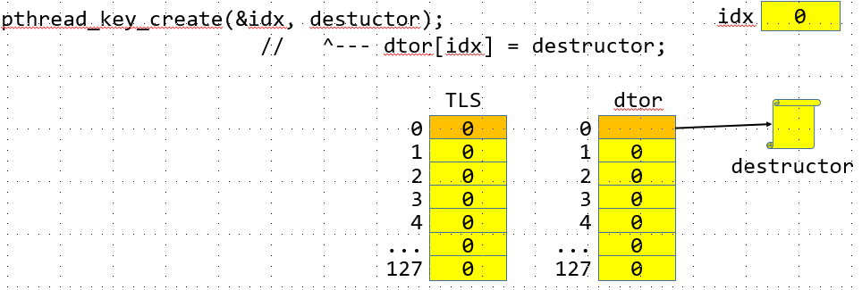
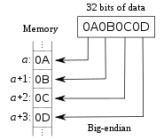
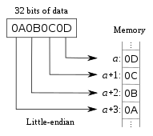
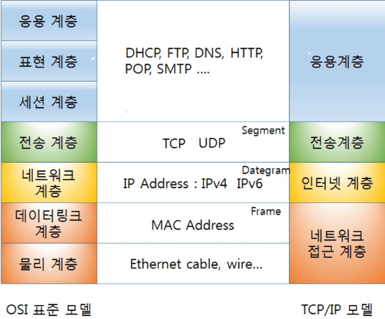
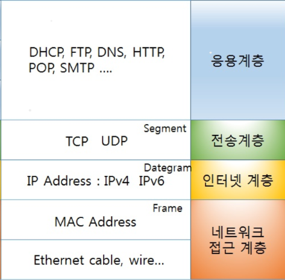
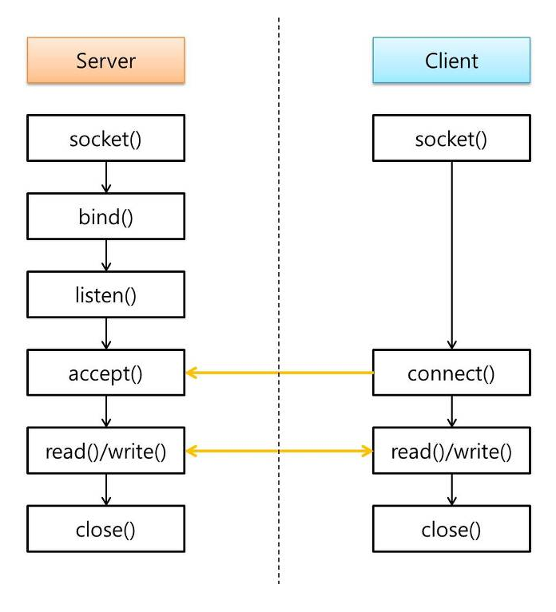

# CAS(Compare And Set) 연산

## spin lock
spin lock은 운영 체제의 스케줄링 기능을 지원 받지 않으므르 thread에 대한 문맥 교환(context switch)이 일어나지 않음

sleep lock은 임계영역(critical section)에서 짧은 시간이 소요되는 경우 문맥 교환을 제거할 수 있어 효율적

임계영역에서 오랜시간을 소요하게되면 다른 thread를 실행하지 못하고 대기하게 되어 성능 하락을 발생시킴
```c
#include <pthread.h>
#include <stdio.h>

int lock = 0; //key

int cnt = 0 ;
void *thread_main(void *arg) {
    for(int i = 0 ; i < 5000000;i ++ ) {
        while(lock != 0);
        lock = 1;
        //critical section ---------------------
        ++cnt;
        //--------------------------------------
        lock = 0;
    }
    return NULL;
}

int main() {
    pthread_t tid[2];
    for(int i = 0 ; i < 2; i ++ ) {
        pthread_create(&tid[i], NULL, thread_main, NULL);
    }

    for(int i = 0 ; i < 2; i ++ ) {
        pthread_join(tid[i], NULL);
    }

    printf("%d\n", cnt);
    return 0;
}
```
---
## sleep lock
wating 할때 sleep 상태로 대기하여 자원을 크게 사용하지 않는 연산<br/>
context switching이 길고, 자주 일어날때 사용
### mutex(mutual exclusion)

임계영역안에 오직하나의 Thread만 들어가게 보장하는 연산
pthread_mutex_t 타입으로 lock을 대신하는 타입을 만든다.

1. mutex 초기화
   1. 정적 초기화(컴파일 타임) : 매크로
    - pthread_mutex_t mtx = PTHREAD_MUTEX_INITIALIZER;
   2. 동적 초기화(런타임) : 함수
    - pthread_mutex_init(&mtx, NULL);
보통 정적초기화를 많이쓴다.
```c
#include <pthread.h>
#include <stdio.h>
#include <unistd.h>
pthread_mutex_t mtx = PTHREAD_MUTEX_INITIALIZER;

int cnt = 0 ;
void *thread_main(void *arg) {
    for(int i = 0 ; i < 5000000;i ++ ) {
        pthread_mutex_lock(&mtx);//lock = 1;
        //critical section ---------------------
        ++cnt;
        sleep(60);
        //--------------------------------------
        pthread_mutex_unlock(&mtx);//lock = 0;
    }
    return NULL;
}

int main() {
    pthread_t tid[2];
    for(int i = 0 ; i < 2; i ++ ) {
        pthread_create(&tid[i], NULL, thread_main, NULL);
    }

    for(int i = 0 ; i < 2; i ++ ) {
        pthread_join(tid[i], NULL);
    }

    printf("%d\n", cnt);
    return 0;
}
```
---
# Thread Safe function
우리가 사용하는 표준라이브러리는 thread라는 개념이 없을 때 나온 함수이다.
```c
#include <stdio.h>
#include <pthread.h>
int foo() {
    static int cnt = 0;
    ++cnt;
    return cnt;
}
void * thread_main(void *arg) {
    foo();
    foo();
    int cnt = foo();
    printf("%d\n", cnt);
    return NULL;
}
int main() {
    pthread_t tid1, tid2;
    pthread_create(&tid1, NULL, thread_main, NULL);
    pthread_create(&tid2, NULL, thread_main, NULL);

    pthread_join(tid1, NULL);
    pthread_join(tid2, NULL);
    return 0;
}
```

mutex를 걸어주게 되면 thread에 안전하게되지만 동작하지 않는다
해당의 코드는 mutex를 걸어주는것과 별게의 문제

---
## 재진입 가능 함수
호출자가 제공하는 메모리영역의 변수 활용
```c
int foo() {
    static int cnt = 0;
    ++cnt;
    return cnt;
}
//쓰레드에 안전한 함수(thread-safety)
//호출자의 스택을 사용하는 방법
int foo_r(int *cnt) { //r == reentrance(재진입 가능 함수)
    ++(*cnt);
}
void * thread_main(void *arg) {
    int cnt = 0;
    foo_r(&cnt);
    foo_r(&cnt);
    foo_r(&cnt);
    printf("%d\n", cnt);
    return NULL;
}
int main() {
    pthread_t tid1, tid2;
    pthread_create(&tid1, NULL, thread_main, NULL);
    pthread_create(&tid2, NULL, thread_main, NULL);

    pthread_join(tid1, NULL);
    pthread_join(tid2, NULL);
    return 0;
}
```
서로 다른 Thread가 같은 함수를 사용한다 하더라도 언제나 같은 실행 결과를 보장하는 함수

재진입 가능 함수는 병행과 병렬 모두에서 안전하게 실행된다.

재진입 가능 함수를 구현하려면 아래의 조건을 구현해야한다
1. 정적 또는 전역 변수를 사용하면안됨
2. 정적 또는 전역 변수의 주소를 반환하면안됨
3. 호출자가 호출 시에 제공한 매개변수(또는 저장공간)만을 사용하여 동작
4. 다른 비 재진입 함수 호출하면 안됨

```c
#include <stdio.h>
#include <string.h>
#include <pthread.h>

void *thread_main1(void *arg) {
    char str[] = "010-1234-5678";
    char *savePtr;
    //char *p = strtok(str, "-");
    char *p = strtok_r(str, "-", &savePtr);
    while(p) {
        printf("[%s]\n", p);
        p = strtok_r(NULL, "-", &savePtr);
    }
    return NULL;
}

void *thread_main2(void *arg) {
    char str[] = "192.168.0.1";
    char *savePtr;
    //char *p = strtok(str, ".");
    char *p = strtok_r(str, ".", &savePtr);
    //그러나 3개 인자를 넣어주어야한다
    //single thread에서는 해당 함수를 쓰지않고 그냥 함수를 쓰기 때문에
    //그때 또 바꿔주어야한다.
    while(p) {
        printf("[%s]\n", p);
        p = strtok_r(NULL, ".", &savePtr);
    }
    return NULL;
}

//내부적 parsing이 가능했던 이유는 정적의 영역을 사용하고 있기 떄문이다.
//각각의 thread가 임시변수를 가지고있을 수 없기 때문에 올바르게 동작하지 않는다
//전역변수를 사용할 수 없으니 함수 호출자를 활용해서 메모리에 선언해준다.
int main() {
    pthread_t t1, t2;
    pthread_create(&t1, NULL, thread_main1, NULL);
    pthread_create(&t2, NULL, thread_main2, NULL);

    pthread_join(t1, NULL);
    pthread_join(t2, NULL);
    return 0;
}
```
---
## TLS(Thread Local Storage)
Thread 별로 고유한 저장공간(전역공간)을 가질 수 있는 방법이다.

스택에 잡히는 지역 변수는 Thread 마다 별도의 stack을 사용하므로 당연히 다른 값을 가지지만

전역 변수의 경우에는 모든 Thread가 공유하므로 접근 시 rece condition이 생길 수 있다

Thread마다 개별적으로 사용할 수 있는 Thread-local 변수를 사용하여 안정성 및 성능향상

TLS(Thread Local Storage) : Windows
TSD(Thread Specific Data) or TSS(Thread Speific Storage) : Linux

설치
```s
linux@ubuntu:~/0624$ sudo apt install glibc-doc
```

```c
#include <stdio.h>
#include <pthread.h>
#include <stdlib.h>

pthread_key_t idx; //key

void destructor(void *arg) {
    printf("destructor()\n");
    free(arg);
}
int foo() {
    int *pInt = pthread_getspecific(idx); //static int cnt = 0;
    if (pInt == NULL ) {
        pInt = malloc(sizeof(int));
        *pInt = 0;
        pthread_setspecific(idx, pInt); //TLS[idx] = pInt;
    }
    return ++(*pInt);
}
void *thread_main(void *arg) {
    foo();
    foo();
    int cnt = foo();
    printf("%ld: %d\n", pthread_self(), cnt);//pthread_self() == getpid();
}
int main() {
    //TLS: 원소가 void*인 포인터 배열 ex) void* TLS[128];
    pthread_key_create(&idx, destructor); //비어있는 가장작은 인덱스를 발급
                                          //해당포인터의 자원해제를 위한 함수를 등록
    pthread_t t1, t2;
    pthread_create(&t1, NULL, thread_main, NULL);
    pthread_create(&t2, NULL, thread_main, NULL);
    pthread_join(t1, NULL);
    pthread_join(t2, NULL);

    pthread_key_delete(idx); // destructor() ; - > free(TLS[idx]);
    return 0;
}
```
```s
linux@ubuntu:~/0624$ gcc 4_tls.c -pthread
linux@ubuntu:~/0624$ ./a.out
140200983414528: 3
destructor()
140200975021824: 3
destructor()
```
TLS는 내부적으로 void*를 사용하기 때문에 0으로 초기화 되어있다<br/>
<br/>
서로 다른 thread에 대해서 똑같은 값으로 접근해야하는데
동일한 코드에 대해서 index는 하나의 값으로 사용할 수 있게된다.

pthread_key 는 결국 index일 뿐이고 
서로다른 thread를 같은 index를 볼수 있게된다.

기존의 single thread에서 작성했던 foo의 코드도 그대로이다.

장점 : 기존 함수의 인터페이스를 변경하지 않고 Thread에 안전한 함수 구현가능
단점 : 사용자가 TLS애 대한 KEY(index) 생성 및 관리
        포인터만 저장 가능(void* TLS[]);
        메모리에 대하여 동적 할당 사용 오버헤드 발생
        메모리 누수 가능성 존재(trade off)

---
### 정적 TLS
기존 TLS의 단점을 극복하기 위해 나온 TLS
이전의 모든 처리를 컴파일러가 대신 처리해 줌

변수 선언 시, 앞에 _thread 를 작성
ex) _thread int cnt; (GNU 확장 문법)
```c
#include <stdio.h>
#include <pthread.h>
#include <stdlib.h>
__thread int cnt = 0; // 정적 TLS
int foo() {
    return ++cnt;
}
void *thread_main(void *arg) {
    foo();
    foo();
    int cnt = foo();
    printf("%ld: %d\n", pthread_self(), cnt);//pthread_self() == getpid();
}
int main() {
    pthread_t t1, t2;
    pthread_create(&t1, NULL, thread_main, NULL);
    pthread_create(&t2, NULL, thread_main, NULL);
    pthread_join(t1, NULL);
    pthread_join(t2, NULL);

    return 0;
}
```
```s
linux@ubuntu:~/0624$ gcc 4_tls.c -pthread
linux@ubuntu:~/0624$ ./a.out
140180468573952: 3
140180460181248: 3
```
기존의 TLS보다 구현이 복잡함 (기계어 코드가 늘어난다.)

정적 TLS의 지원은 최근이기때문에 이식성 보장을 위해서는 이전의 TLS를 사용해야한다.

---

```c
//5_tls.c
#if 0
#include <stdio.h>

int main() {
    FILE *fp = fopen("xxx.", "r");
    if(fp == NULL) {
        perror("fopen");
        return -1;
    }

    char buf[BUFSIZ];
    fgets(buf, sizeof(buf), fp);

    fclose(fp);
    return 0;
}
#endif

#if 0
#include <stdio.h>
#include <pthread.h>
int main() {
    pthread_t tid;
    if(pthread_join(tid, NULL) != 0) {
        //POSIX 라이브러리는 오류가 발생하면 오류코드를 설정하지 않는다.
        //errno가 전역변수이기 하지만 구현에선 각 Thread별로 구현되어 있다
        //오류처리의 복잡함을 해결하기위해서 return 값을 사용한다
        perror("pthread_join");
        return -1;
    }
    return 0;
}

#endif
#include <string.h>
#include <stdio.h>
#include <pthread.h>
int main() {
    pthread_t tid;
    int ret = pthread_join(tid, NULL);
    if (ret) {
        //fprintf(stderr, "pthread_join : %d\n",ret);
        fprintf(stderr, "pthread_join : %s\n", strerror(ret));
        return -1;
    }
    //errcode를 사용하긴 하는데 전역변수를 사용하지 않고 return 값을 사용한다
    //return값을 받아서 직접 출력을 해야한다.
    return 0;
}
```

---
### thread의 종류
Worker Thread 종료 방법 
1. 시작함수가 종료
```c
// 6_exit.c
#include <stdio.h>
#include <unistd.h>
#include <pthread.h>
void *thread_main(void *arg) {
    for(int i = 0; i < 5; i ++ ) {
        sleep(1);
        printf("[worker]....\n");
    }
    return NULL;
}
int main() {
    pthread_t t;
    pthread_create(&t, 0, thread_main, NULL);
    pthread_join(t, NULL);

    return 0;
}
```
```s
linux@ubuntu:~/0624$ ./a.out
[worker]....
[worker]....
[worker]....
[worker]....
[worker]....
```
pthread_create의 startroutine함수로 들어간 함수의 
반환된 값은 pthread_join 함수의 2번째 인자로 읽어올 수 있다.
```c
// 6_exit.c
#include <stdio.h>
#include <unistd.h>
#include <pthread.h>
#include <stdlib.h>
#include <string.h>
void *thread_main(void *arg) {
    for(int i = 0; i < 5; i ++ ) {
        sleep(1);
        printf("[worker]....\n");
    }
    const char *msg = "hello, world";
    char *p =malloc(strlen(msg) + 1);
    strcpy(p, msg);
    return p;//Thread 함수내의 지역 객체의 주소를 반환하면 안된다
            // 가지고있던 메모리가 파괴된다.
}
int main() {
    pthread_t t;
    pthread_create(&t, 0, thread_main, NULL);

    char *p;
    pthread_join(t, (void**)&p);
    //join함수는 두분째 return value가 이중포인터로 되어있다.
    //어떠한 곳으로 값을 return
    printf("msg from thread: %s\n", p);
    free(p);

    return 0;
}
```
```s
linux@ubuntu:~/0624$ ./a.out
[worker]....
[worker]....
[worker]....
[worker]....
[worker]....
msg from thread: hello, world
```
2. pthread_exit 함수 사용
```c
void *thread_main(void *arg) {
    for(int i = 0; i < 5; i ++ ) {
        sleep(1);
        printf("[worker]....\n");
    }
    const char *msg = "hello, world";
    char *p =malloc(strlen(msg) + 1);
    strcpy(p, msg);
    pthread_exit(p);// return p;
}
```
```s
linux@ubuntu:~/0624$ ./a.out
[worker]....
[worker]....
[worker]....
[worker]....
[worker]....
msg from thread: hello, world
```
- pthread_exit를 제공하는 이유

        return 하여 반환하게되면 foo함수가 종료 main으로 복귀
        full stack에 깊게 들어갔을때 함수를 종료하고 싶다면

        foo 함수를 생성하고 exit를 하게되면 바로종료된다.
```c
void foo() {
    ....
    pthread_exit(p) // 여기서 바로 thread 종료
}
void *thread_main(void *arg) {
   foo();
   return NULL;
```
| 구분 | process |      thread      |
| ---- | :-----: | :--------------: |
| 생성 | fork()  | pthread_create() |
| 대기 | wiat()  |  pthread_join()  |
| 종료 | exit()  |  pthread_exit()  |
| PID  | getpid  |  pthread_self()  |

---
# socket 프로그래밍
socket 프로그래밍 == Network 프로그래밍 == TCP/IP 프로그래밍


2byte이상의 값 사용 시.
- 빅엔디안
- 리틀엔디안
  
네트워크 패킷의 관례 : 빅엔디안

---
## Endian
엔디언(Endianness)은 컴퓨터의 메모리와 같은 1차원의 공간에 여러 개의 연속된 대상을 배열하는 방법을 뜻하며, 바이트를 배열하는 방법을 특히 바이트 순서(Byte order)라 한다


```c
#include <stdio.h>
int is_bigendian() {
    unsigned int x = 0x1; // 00 00 00 01
    unsigned char *p = (unsigned char *)&x;
    return (*p == 1);
}
//리터럴에 대하여 주소연산자를 사용할수 없다
//#define IS_BIGENDIAN() (*(((unsigned char*)&0x1) == 0)

//stack 영역을 쓴다는 점과 심볼릭명이 겹칠수 있다는 문제점이있다
static const unsigned int __ENDIAN_VALUE = 0x1;
#define IS_BIGENDIAN() (*(((unsigned char*)&__ENDIAN_VALUE) == 0)
//해결법 C99 : compond literal
int main() {
    if(is_bigendian())
        printf("little endian\n");
    else
        printf("big endian\n");
    return 0;
}
```
```c
 #include <stdio.h>
 #define IS_ENDIAN() \
     (((union {unsigned int i; unsigned char c;}) ){1}.c == 0)
     //잡히는 메모리의 크기는 union member크기중에 가장 큰 멤버로 잡히므로
     //4byte unsigned int 1 이라는 의미다.
     //이름이 없는 임시객체를 써서 if 조건문의 판단으로 사용

 int main() {
     if(IS_ENDIAN())
         printf("big endian\n");
     else
         printf("little endian\n");

 }
 #endif
 #include <stdio.h>
 int main() {
 #if __BYTE_ORDER == __LITTLE_ENDIAN
     printf("little endian\n");
 #else
     printf("big endian\n");
 #endif
```
- BYTE에서 ORDER로 바꾸기
```c
 #include <arpa/inet.h>
#include <stdio.h>
#define IS_ENDIAN() \
    (((union {unsigned int i; unsigned char c;} ){1}.c == 0)
    //잡히는 메모리의 크기는 union member크기중에 가장 큰 멤버로 잡히므로
    //4byte unsigned int 1 이라는 의미다.
    //이름이 없는 임시객체를 써서 if 조건문의 판단으로 사용

void printMemory(void *value, size_t size) {
    unsigned char *p = (unsigned char *)value;
    for (size_t i = 0; i < size; i++ )
        printf("[%X]", p[i]);
    printf("\n");
}
//unsigned int toBigEndian(unsigned int value){
//  if( IS_ENDIAN() )
//      return value;

    //unsigned char *src = (unsigned char*)&value;
    //unsigned int data = 0;
    //unsigned char *dst = (unsigned char *)&data;
    //dst[0]=src[3];
    //dst[1]=src[2];
    //dst[2]=src[1];
    //dst[3]=src[0];

    //return data;
//}

int main() {
    unsigned int data = 0x12345678;
    //현재 시스템이 리틀엔디안이라면
    printMemory(&data, sizeof(data)); //78563412
    data = htonl(data);//data = toBigEndian(data);
    //htons : host to network short(2byte)
    //ntohs, ntohl, ..
    printMemory(&data, sizeof(data)); //12345678
    return 0;

}
```
```s
linux@ubuntu:~/0624$ ./a.out
[78][56][34][12]
[12][34][56][78]
```
---
# TCP/IP
<br/>
네트워크 인터페이스 컨트롤러(network interface controller, NIC)는 컴퓨터를 네트워크에 연결하여 통신하기 위해 사용하는 하드웨어 장치이다. 네트워크 카드(network card), 랜 카드(문화어: 망카드, 망기판, LAN card), 물리 네트워크 인터페이스(physical network interface)라고 하며, 네트워크 인터페이스 카드, 네트워크 어댑터, 네트워크 카드, 이더넷 카드 등으로도 부른다.

OSI 계층 1(물리 계층)과 계층 2(데이터 링크 계층) 장치를 가지는데, 맥 주소를 사용하여 낮은 수준의 주소 할당 시스템을 제공하고 네트워크 매개체로 물리적인 접근을 가능하게 한다. 사용자들이 케이블을 연결하거나 무선으로 연결하여 네트워크에 접속할 수 있다.

NIC들의 통신에 broadcast packet을 보내게되는데 mac주소를 받아 기억.
route와 route가 연결되어있으면

route에 연결되어있는 NIC가 다른 구역의 NIC의 MAC주소를 받을 수가없다.

그래서 network상에 있는 host를 식별하고 32비트 정수값을 가지고 연결되어 있는 host pc를 구별하기 위해 IP라는 개념을 가져와서 규정한다.

핸드폰을 사용하는 기지국이 바뀐다고 하더라도 핸드폰의 정보는 바뀌지 않는다
session의 개념
<br/>

전송계층, 인터넷계층, 네트워크 접근계층만 구현하고
응용계층은 프로그램을 사용 따로 구현한다.
<br/>
TCP/IP 모델


## 소켓생성
>int socket(int domain, int type, int protocol);

domain : 프로토콜 패밀리(접두어로 PF(Protocol Family))
  - PF_INET : IPv4 프로토콜 (32비트 정수, 192.168.0.1)
  - PF_INET6 : IPv6 ..
        ...
```
AF_UNIX, AF_LOCAL   Local communication              unix(7)
AF_INET             IPv4 Internet protocols          ip(7)
AF_INET6            IPv6 Internet protocols          ipv6(7)
AF_IPX              IPX - Novell protocols
AF_NETLINK          Kernel user interface device     netlink(7)
AF_X25              ITU-T X.25 / ISO-8208 protocol   x25(7)
AF_AX25             Amateur radio AX.25 protocol
AF_ATMPVC           Access to raw ATM PVCs
AF_APPLETALK        AppleTalk                        ddp(7)
AF_PACKET           Low level packet interface       packet(7)
AF_ALG              Interface to kernel crypto API
```
type :
```
SOCK_STREAM     Provides sequenced, reliable, two-way, connection-based byte streams.  An out-of-band  data
                transmission mechanism may be supported.

SOCK_DGRAM      Supports datagrams (connectionless, unreliable messages of a fixed maximum length).

SOCK_SEQPACKET  Provides  a  sequenced, reliable, two-way connection-based data transmission path for data‐
                grams of fixed maximum length; a consumer is required to read an entire  packet  with  each
                input system call.

SOCK_RAW        Provides raw network protocol access.

SOCK_RDM        Provides a reliable datagram layer that does not guarantee ordering.

SOCK_PACKET     Obsolete and should not be used in new programs; see packet(7).
```

## IP Address
컴퓨터 네트워크에서 장치들이 서로를 인식하고 통신을 하기 위해서 사용하는 특수한 번호 - 0을 포함한 양의 정수
32비트 정수 : 2^32 = 42억개(IPv4)
64비트 정수 : 2^54 = ...(IPv6)

struct sockaddr_int add; -> session 확립.

---
## Port
컴퓨터 상에서 구동중인 서비스를 식별하는 정수

16비트값 : 0 ~ 65535
- 0번 ~ 1023번: 잘 알려진 포트 (well-known port)
- 1024번 ~ 49151번: 등록된 포트 (registered port)
- 49152번 ~ 65535번: 동적 포트 (dynamic port)

---

daytime 서버 클라이언트 구현
최종 코드
```c
#include <sys/types.h>
#include <sys/socket.h>
#include <stdio.h>
#include <netinet/in.h>
#include <arpa/inet.h>
#include <unistd.h>

// $. ./a.out 192.168.0.1 이 문자열로 이루어진 ip주소 패턴에서 .을 잘라내어 정수값으로 바꿔주어야한다.
int main(int argc, char**argv) {
    if (argc != 2) {
        fprintf(stderr, "usage : %s IPADDRESS\n", *argv);
        return -1;
    }
    --argc, ++argv;
    //int socket(int domain, int type, int protocol);
    //1. 전화기를 준비
    int soc = socket(PF_INET, SOCK_STREAM, 0);
    if(soc == -1) {
        perror("socket");
        return -1;
    }
    //2. 전화할 상대방의 전화번호 입력
    //IP ADDRESS
    struct sockaddr_in addr = {0,};
    addr.sin_family = AF_INET; //주소체계 = IPv4
    //addr.sin_port =13; //상대방이 읽었을 때 몇번서비스에 보내는지 알 수없으므로 host addr로 바꿔 보내야한다

    addr.sin_port =htons(13); //port for daytime server
    addr.sin_addr.s_addr = inet_addr(*argv); // 192.168.0.1 -> 32bit integer

    //3. 통화 버튼 입력
    //int connect(int sockfd, const struct sockaddr *addr, socklen_t addrlen);
    if(connect(soc, (struct sockaddr *)&addr, sizeof(addr)) == -1) {
        perror("connect");
        return -1;
    }

    //서버와 연결이 확립되면 서버는 클라이언트에게 현재 시간을 문자열 형태로 전송하고 연결을 끊는다
    char buf[BUFSIZ];
    int nRead = read(soc, buf, sizeof(buf));
    if (nRead < 0) {
        perror("read");
        return -1;
    }
    else if (nRead == 0 ) { //상대방이 연결을 끊었다는 의미 EOF
        // ...

    }
    buf[nRead] = '\0';
    printf("%s\n", buf);

    close(soc);
    return 0;
}
```
# Echo Server 구현
<br/>

```c
```