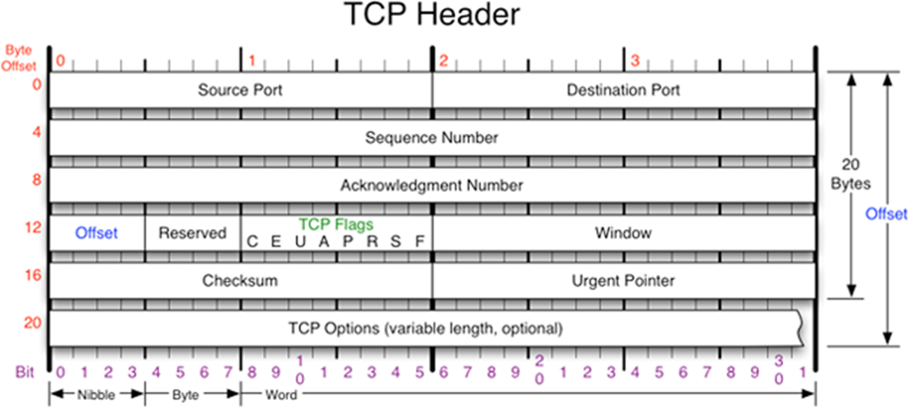
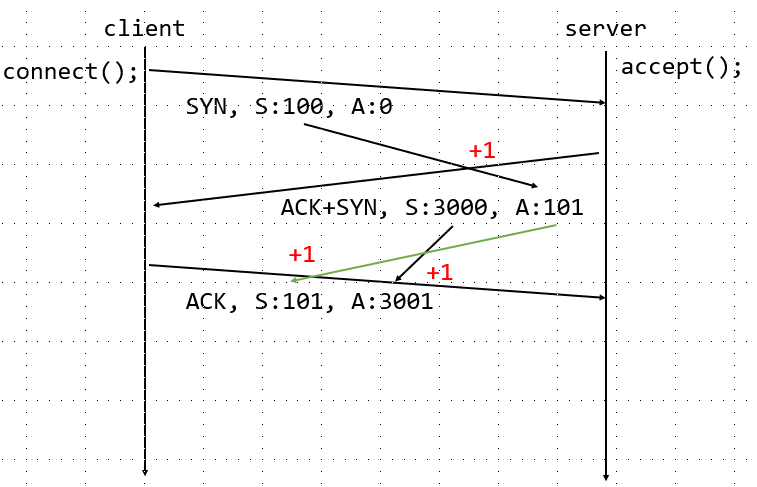
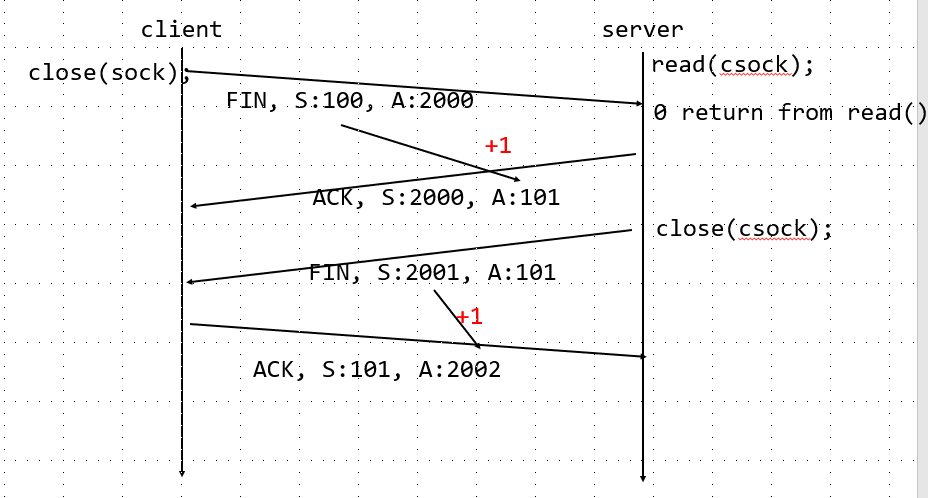
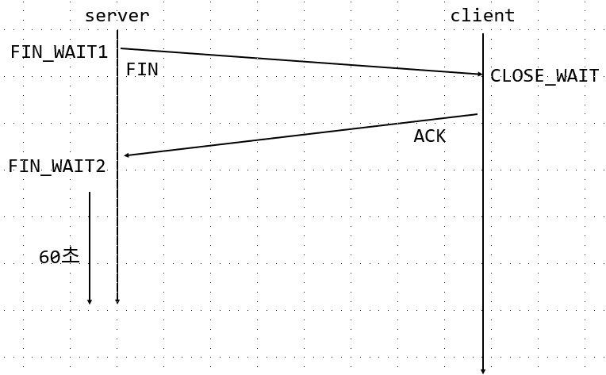

```s
linux@ubuntu:~/0625$ netstat -ant | grep 8080
tcp        0      0 127.0.0.1:8080          0.0.0.0:*               LISTEN 서버
tcp        0      0 127.0.0.1:48860         127.0.0.1:8080          TIME_WAIT 클라이언트
```
---
# TCP/IP Packet
<br/>
- SYN(Synchronization) 
연결을 수립하기 위한 flag, data 송수신을 위한 번호를 동기화

- SEQ(Sequence Number)
상대방에게 전송할 패킷 번호, 보안상의 이유로 난수를 사용한다.

- ACK(Acknowledgement Number)
전송된 패킷에 대한 응답으로 다음 요청할 패킷 번호

- FIN(Finish)
종료를 알리는 패킷

---
## 3-way handshake
TCP/IP 프로토콜 중 TCP 통신 쌍방 간에 처음으로 이루어지는 TCP 연결 설정 과정<br/>
<br/>


1. SYN(서버측 사용 패킷번호)+ACK(요청 번호)는 처음보낸 SYN에 대한 응답
2. ACK+SYN : (100받고)내가 보낼 패킷 번호는 3000이고 니가 보내줘야할 패킷은 101이야
3. ACK : (3000받고)알겠어 101 보낼게 3001줘

>발생한 난수에 + 1
## 4-way handshake
비록 양단 간에 사전에 준비된 키가 없더라도,<br/>
안전하지 못한 채널(비 보안 채널)을 통해서도 같은 비밀 키(세션 키)를 공유할 수 있게끔,<br/>
일련의 패킷 등을 교환해가며 대칭 키를 합의하는 과정<br/>
<br/>

1. Client가 FIN을 보내고FIN_WAIT로 바꾼다. FIN패킷을 기다리는중
2. Server는 ACK를 보내주면서 CLOSE_WAIT상태로 바꾼다.
3. Client가 Ack을 받고 FIN_WAIT2 상태로 바뀐다
4. Server가 다시한번 FIN을 보내고 Client가 TIME_WAIT상태가 되고
5. ACK을 보낸다 ACK을 받은 Server는 CLOSE된다
5-1.만약 마지막 ACK가 유실되거나 못보내면 Server가 FIN 패킷을 다시보낸다.

>TIME_WAIT가 되는 이유 : ACK가 제대로 송신이 안되었을떄 Server가 보내는 FIN을 받기 위해. FIN이 오지않는다면 ACK가 제대로 송신되었다는 의미이므로 정상종료한다.

- 서버 비정상 종료 시
<br/>
1. Server는 FIN을 보내고 FIN_WAIT1이되고 Client는 CLOSE_WAIT가 되고 ACK을 보낸다
2. Server는 FIN_WAIT2 상태가된다.
3. 하지만 Server가 이미 종료되었다고 하면 FIN_WAIT 상태를 60초동안 유지하다가 Server를 종료해버림.

해당 프로세스가 동일한 주소(포트)를 다시 재사용하도록 하려면
SO_REUSEADDR 옵션을 사용한다.

- setsockopt
  int setsockopt(int sockfd, int level, int optname, const void *optval, socklen_t optlen);

> setsockopt(ssoc, SOL_SOCKET, SO_REUSEADDR, (char*)&value, sizeof(value))
```c
#include <sys/types.h>
#include <sys/socket.h>
#include <stdio.h>
#include <string.h>
#include <unistd.h>
#include <sys/socket.h>
#include <netinet/in.h>
#include <arpa/inet.h>
int main() {

    int ssoc=socket(PF_INET, SOCK_STREAM, 0); //서버소켓 TCP/IP로 생성
    if(ssoc < 0 ) { //서버소켓 생성여부 확인
        perror("socket");
        return -1;
    }
    //server socket의 정보설정.
    struct sockaddr_in saddr = {0,}; //PORT와 IP Addr를 받는 구조체 생성
    saddr.sin_family = AF_INET; //연결방식 선택
    saddr.sin_port = htons(8080);
    saddr.sin_addr.s_addr = inet_addr("127.0.0.1");

    //서버 소켓이 주소와 바인딩하기 전에 설정
    int value = 1; 
    if(setsockopt(ssoc, SOL_SOCKET, SO_REUSEADDR, (char*)&value, sizeof(value)) == -1) {
        //해당 IP를 재 사용하기위해 option 설정.
        perror("setsockopt");
        return -1;
    }
    //server socket 설정 bind
    if(bind(ssoc, (struct sockaddr *)&saddr, sizeof(saddr))) {//socket int와 server socket 설정된 정보로 bind
        perror("bind");
        return -1;
    }

    if(listen(ssoc, 10) == -1) {//해당 server socket의 정보로 연결을 요청해오는 socket을 기다리는 함수. backlog를 10개까지 받는다.
        perror("listen");
        return -1;
    }
    printf("[server] running...\n");

    struct sockaddr_in caddr = {0,}; //client의 socket 설정
    int caddr_len = sizeof(caddr); //server 쪽에서 받아주는 함수 accept는 마지막인자를 포인터로 받기 때문에 sizeof연산자를 바로 사용할 수 없다.
    int csoc = accept(ssoc, (struct sockaddr *)&caddr, &caddr_len);//server socket에 client socket의 정보를 주고 해당 client socket에 관련된 정수값을 return 받는다.
    if(csoc == -1) {
        perror("accept");
        return -1;
    }

    printf("[server] %s is connected...\n", inet_ntoa(caddr.sin_addr)); //IPv4의 값을 문자열로출력
    char buf[BUFSIZ];//client의 입력을 받을 buffer
    int nRead = read(csoc, buf, sizeof(buf));//buf의 size만큼 buf에 client의 입력값을 읽어온다.
    if(nRead < 0 ) {
        perror("read");
        return -1;
    }
    else if(nRead==0)  { //nRead가 EOF를 만났을 경우
        printf("[server] %s is connected...\n", inet_ntoa(caddr.sin_addr));
        close(csoc); //파일의 끝이므로 socket을 닫아준다.
        close(ssoc);
        return -1;
    }
    else {
        write(csoc, buf, nRead);//그외의 경우는 읽어온 데이터가 있다는 것 이므로 읽어온 개수만큼 buf에 넣고 출력한다.
    }

    close(csoc); //작업이 끝나고 socket close
    close(ssoc);
    return 0;
}
```
```s
#server
linux@ubuntu:~/0625$ ./server
[server] running...
[server] 127.0.0.1 is connected...
^C
linux@ubuntu:~/0625$ ./server
[server] running...
^C
```
바로 Binding 할 수 있다.

그러나 Client가 종료하면 Server도 같이 종료된다.
```c
#include <sys/types.h>
#include <sys/socket.h>
#include <stdio.h>
#include <string.h>
#include <unistd.h>
#include <sys/socket.h>
#include <netinet/in.h>
#include <arpa/inet.h>

//이전 에코서버는 에코를 수행한 후, 바로 종료된다는 문제가 있다.
//다른 클라이언트의 접속을 처리할 수 잇도록 코드를 변경
int main() {

    int ssoc=socket(PF_INET, SOCK_STREAM, 0); //server socket을 TCP/IP방식으로 만든다.
    if(ssoc < 0 ) {
        perror("socket");
        return -1;
    }
    struct sockaddr_in saddr = {0,};//server socket에 관한 세부설정
    saddr.sin_family = AF_INET;
    saddr.sin_port = htons(8080);
    saddr.sin_addr.s_addr = inet_addr("127.0.0.1");

    //서버 소켓이 주소와 바인딩하기 전에 설정
    int value = 1;
    //이전에 설정됬던 IP로 다시 server socket열 수 있게 설정.
    if(setsockopt(ssoc, SOL_SOCKET, SO_REUSEADDR, (char*)&value, sizeof(value)) == -1) {
        perror("setsockopt");
        return -1;
    }

    if(bind(ssoc, (struct sockaddr *)&saddr, sizeof(saddr))) {//설정된 server socket을 위치시키는 코드.
        perror("bind");
        return -1;
    }

    if(listen(ssoc, 10) == -1) { //해당 server socket으로 오는 요청을 기다리는중
        perror("listen");
        return -1;
    }
    printf("[server] running...\n");
    while(1){
        struct sockaddr_in caddr = {0,};//client socket 세부설정
        int caddr_len = sizeof(caddr);
        int csoc = accept(ssoc, (struct sockaddr *)&caddr, &caddr_len);
        if(csoc == -1) {
            perror("accept");
            return -1;
        }

        printf("[server] %s is connected...\n", inet_ntoa(caddr.sin_addr));
        char buf[BUFSIZ];
        int nRead = read(csoc, buf, sizeof(buf)); //client의 입력정보 읽기.
        if(nRead < 0 ) {
            perror("read");
                        return -1;
        }
        else if(nRead==0)  { //EOF
            printf("[server] %s is connected...\n", inet_ntoa(caddr.sin_addr));
            close(csoc);
            return -1;
        }
        else {
            write(csoc, buf, nRead);//정보가 있을때 입력.
        }

        close(csoc); //client socket close
    }
    //client의 socket이 close 되어도 server socket은 닫히지 않는다.  ctrl + c 와 같은 강제 종료를 통해서만 종료가능.
    close(ssoc);
    return 0;
}
```
```s
linux@ubuntu:~/0625$ gcc -o server 3_echo_server.c
linux@ubuntu:~/0625$ ./server
[server] running...
[server] 127.0.0.1 is connected...
[server] 127.0.0.1 is connected...
[server] 127.0.0.1 is connected...
# 서버의 접속이 끊기지 않는 모습.
```
그러나 다수의 유저에 대해서 처리가 되지 않는다.
```c
 if(listen(ssoc, 10) == -1) {
     perror("listen");
     return -1;
 }
 // Server의 listen을 초과.
```
### fcntl nonblock

```c
#include <sys/types.h>
#include <sys/stat.h>
#include <fcntl.h>
#include <unistd.h>
#include <stdio.h>

int main() {
	int fifo = open("myfifo", O_RDONLY);	// $ mkfifo myfifo
	if (fifo < 0) {
		perror("open");
		return -1;
	}

	// 키보드로부터 입력 받은 데이터와 파이프로부터 입력 받은 데이터를
	// 출력하는 코드를 구현해 봅니다.
	char buf[BUFSIZ];
	while (1) {
		// keyboard
		int nRead = read(0, buf, sizeof(buf)); //stdin(keyboard)로 부터 데이터 readd
		if (nRead < 0) {
			perror("read");
			return -1;
		}
		else if (nRead > 0) { //nRead의 값이 양수라면 
			buf[nRead-1] = 0; //개행문자를 없앤다.
			printf("keyboard: %s\n", buf); //buf의 값을 %s로 찍는다.
		}

		// pipe
		nRead = read(fifo, buf, sizeof(buf)); // fifo에서도 read를 한다.
		if (nRead < 0) {
			perror("read");
			return -1;
		}
		else if (nRead > 0) {
			buf[nRead-1] = 0;
			printf("fifo: %s\n", buf);
		}
	}
	return 0;
}
```

```s
linux@ubuntu:~/0625$ ./a.out
read: Resource temporarily unavailable
```
위의 코드는 stdin과 fifo를 동시에 while문에서 데이터의 값을 확인하고있다.
유저가 keyboard만쳤을때는 fifo에 값이 없으므로 fifo에서 read 오류가 나게된다.
해당 read 오류가 데이터가 없는 -1의 오류인지 데이터값의 오류인지를 명확하게 해주어
하나만 입력하여도 제대로된 값이 나올 수 있게 설정한다.

```c
#if 1
#include <sys/types.h>
#include <sys/stat.h>
#include <fcntl.h>
#include <unistd.h>
#include <stdio.h>
#include <errno.h>

int main() {
	int fifo = open("myfifo", O_RDONLY);	// $ mkfifo myfifo
	if (fifo < 0) {
		perror("open");
		return -1;
	}

	// 키보드와 파이프의 속성을 non-block으로 변경합니다.
	if ((fcntl(0, F_SETFL, O_NONBLOCK) == -1) || (fcntl(fifo, F_SETFL, O_NONBLOCK) == -1)) {
    //nonblocking 입출력의 특성을 재설정 해주었다 RW 함수 호출시에도 데이터의 유무에 상관없이 블로킹이 되지 않는 파일 생성
		perror("fcntl");
		return -1;
	}

	char buf[BUFSIZ];
	while (1) {
		// keyboard
		int nRead = read(0, buf, sizeof(buf));
		if (nRead < 0) {    //read가 읽을 데이터가 없다는 -1을 반환하고 errno에 저장된 값이 EAGAIN이라면 더 이상 읽을 데이터가 존재하지 않는 상황
			if (errno != EAGAIN) {
				perror("read");
				return -1;
			}
		}
		else if (nRead > 0) {//읽을 데이터가 있다면 
			buf[nRead-1] = 0; //buf에서 개행을 제외하고
			printf("keyboard: %s\n", buf); //그 값을 찍는다.
		}

		// pipe
		nRead = read(fifo, buf, sizeof(buf));
		if (nRead < 0) {//이제 더이상 keyboard만 입력하여도 fifo의 read에서 perror가 뜨지 않는다.
			if (errno != EAGAIN) {
				perror("read");
				return -1;
			}
		}
		else if (nRead > 0) {
			buf[nRead-1] = 0;
			printf("fifo: %s\n", buf);
		}
	}
	return 0;
}
#endif
```
```s
linux@ubuntu:~/0625$ ./server
fifo: asdf
fifo: wer
fifo: asdf
asd
keyboard: asd
sad
keyboard: sad
asd
keyboard: asd
```
nonblock은 입력이 있기전까지 공회전을 하기 때문에 cpu 자원을 너무 많이 쓴다.
accept로 대기하고 있다가 client가 온다면 server 프로세스를 하나 더만들고

다른 server에서는 다른 client socket을 기다린다.
multi process를 이용한 채팅서버
```c
#include <sys/types.h>
#include <sys/socket.h>
#include <netinet/in.h>
#include <arpa/inet.h>
#include <sys/wait.h>
#include <unistd.h>
#include <fcntl.h>
#include <stdio.h>
#include <stdlib.h>
#include <errno.h>
#include <signal.h>

void __quit(const char *msg, int line) {
	char buf[BUFSIZ]; //buf를 생성하여 
	sprintf(buf, "%s(%d)", msg, line);//해당 버퍼로 데이터 값을 받는 함수 생성. line은 매크로로 불러온다.
	perror(buf);
	exit(1);
}
#define err_quit(msg)	__quit(msg, __LINE__)

void signal_handler(int signo) {
	if (signo == SIGCHLD) {
		while (waitpid(-1, NULL, WNOHANG) > 0); //모든 자식 프로세스들에 대해, 종료된 자식프로세스가 없으면 0 return
                                                //자식프로세스가 종료할때까지 while loop
                                                //자식프로세스에 대해 종료된 자식이 있는지 확인.
	}
}

int main() {
	if (signal(SIGCHLD, signal_handler) == SIG_ERR)//자식 프로세스가 종료되어 반환된 signal이 있는지 확인
		err_quit("signal");

	int ssock = socket(PF_INET, SOCK_STREAM, 0);//server socket 생성
	if (ssock == -1)
		err_quit("socket");

	struct sockaddr_in saddr = {0,};//server socket 설정
	saddr.sin_family = AF_INET;
	saddr.sin_port = htons(8080);
	saddr.sin_addr.s_addr = htonl(INADDR_ANY);	// 현재 시스템에 할당된 모든 아이피로부터
																							// 접속을 허용하겠다는 의미

	int value = 1;
	if (setsockopt(ssock, SOL_SOCKET, SO_REUSEADDR, (char*)&value, sizeof(value)) == -1)
		err_quit("setsockopt");
	
	if (bind(ssock, (struct sockaddr *)&saddr, sizeof(saddr)) == -1)
		err_quit("bind");

	if (listen(ssock, 10) == -1)
		err_quit("listen");
	printf("[server] running...\n");
//server socket 환결설정 ---------------------

//client socekt 환경설정 및 read & write ---------------------
	while (1) {
		struct sockaddr_in caddr = {0,};
		int caddr_len = sizeof(caddr);
		int csock = accept(ssock, (struct sockaddr *)&caddr, &caddr_len);
		if (csock < 0)
			err_quit("accept");

		printf("[server] %s is connected...\n", inet_ntoa(caddr.sin_addr));

		pid_t pid = fork(); // 자식 프로세서 생성
		if (pid > 0) { //들어온 프로세스 id가 부모 일때 자식은 존재하지 않기 때문에 
			close(csock); //설정해준 client socket은 닫아준다
		}
		else if (pid == 0) {	//server socket close
			close(ssock);       //client일때 설정할 server socket이 없기 때문에 server socket을 닫아준다.

			// 자식 프로세스에서 입출력을 수행합니다.
			char buf[BUFSIZ];
			int nRead = read(csock, buf, sizeof(buf));
			if (nRead < 0) {
				err_quit("read");
			}
			else if (nRead == 0) {
				return -1;
			}
			else {
				buf[nRead] = 0;
				write(csock, buf, nRead);
			}
			close(csock);
			return 0;
		}
		else {
			err_quit("fork"); //에러출력 fork + line 수
		}
	}

	close(ssock);
	return 0;
}
```
---
## Pre-forked Server

```c
#include <sys/types.h>
#include <sys/socket.h>
#include <netinet/in.h>
#include <arpa/inet.h>
#include <sys/wait.h>
#include <unistd.h>
#include <fcntl.h>
#include <stdio.h>
#include <stdlib.h>
#include <errno.h>
#include <signal.h>

void __quit(const char *msg, int line) {
	char buf[BUFSIZ];
	sprintf(buf, "%s(%d)", msg, line);
	perror(buf);
	exit(1);
}
#define err_quit(msg)	__quit(msg, __LINE__)

#define MAX_POOL		(3)
void start_child(int ssock, int id) {
	printf("[server %d] running...\n", id);

	while (1) {
		struct sockaddr_in caddr = {0,};
		int caddr_len = sizeof(caddr);
		int csock = accept(ssock, (struct sockaddr *)&caddr, &caddr_len);
		if (csock < 0)
			err_quit("accept");

		printf("[server %d] %s is connected...\n", id, inet_ntoa(caddr.sin_addr));

		char buf[BUFSIZ];
		int nRead = read(csock, buf, sizeof(buf));
		if (nRead < 0) {
			err_quit("read");
		}
		else if (nRead == 0) {
			exit(1);
		}
		else {
			write(csock, buf, nRead);
		}
		close(csock);
	}
}

int main() {
	int ssock = socket(PF_INET, SOCK_STREAM, 0);
	if (ssock == -1)
		err_quit("socket");

	struct sockaddr_in saddr = {0,};
	saddr.sin_family = AF_INET;
	saddr.sin_port = htons(8080);
	saddr.sin_addr.s_addr = htonl(INADDR_ANY);

	int value = 1;
	if (setsockopt(ssock, SOL_SOCKET, SO_REUSEADDR, (char*)&value, sizeof(value)) == -1)
		err_quit("setsockopt");

	if (bind(ssock, (struct sockaddr *)&saddr, sizeof(saddr)) == -1)
		err_quit("bind");

	if (listen(ssock, 10) == -1)
		err_quit("listen");

	for (int i = 0; i < MAX_POOL; i++) {
		pid_t pid = fork();
		if (pid < 0) 
			err_quit("fork");
		else if (pid == 0)
			start_child(ssock, i); //여러 child를 설정할 수 있도록 함수로 만들었다.
		else
			;
	}

	while (wait(NULL) != -1);

	close(ssock);
	return 0;
}


```
효율성있는 메모리 사용을 위해 미리 자식 프로세스들을 fork해두고 호출이 있을 때 fork된 자식을 물려준다.

문제를 해결하기 위해서 서로의 프로세스를 협력하는 작업을 하는 경우에는
다른 프로세스의 결과물을 공유하거나 부모에 올려줄려면
IPC가 필요하다.
CPU의 환경 발전의 한계가 있었음

thread를 활용
int pthread_detach(pthread_t thread);
```c

```


data를 수신은 비동기적(언제 수신할 지 모름)
callback함수를 등록 그때마다 처리


```c
#include <sys/types.h>
#include <sys/socket.h>
#include <netinet/in.h>
#include <arpa/inet.h>
#include <sys/wait.h>
#include <unistd.h>
#include <fcntl.h>
#include <stdio.h>
#include <stdlib.h>
#include <errno.h>
#include <string.h>
#include <signal.h>
#include <pthread.h>

// 멀티 프로세스 기반의 서버는 안정적이지만 메모리 사용량이 많고 프로세스 간 
// 데이터 공유도 어렵다는 단점이 있습니다. 이를 해결하기 위해 멀티 쓰레드를
// 도입해 보세요 :D

void __quit(const char *msg, int line) { //에러 출력 함수
	char buf[BUFSIZ];
	sprintf(buf, "%s(%d)", msg, line);
	perror(buf);
	exit(1);
}
#define err_quit(msg)	__quit(msg, __LINE__)

void *thread_main(void *arg) {
	int csock = (int)arg;

	char buf[BUFSIZ];
	int nRead = read(csock, buf, sizeof(buf));
	if (nRead < 0) {
		perror("read");
		close(csock);
		return NULL;
	}
	else if (nRead == 0) {
		close(csock);
		return NULL;
	}

	write(csock, buf, nRead);
	close(csock);

	return NULL;
}

int main() {
	int ssock = socket(PF_INET, SOCK_STREAM, 0);
	if (ssock == -1)
		err_quit("socket");

	struct sockaddr_in saddr = {0,};
	saddr.sin_family = AF_INET;
	saddr.sin_port = htons(8080);
	saddr.sin_addr.s_addr = htonl(INADDR_ANY);
																					

	int value = 1;
	if (setsockopt(ssock, SOL_SOCKET, SO_REUSEADDR, (char*)&value, sizeof(value)) == -1)
		err_quit("setsockopt");
	
	if (bind(ssock, (struct sockaddr *)&saddr, sizeof(saddr)) == -1)
		err_quit("bind");

	if (listen(ssock, 10) == -1)
		err_quit("listen");
	printf("[server] running...\n");

	while (1) {
		struct sockaddr_in caddr = {0,};
		int caddr_len = sizeof(caddr);
		int csock = accept(ssock, (struct sockaddr *)&caddr, &caddr_len);
		if (csock < 0)
			err_quit("accept");
		printf("[server] %s is connected...\n", inet_ntoa(caddr.sin_addr));

		pthread_t tid;
		int ret = pthread_create(&tid, NULL, thread_main, (void*)csock); //read하는 부분과 write하는 부분 을 thead function으로 만들었다.
		if (ret != 0)
			err_quit(strerror(ret));

		ret = pthread_detach(tid);//해당 id의 thread를 해제
		if (ret != 0)
			err_quit(strerror(ret));
	}

	close(ssock);
	return 0;
}
```
---
다중 Process 채팅 구현
Server
```c
#include <sys/types.h>
#include <sys/socket.h>
#include <netinet/in.h>
#include <arpa/inet.h>
#include <sys/wait.h>
#include <unistd.h>
#include <fcntl.h>
#include <stdio.h>
#include <stdlib.h>
#include <errno.h>
#include <string.h>
#include <signal.h>
#include <pthread.h>

void __quit(const char *msg, int line) {//에러출력 함수
	char buf[BUFSIZ];
	sprintf(buf, "%s(%d)", msg, line);
	perror(buf);
	exit(1);
}
#define err_quit(msg)	__quit(msg, __LINE__)

#define MAX_CLIENT	(128) 
int clients[MAX_CLIENT]; //받을 수 있는 클라이언트 개수
int cnt = 0;//접속한 클라이언트의 개수 파악 (stack)
pthread_mutex_t mtx = PTHREAD_MUTEX_INITIALIZER; //mutex설정값 

void broadcast_msg(char *msg, int len) {
	pthread_mutex_lock(&mtx);	
	//---------------------------
	for (int i = 0; i < cnt; i++)
		write(clients[i], msg, len); //메세지 출력
	//---------------------------
	pthread_mutex_unlock(&mtx);	
}

void delete_client(int sock) {
	pthread_mutex_lock(&mtx);	
	//------------------------------
	for (int i = 0; i < cnt; i++) {
		if (clients[i] == sock)
			clients[i] = clients[--cnt]; //client socket 해제
	}
	//------------------------------
	pthread_mutex_unlock(&mtx);	
}

void add_client(int sock) {
	pthread_mutex_lock(&mtx);	
	//-------------------------
	clients[cnt++] = sock; //client 추가
	//-------------------------
	pthread_mutex_unlock(&mtx);	
}

void *thread_main(void *arg) {
	int csock = (int)arg;
	add_client(csock);

	char buf[BUFSIZ];
	while (1) {//내용읽기.
		int nRead = read(csock, buf, sizeof(buf));
		if (nRead < 0) {
			perror("read");
			break;
		}
		else if (nRead == 0) {
			break;
		}
		
		buf[nRead] = 0;
		if (strcmp(buf, "quit") == 0)
			break;
		broadcast_msg(buf, nRead);//최종출력
	}
	close(csock);
	delete_client(csock); //cnt --
	return NULL;
}

int main() {
	int ssock = socket(PF_INET, SOCK_STREAM, 0);
	if (ssock == -1)
		err_quit("socket");

	struct sockaddr_in saddr = {0,};
	saddr.sin_family = AF_INET;
	saddr.sin_port = htons(8080);
	saddr.sin_addr.s_addr = htonl(INADDR_ANY);
																					

	int value = 1;
	if (setsockopt(ssock, SOL_SOCKET, SO_REUSEADDR, (char*)&value, sizeof(value)) == -1)
		err_quit("setsockopt");
	
	if (bind(ssock, (struct sockaddr *)&saddr, sizeof(saddr)) == -1)
		err_quit("bind");

	if (listen(ssock, 10) == -1)
		err_quit("listen");
		//여기까지 server socket 설정
	printf("[server] running...\n");

	while (1) {
		struct sockaddr_in caddr = {0,};
		int caddr_len = sizeof(caddr);
		int csock = accept(ssock, (struct sockaddr *)&caddr, &caddr_len);
		//client의 정보 받기 대기!
		if (csock < 0)
			err_quit("accept");
		printf("[server] %s is connected...\n", inet_ntoa(caddr.sin_addr));

		pthread_t tid;
		int *arg = (int *)csock;//전달인자가 포인터이어야하므로 강제 형변환 ! 그러나 너무 위험하다
								//malloc하고 free해주는게 정석!
		int ret = pthread_create(&tid, NULL, thread_main, arg); //thread 생성
		if (ret != 0)
			err_quit(strerror(ret));

		ret = pthread_detach(tid); //thread 해제
		if (ret != 0)
			err_quit(strerror(ret));
	}

	close(ssock);
	return 0;
}
```
Client
```c
// Echo Client
#include <sys/types.h>
#include <sys/socket.h>
#include <netinet/in.h>
#include <arpa/inet.h>
#include <unistd.h>
#include <string.h>
#include <stdio.h>
#include <pthread.h>

void* thread_main(void *arg) {
	int sock = (int)arg; //받는 인자가 void* 이므로 int로 강제 형변환

	char buf[BUFSIZ];
	while (1) {
		int nRead = read(sock, buf, sizeof(buf));
		if (nRead < 0) {
			perror("read");
			break;
		}
		else if (nRead == 0) {
			break;
		}
		buf[nRead] = 0;
		write(1, buf, nRead);
	}

	close(sock);
	return NULL;
}

int main() {
	int sock = socket(PF_INET, SOCK_STREAM, 0);
	if (sock == -1) {
		perror("socket");
		return -1;
	}

	struct sockaddr_in addr = {0,};
	addr.sin_family = AF_INET;
	addr.sin_port = htons(8080);
	addr.sin_addr.s_addr = inet_addr("127.0.0.1"); 

	if (connect(sock, (struct sockaddr *)&addr, sizeof(addr)) == -1) {
		perror("connect");
		return -1;
	}

	pthread_t tid;
	int ret = pthread_create(&tid, NULL, thread_main, (void*)sock);//전달해야하는 인자가 포인터이므로 강제 형변환.
																//본래는 malloc을 통해 동적할당해주어야 한다.
	if (ret) {
		perror(strerror(ret));
		return -1;
	}

	while (1) {
		char buf[BUFSIZ];
		int nRead = read(0, buf, sizeof(buf));
		if (nRead < 0) {
			perror("read");
			return -1;
		}
		else if (nRead == 0) {
			break;
		}
		write(sock, buf, nRead);
	}

	close(sock);
	return 0;
}


```