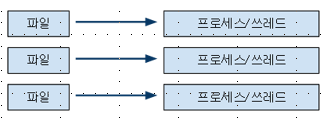
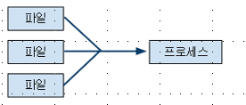
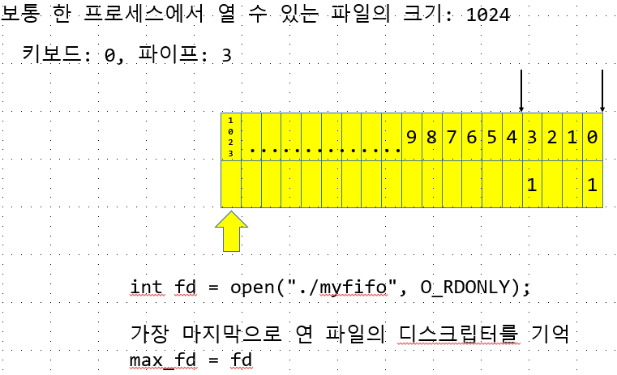
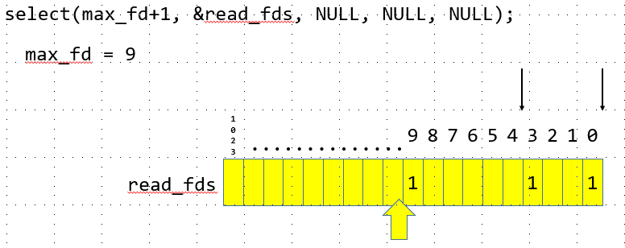
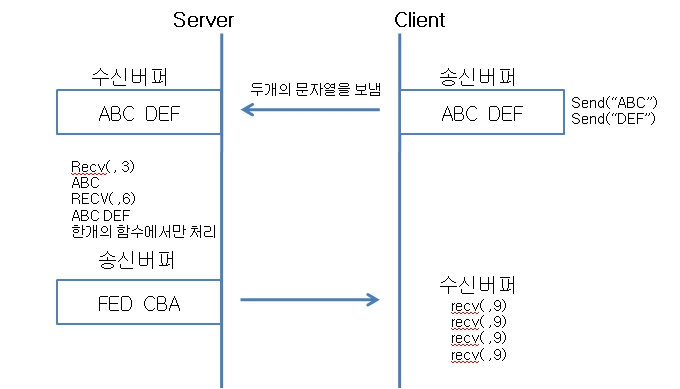
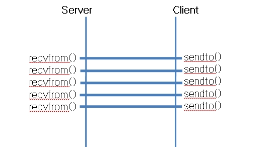

- Multi Thread 프로그래밍 단점
1. 많은 Thread 생성.
2. 코어의 개수를 초과하는 Thread가 생성되면 대부분의 Thread는 대기 상태로 존재
3. Thread는 LWP(Light Weight Process, 경량 프로세스)이므로 스케줄링의 대상이고 이로 인해 context swithing이 빈번하게 발생할 수 있음
4. 운영체제가 감당할 수 있는 Thread의 수는 한정되어있다.
5. 동기화 문제를 해결하기위해 락을 사용 : 성능 하락

일정 수준까지는 좋은 성능을 보이지만 그 수준을 넘기면 해당 단점 발생
해당문제를 해결하기위해 I/O Multiplexing을 쓴다.

---
# 입출력 다중화(I/O Multiplexing)

<br/>
하나의 Thread에 하나의 파일 입출력을 한다.

<br/>
하나의 Thread가 Nonblock을 돌면서 파일 입출력을한다.
그러나 Nonblock을 쓰면 CPU가 공회전을 하기 때문에 많은 자원을 소모한다

그래서 리눅스는 입출력을 다중으로 하기위해 select나 poll을 지원해준다.

---
## select
세개의 독립적인 파일지시자 집합들을 검사<br/>
>int select(int nfds, fd_set *readfds, fd_set *writefds, fd_set *exceptfds, struct timeval *timeout);

    readfds : 출력 디스크립터
    읽기가 봉쇄되지 않았는지를 검사한다. 
    봉쇄되지 않음을 검사함으로 (EOF)end-of-file가 발생하는 것도 검사하고 리턴

    writefds : 쓰기가 봉쇄되어 있는지가 검사

    excptfds : 예외가 있는지가 검사된다. 
    종료시, 이 집합들은 파일 기술자들이 실제로 변경된 상태가 무엇인지 가리키도록 수정

    timeout : select가 반환하기전에 블럭킹될수 있는 시간의 상위제한값

<br/>
해당하는 파일 디스크립터에 대해서 데이터가 들어온것을 읽어오려면 범위 값을 지정해야한다

select가 return 되었다는 것은 등록된 디스크립터에 대해 1로 켜두고 나머지는 0으로 설정<br/>
<br/>

```c
#include <sys/types.h>
#include <sys/stat.h>
#include <fcntl.h>
#include <unistd.h>
#include <stdio.h>
#include <sys/select.h>
int main() {
    int fifo = open("./myfifo", O_RDONLY);//myfifo read로 open
    if(fifo < 0 ) {
        perror("open");
        return -1;
    }
    int max_fd = fifo;//3

    //int fd1 = open();
    //max_fd = fd1;

    fd_set read_fds; //== unsigned int read_fds[1024]; // 32 * 32  = 1024
    FD_ZERO(&read_fds); //for(int i = 0; i < 32; i++) read_fds[i] = 0;
    FD_SET(0,&read_fds); // descriptor 0 에 대해서 1로
    FD_SET(fd,&read_fds);// descriptor 3 에 대해서 1로

    //0~1023까지 검사할때 할당하지 않은 이벤트에 대해서도 검사하기 때문에 성능이 떨어진다

    //범위를 설정해주어야 한다.
    //입출력을 0 ~ 3까지 쓴다고 한다면. 해당 범위까지만 조사하기위해서 범위지정
    //해당하는 파일에 대해서 입출력이 있었는지 확인해야한다
    //성능하락

    //특정 파일 디스크립터에 대한 이벤트를 감지하기 위해서
    //운영체제를 통해 커널에 이벤트 감지요청을 해놓고
    //해당 디스크립터가 이벤트를 발생한다면 커널이 select 함수에 알려준다

    char buf[BUFSIZ]; 
    while(1) {
        fd_set temp_fds = read_fds;//읽어온 값을 임시 변수에 넣어준다.
        int ret = select(max_fd + 1, &read_fds, NULL, NULL, NULL);
        //2번째 : 출력 descriptor 
        //3번째 : 입력 descriptor
        //4번째 : 에러 descriptor
        //return 설정된 desciptor
        //관리하는 파일 개수이다 설정된 file descriptor중 높은 값 + 1의 값을 주자
        //3이 들어와 3+1 = 4가 되었다면
        //0, 1, 2, 3 을 return 해야하므로 최대 3을 return 할수 있는 값을 주는것이다
        //file descriptor는 0 base라는걸 잊지말자
		if (ret < 0) {
			perror("select");
			return -1;
		}

		for (int i = 0; i < (max_fd + 1); i++) {//max_fd는 open하면서 return 된 fifo의 값.
			if (FD_ISSET(i, &temp_fds)) { //0~1023까지 돌면서 설정되어 있는 file descriptor가 있는지 확인한다
				int nRead = read(i, buf, sizeof(buf));//설정되어 있는 file descriptor로 read
				if (nRead < 0) {
					perror("read");
					return -1;
				}
				write(1, buf, nRead); //write는 무조건 keyboard
			}
		}
	}

    close(fifo);//다쓴 fifo는 close 해주자
    return 0;
}
```

```c
#include <sys/time.h>
#include <sys/types.h>
#include <sys/socket.h>
#include <netinet/in.h>
#include <arpa/inet.h>
#include <sys/wait.h>
#include <unistd.h>
#include <fcntl.h>
#include <stdio.h>
#include <stdlib.h>
#include <errno.h>
#include <string.h>

// 아래의 코드를 select를 사용한 코드로 변경해 보세요 :D

void __quit(const char *msg, int line) {
	char buf[BUFSIZ];
	sprintf(buf, "%s(%d)", msg, line);
	perror(buf);
	exit(1);
}
#define err_quit(msg)	__quit(msg, __LINE__)

int main() {
	int ssock = socket(PF_INET, SOCK_STREAM, 0);
	if (ssock == -1)
		err_quit("socket");

	struct sockaddr_in saddr = {0,};
	saddr.sin_family = AF_INET;
	saddr.sin_port = htons(8080);
	saddr.sin_addr.s_addr = htonl(INADDR_ANY);
																					

	int value = 1;
	if (setsockopt(ssock, SOL_SOCKET, SO_REUSEADDR, (char*)&value, sizeof(value)) == -1)
		err_quit("setsockopt");
	
	if (bind(ssock, (struct sockaddr *)&saddr, sizeof(saddr)) == -1)
		err_quit("bind");

	if (listen(ssock, 10) == -1)
		err_quit("listen");
	printf("[server] running...\n");

	// 서버 소켓 등록
	int max_fd = ssock;
	fd_set read_fds;
	FD_ZERO(&read_fds);
	FD_SET(ssock, &read_fds);
	
	char buf[BUFSIZ];
	while (1) {
		fd_set temp_fds = read_fds;
		int nfds = max_fd + 1;
		int ret = select(nfds, &temp_fds, NULL, NULL, NULL);
		if (ret < 0)
			err_quit("select");
		else if (ret == 0)	// timeout
			continue;

		for (int i = 0; i < nfds; i++) {
			if (FD_ISSET(i, &temp_fds)) {
				if (i == ssock) {
					struct sockaddr_in caddr = {0,};
					int caddr_len = sizeof(caddr);
					int csock = accept(ssock, (struct sockaddr *)&caddr, &caddr_len);
					if (csock < 0)
						err_quit("accept");
					printf("[server] %s is connected...\n", inet_ntoa(caddr.sin_addr));

					FD_SET(csock, &read_fds);
					if (csock > max_fd)
						max_fd = csock;
				}
				else {
					int nRead = read(i, buf, sizeof(buf));
					if (nRead < 0) {
						err_quit("read");
					}
					else if (nRead == 0) {
						close(i);
						FD_CLR(i, &read_fds);
					}
					else {
						write(i, buf, nRead);
						close(i);
						FD_CLR(i, &read_fds);
					}
				}
			}
		}
	}	// end of while

	close(ssock);
	return 0;
}
```
select 의 관리를 유저영역에서 해주어야하기 때문에 해당 기능을 커널로 넣어버린
개선된 기능의 call 사용

---
## poll
>int poll(struct pollfd *fds, nfds_t nfds, int timeout);

timeout : 부호없는 정수

RETURN VALUE
```
On  success,  a  positive  number is returned; this is the number of structures which have nonzero revents fields (in other
words, those descriptors with events or errors reported).  A value of 0 indicates that the  call  timed  out  and  no  file
descriptors were ready.  On error, -1 is returned, and errno is set appropriately.
```
```
struct pollfd {
    int   fd;         /* file descriptor */
    short events;     /* requested events */ //사용자세팅
    short revents;    /* returned events */ //커널세팅 
};
```
```c
#include <sys/time.h>
#include <sys/types.h>
#include <sys/socket.h>
#include <netinet/in.h>
#include <arpa/inet.h>
#include <sys/wait.h>
#include <unistd.h>
#include <fcntl.h>
#include <stdio.h>
#include <stdlib.h>
#include <errno.h>
#include <string.h>
#include <poll.h>

// 아래의 코드를 select를 사용한 코드로 변경해 보세요 :D

void __quit(const char *msg, int line) {
	char buf[BUFSIZ];
	sprintf(buf, "%s(%d)", msg, line);
	perror(buf);
	exit(1);
}
#define err_quit(msg)	__quit(msg, __LINE__)

int main() {
	int ssock = socket(PF_INET, SOCK_STREAM, 0);
	if (ssock == -1)
		err_quit("socket");

	struct sockaddr_in saddr = {0,};
	saddr.sin_family = AF_INET;
	saddr.sin_port = htons(8080);
	saddr.sin_addr.s_addr = htonl(INADDR_ANY);
																					

	int value = 1;
	if (setsockopt(ssock, SOL_SOCKET, SO_REUSEADDR, (char*)&value, sizeof(value)) == -1)
		err_quit("setsockopt");
	
	if (bind(ssock, (struct sockaddr *)&saddr, sizeof(saddr)) == -1)
		err_quit("bind");

	if (listen(ssock, 10) == -1)
		err_quit("listen");
	printf("[server] running...\n");

	// 서버 소켓 등록
	// struct pollfd {
	//    int   fd;         /* file descriptor */
	//    short events;     /* requested events */
	//    short revents;    /* returned events */
	// };
	struct pollfd poll_fds[1024];	// poll: 2K
	int fd_cnt = 0;

	poll_fds[fd_cnt].fd = ssock;
	poll_fds[fd_cnt].events = POLLIN;
	++fd_cnt;

	char buf[BUFSIZ];
	while (1) {
		int ret = poll(poll_fds, fd_cnt, -1);
		if (ret < 0)
			err_quit("poll");
		else if (ret == 0)	// timeout
			continue;

		for (int i = 0; i < fd_cnt; i++) {
			if (poll_fds[i].revents & POLLIN) {
				if (poll_fds[i].fd == ssock) {
					struct sockaddr_in caddr = {0,};
					int caddr_len = sizeof(caddr);
					int csock = accept(ssock, (struct sockaddr *)&caddr, &caddr_len);
					if (csock < 0)
						err_quit("accept");
					printf("[server] %s is connected...\n", inet_ntoa(caddr.sin_addr));

					// 새로운 클라이언트를 등록합니다.
					poll_fds[fd_cnt].fd = csock;
					poll_fds[fd_cnt].events = POLLIN;
					++fd_cnt;
				}
				else {
					int nRead = read(poll_fds[i].fd, buf, sizeof(buf));
					write(1, buf, nRead);
					if (nRead < 0) {
						err_quit("read");
					}
					else if (nRead == 0) {
						close(poll_fds[i].fd);
						poll_fds[i] = poll_fds[--fd_cnt];
					}
					else {
						write(poll_fds[i].fd, buf, nRead);
						close(poll_fds[i].fd);
						poll_fds[i] = poll_fds[--fd_cnt];
					}
				}
			}
		}	
	}

	close(ssock);
	return 0;
}
```
하지만 loop를 돌아 처리하는 연산은 select과 다를것이 없어 
이러한 연산을 개선한 poll이 나왔다

---
## epoll

>int epoll_create(int size); // 오류가 존재 하위호환성용

int epoll_create1(int flags);

int epoll_ctl(int epfd, int op, int fd, struct epoll_event *event);
int epoll_wait(int epfd, struct epoll_event *events, int maxevents, int timeout);

epoll내부 구조체
```
struct epoll_event {
    uint32_t     events;      /* Epoll events */
    epoll_data_t data;        /* User data variable */
};

typedef union epoll_data {
    void        *ptr;
    int          fd;
    uint32_t     u32;
    uint64_t     u64;
} epoll_data_t;
```
```
RETURN VALUE
       When successful, epoll_wait() returns the number of file descriptors ready for the  requested  I/O,  or  zero  if  no  file
       descriptor became ready during the requested timeout milliseconds.  When an error occurs, epoll_wait() returns -1 and errno
       is set appropriately.
```
```c
#include <sys/types.h>
#include <sys/socket.h>
#include <netinet/in.h>
#include <arpa/inet.h>
#include <sys/wait.h>
#include <unistd.h>
#include <fcntl.h>
#include <stdio.h>
#include <stdlib.h>
#include <errno.h>
#include <string.h>
#include <sys/time.h>
#include <sys/epoll.h>
// 아래의 코드를 select를 사용한 코드로 변경해 보세요 :D

void __quit(const char *msg, int line) {
    char buf[BUFSIZ];
    sprintf(buf, "%s(%d)", msg, line);
    perror(buf);
    exit(1);
}
#define err_quit(msg)   __quit(msg, __LINE__)

int main() {
    int ssock = socket(PF_INET, SOCK_STREAM, 0);
    if (ssock == -1)
        err_quit("socket");

    struct sockaddr_in saddr = {0,};
    saddr.sin_family = AF_INET;
    saddr.sin_port = htons(8080);
    saddr.sin_addr.s_addr = htonl(INADDR_ANY);


    int value = 1;
    if (setsockopt(ssock, SOL_SOCKET, SO_REUSEADDR, (char*)&value, sizeof(value)) == -1)
        err_quit("setsockopt");

    if (bind(ssock, (struct sockaddr *)&saddr, sizeof(saddr)) == -1)
        err_quit("bind");

    if (listen(ssock, 10) == -1)
        err_quit("listen");
    printf("[server] running...\n");

    // 서버 소켓 등록
    int efd = epoll_create(1); //적절한 poll의 크기를 설정해준다.
    if(efd == -1)
        err_quit("epoll_create");
    struct epoll_event event;//epoll_ctl : 2
    event.events = EPOLLIN;
    event.data.fd = ssock;
    //int epoll_ctl(int epfd, int op, int fd, struct epoll_event *event);
    if(epoll_ctl(efd, EPOLL_CTL_ADD, ssock, &event) == -1)
            err_quit("epoll_ctl");

    struct epoll_event events[128];
    char buf[BUFSIZ];
    while (1) {
        //int epoll_wait(int epfd, struct epoll_event *events, int maxevents, int timeout);
        int nEvent =  epoll_wait(efd, events, 128, -1); //42억초 blcok
        //발생한 event 개수 반환
        if(nEvent < 0 )
            err_quit("epoll_wait");
        else if(nEvent == 0)
            continue;

        for(int i = 0 ; i < nEvent;i ++ ) {
            if(events[i].data.fd == ssock) {
                struct sockaddr_in caddr = {0,};
                int caddr_len = sizeof(caddr);
                int csock = accept(ssock, (struct sockaddr *)&caddr, &caddr_len);
                if (csock < 0)
                    err_quit("accept");
                printf("[server] %s is connected...\n", inet_ntoa(caddr.sin_addr));

                //새로운 클라이언트 등록
                event.events =EPOLLIN;
                event.data.fd = csock;
                if(epoll_ctl(efd, EPOLL_CTL_ADD, csock, &event) == -1)
                    err_quit("epoll_ctl");
                continue;
            }
            else {
                //if(poll_fds[i].revents & POLLIN) {//별도처리
                int nRead = read(events[i].data.fd, buf, sizeof(buf));
                if (nRead < 0) {
                    err_quit("read");
                }
                else if (nRead == 0) {
                    if(epoll_ctl(efd, EPOLL_CTL_DEL, events[i].data.fd, NULL) == -1)
                        err_quit("epoll_ctl");
                    close(events[i].data.fd);
                }
                else {
                    write(events[i].data.fd, buf, nRead);
                    if(epoll_ctl(efd, EPOLL_CTL_DEL, events[i].data.fd, NULL) == -1)
                        err_quit("epoll_ctl");
                    close(events[i].data.fd);
                }
            }
        }
    }   // end of while
    close(ssock);
    return 0;
}
```
TCP는 바이트 스트림이므로 그 경계가 없다. 그러므로 받는 쪽에서 데이터를 모아
Packet을 만드는 과정이 필요하다.
>TCP/IP 수신
<br/>
보낸 문자열을 서로 구분하지 않고 함수처리에 의해 수신<br/>
데이터의 경계가 없어서 넘어온 데이터는 송신버퍼에 쌓인 후 순서대로 수신버퍼로 보내진다.

>UDP 수신

수신버퍼와 송신버퍼가 1:1 이므로
ABC를 보내고 DEF를 보내면 ABC DEF가 아닌
ABC를 처리하고 DEF를 처리한다.

```c
#include <stdio.h>
#include <unistd.h>
#include <sys/types.h>
#include <sys/stat.h>
#include <fcntl.h>
int main() {
    int fd = open("myfifo", O_RDONLY);
    if(fd < 0) {
        perror("open");
        return -1;
    }

    char buf[BUFSIZ];
    int nRead = read(fd, buf, sizeof(buf));
    if(nRead < 0) {
        perror("read");
        return -1;
    }

    buf[nRead-1] = '\0';
    fputs(buf, stdout);
    close(fd);
    return 0;
}
```
```s
#include <stdio.h>
#include <unistd.h>
#include <sys/types.h>
#include <sys/stat.h>
#include <fcntl.h>
int main() {
    int fd = open("myfifo", O_WRONLY);
    if(fd < 0) {
        perror("open");
        return -1;
    }
    getchar(); write(fd, "he", 2);
    getchar(); write(fd, "ll", 2);
    getchar(); write(fd, "o\n", 2);
    close(fd);
    return 0;
}
```
```s
#TCP는 데이터의 경계가 없으므로 처음에 보낸 he만 받고 데이터의 끝이라고 생각하여
#read를 종료한다.

linux@ubuntu:~/0626$ ./server
helinux@ubuntu:~/0626$


```

```c
#include <stdio.h>
#include <unistd.h>
#include <sys/types.h>
#include <sys/stat.h>
#include <fcntl.h>
int readLine(int fd, void * buf, size_t size){
    if(fd < 0 || buf == NULL || size == 0) {
        return -1;
    }
    int totalRead = 0;
    char *ptr = (char*)buf;
    while(1) {
        char ch;
        int nRead = read(fd, &ch, sizeof(ch));
        if (nRead < 0 ) {
            perror("read");
            return -1;
        }
        else if(nRead == 0) {
            if(totalRead == 0) //읽은 데이터가 없는 경우
                return 0;
            else //읽은 데이터가 있는 경우
                break;
        }
        else {//읽은 데이터가 있는 경우
            if(totalRead < size) {
                *ptr++ =ch;
                ++totalRead;
            }
            if(ch == '\n') //개행을 만나면 개행을 포함후 , 읽기 종료
                break;  //fgets 함수와 같이 개행을 포함
        }
    }
        *ptr = '\0'; //fgets 함수와 같이 널로 끝난다

    return totalRead;
}
int main() {
    int fd = open("myfifo", O_RDONLY);
    if(fd < 0) {
        perror("open");
        return -1;
    }
    //--------------------------
    char buf[BUFSIZ];
    int nRead = readLine(fd, buf, sizeof(buf));
    if (nRead < 0 ) {
        fprintf(stderr, "readLine error\n");
        return -1;
    }
    //--------------------------
    fputs(buf, stdout);
    close(fd);
    return 0;
}
```
하지만 사용자가 함수 사용함에 있어서 buf의 크기가 사용자가 전달한 크기보다 작아지게되면 개행이 유실된다
```c
char buf[3];//char buf[BUFSIZ];
int nRead = readLine(fd, buf, sizeof(buf));
if (nRead < 0 ) {
    fprintf(stderr, "readLine error\n");
    return -1;
}
```
```s
linux@ubuntu:~/0626$ ./server
hellinux@ubuntu:~/0625$

%d로 찍은 값.
[104][101][108] 끝에 NULL의 값이 없다...
```
해결방안
```c
 else {//읽은 데이터가 있는 경우
     if(totalRead < size -1) {//NULL 문자의 자리를 만들어주었다.
         *ptr++ =ch;
         ++totalRead;
     }
 }
```
비교하여 값을 출력할 때 버퍼에 NULL 문자가 들어갈 공간을 만들어준다.
```s
[104][101][0] -1을 한 자리에 NULL의 ASCII CODE가 들어왔다.
```
---
보내는 데이터가 유실 되지않게 정확히 받을 수 있는 함수.

## readn
read() : 파일의 끝에 도달하지 않는 경우에도 요청한 바이트 수보다
작은 값을 return 하는경우

이는 오류가 아닌 그 파일을 더 읽어야한다는 의미

write() : 커널 출력 버퍼가 가득 찼거나 부족할 때 지정한 바이트 수보다 작은 수를 return 한다.

이러한 경우는 파이프나 터미널 또는 네트워크 입출력을 할 때 매우 빈번히 발생 이와 같은 장치에서의 입출력시 위의 사항을 고려하여 프로그래밍

- 하지만 Linux에서는 구현이 안되어있다.

readn 구현
```c
 2 ssize_t                         /* Read "n" bytes from a descriptor. */
 3 readn(int fd, void *vptr, size_t n)
 4 {
 5     size_t  nleft;
 6     ssize_t nread;
 7     char   *ptr;

 8     ptr = vptr;
 9     nleft = n;
10     while (nleft > 0) {
11         if ( (nread = read(fd, ptr, nleft)) < 0) {
12             if (errno == EINTR)
13                 nread = 0;      /* and call read() again */
                                //Unix와 Linux는 block된 io가 있었을떄
                                //signal이 같으면 바로 return 을 한다
                                //그럼 -1 이 return이 되는데
                                //-1 return 된것이
                                //에러에 의한 -1인지
                                //signal을 받아서 block이 풀린것인지 구분

                                //SIGNAL을 받아서 errno이 -1이 된것을 구분
14             else
15                 return (-1);
16         } else if (nread == 0)
17             break;              /* EOF */

18         nleft -= nread;
19         ptr += nread;
20     }
21     return (n - nleft);         /* return >= 0 */
22 }

ssize_t                         /* Write "n" bytes to a descriptor. */
 3 writen(int fd, const void *vptr, size_t n)
 4 {
 5     size_t nleft;
 6     ssize_t nwritten;
 7     const char *ptr;

 8     ptr = vptr;
 9     nleft = n;
10     while (nleft > 0) {
11         if ( (nwritten = write(fd, ptr, nleft)) <= 0) {
12             if (nwritten < 0 && errno == EINTR)
13                 nwritten = 0;   /* and call write() again */
14             else
15                 return (-1);    /* error */
16          }

17          nleft -= nwritten;
18          ptr += nwritten;
19     }
20     return (n);
21 }
```

좀더 가시적인 코드.
```c
#include <stdio.h>
#include <unistd.h>
#include <sys/types.h>
#include <sys/stat.h>
#include <fcntl.h>
ssize_t readn(int fd, void *buf, size_t count) {
     if(fd < 0 || buf == NULL || count  == 0) {
        return -1;
    }

     char *ptr = (char*)buf;
     ssize_t totalRead = 0;

     while(totalRead < size) {
         ssize_t nRead =read(fd, ptr, size - totalRead);
         if(nRead < 0 ) {
             return -1;
         }
         else if(nRead == 0 )
             return totalRead;

         totalRead += nRead;
         ptr += nRead;
     }

     return totalRead;
}

//write
//반환값 : 쓴 바이트 수 , -1(오류)
ssize_t writen(int fd, const void *buf, size_t count) {
     if(fd < 0 || buf == NULL || count  == 0) {
        return -1;
    }
    const char *ptr = (const char*)buf;
    ssize_t totalWrite = 0;

    while(totalWrite < size ) {
        ssize_t nWrite = write(fd, ptr, size - totalWrite);
        if(nWrite < 0) {
            return -1;
        }
        else if(nRead == 0 )
            return totalWrite;

        totalWrite += nWrite;
        ptr += nWrite;  
    }

    return totalWrite;
}
```